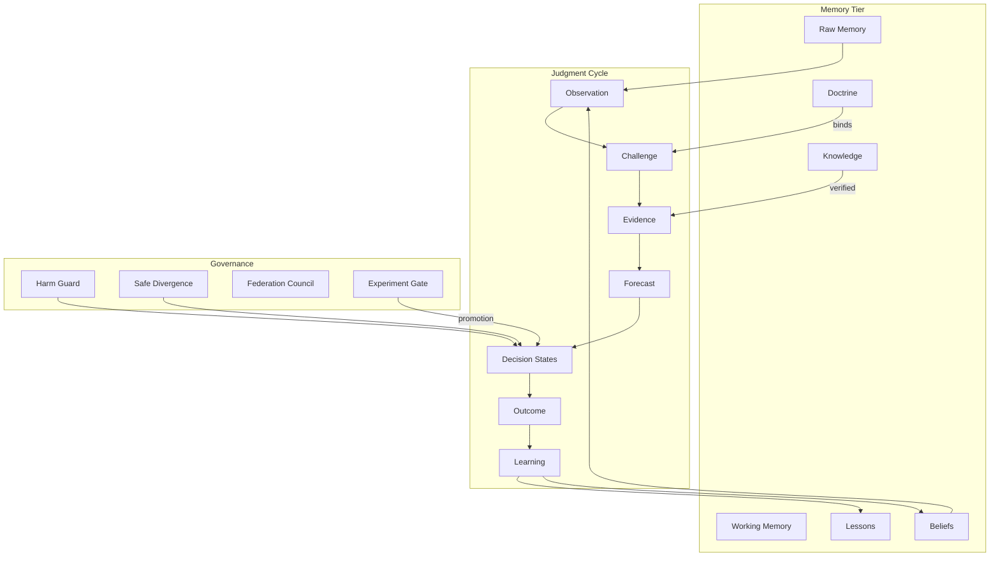

# Blvckshell Cognitive Constitution

**Version:** RFC 0 — Foundational Ontology  
**Status:** Normative for V2 — all subsystems MUST align  
**Date:** 2026-06-14  
**Classification:** Constitutional document — not architecture, not implementation  
**Companion:** [`BLVCKSHELL_OS_V2_ARCHITECTURE_BIBLE.md`](./BLVCKSHELL_OS_V2_ARCHITECTURE_BIBLE.md) (how to build) | This document (what things **are**)

---

## Preamble

Blvckshell OS V1 discovered, through failure, that **algorithm piles without shared definitions become incompatible systems**. Venture contamination, translation seams, observational guards, and binary-only decisions were not primarily code bugs — they were **ontology failures**: different subsystems meant different things by "decision," "proceed," "learning," and "judgment."

This constitution defines the **foundational ontology** of Blvckshell OS V2. Every future subsystem — memory, judgment, federation, curiosity, BKOS, governance — MUST use these definitions or explicitly extend them via amendment process.

**Amendment rule:** Changes to this document require:
1. Written rationale citing V1/V2 evidence
2. Impact assessment on existing subsystems
3. No silent semantic drift in code without constitutional update

---

## Article I — Purpose

Blvckshell OS exists to enable **organizational judgment**: the governed capacity of configured brains to observe, believe, forecast, decide, review, and learn — measurably, safely, and auditably.

This constitution does not define implementation. It defines **meaning**.

---

## Article II — Brain

### Definition

A **Brain** is a **configured cognitive organization** — not a model, not a prompt, not a single agent. A brain is defined by:

- Identity (name, domain, objectives)
- Memory access policy
- Doctrine bindings
- Tool and capability permissions
- Judgment profile (thresholds, harm rules, decision vocabulary)
- Advisor panel configuration
- Federation membership and veto rights

### Properties

| Property | Meaning |
|----------|---------|
| **Configurable** | Brains are declared in configuration; code is shared substrate |
| **Persistent** | Brains have durable memory, beliefs, and audit history |
| **Bounded** | Brains have explicit permissions; unbounded capability is forbidden |
| **Accountable** | Brains produce traceable decisions with outcome review |

### Non-properties

A brain is NOT:
- A single LLM instance
- A chat session
- An autonomous unconstrained agent

### V1 evidence

15 department brains (`platform/departments/`) share lifecycle code but differ in configuration. G0 proved wiring; federation suite proved **native decision ownership** per brain.

### V2 rule

**Brains are configuration. Substrate is shared. Identity is constitutional.**

---

## Article III — Belief

### Definition

A **Belief** is a **structured, persistent proposition** held by a brain with attached confidence, provenance, and revision history.

Beliefs live in judgment ledgers — not in prompts, not in ephemeral context.

### Structure (minimum)

```text
beliefId
statement          — what is believed
confidence         — [0, 1] calibrated strength
provenance         — how belief was formed
evidenceRefs[]     — supporting/contradicting evidence IDs
assumptionRefs[]   — assumptions belief depends on
revisionHistory[]  — changelog of confidence changes
status             — active | weakened | suppressed | retired
```

### Belief vs Lesson

| | Lesson | Belief |
|---|--------|--------|
| **Granularity** | Narrative outcome summary | Structured proposition |
| **Revision** | New lesson supersedes informally | Explicit confidence delta |
| **Contradiction** | Implicit | First-class ledger object |
| **Retrieval** | Similarity recall | Ledger query + influence |

G3 replaced lesson sprawl with beliefs. G1 proved lessons work at single-decision level. **Beliefs are the organizational unit of memory-for-judgment.**

### V2 rule

**No judgment layer may mutate confidence without producing a belief revision record.**

---

## Article IV — Evidence

### Definition

**Evidence** is a **typed, attributable record** that supports, weakens, or contradicts a belief — with explicit strength and quality scores.

Evidence is NOT raw text. Evidence is NOT a model completion. Evidence is a **first-class object**.

### Evidence types (V2 minimum)

| Type | Source |
|------|--------|
| `forecast_outcome` | Forecast vs actual (Brier-derived) |
| `assumption_survival` | Assumption validated/failed against outcome |
| `contradiction_resolution` | Contradiction confirmed/weakened |
| `case_outcome` | Historical case similarity result |
| `outcome_ledger` | Fallback from decision outcome |
| `external_verified` | BKOS verified external source |

### Evidence properties

```text
evidenceId
type
direction       — supports | weakens | contradicts | neutral
strength        — [0, 1]
quality         — [0, 1] (verification tier)
sourceRef       — traceable origin
targetBeliefIds[]
timestamp
```

### V1 evidence

Bayesian updater in `bayesian-belief-updater.ts` consumes `BeliefEvidenceEvent` — V1 prototype of this article.

### V2 rule

**Evidence must be typed and attributable. Untyped text may inform advisors; it may not directly mutate beliefs without evidence object creation.**

---

## Article V — Truth

### Definition

**Truth**, in Blvckshell OS, is **operational, not metaphysical**.

Truth is the state where:

1. **Beliefs are calibrated** — confidence matches observed outcome frequency
2. **Forecasts are scored** — Brier or equivalent proper scoring applies
3. **Contradictions are resolved** — not ignored, not silently overwritten
4. **Outcomes are reviewed** — every committed decision has accountable review

Blvckshell does not claim access to ground truth about the world. It claims **accountable alignment between belief strength and observed results**.

### Truth vs Confidence

| | Confidence | Truth (operational) |
|---|------------|---------------------|
| **Question** | How strongly do we believe? | How well does strength match reality? |
| **Updates** | Pre-decision + post-outcome | Post-outcome calibration primarily |
| **Failure mode** | Overconfidence | Systematic miscalibration |

G4 forecast accountability is the V1 prototype of operational truth.

### V2 rule

**Calibration metrics are mandatory for any brain with forecast obligations. Uncalibrated confidence is advisory only — it cannot authorize PROCEED on high-stakes domains.**

---

## Article VI — Knowledge

### Definition

**Knowledge** is **verified, durable information** suitable for organizational reuse — above raw memory, below doctrine.

### Tier placement

```text
Raw Memory        — unprocessed observations
Working Memory    — session-scoped context
Knowledge         — verified, retrievable, attributable  ← this article
Beliefs           — judgment-relevant propositions with confidence
Doctrine          — promoted, governance-protected knowledge
```

### Knowledge properties

- Must have **source provenance**
- Must declare **verification status** (candidate | verified | deprecated)
- Must NOT automatically mutate beliefs without evidence object
- May inform advisors and curiosity engine

### V1 failure

G5.2A: 138 knowledge entries, 0.7% divergence — **knowledge without judgment integration is archival, not cognitive**.

### V2 rule

**Knowledge promotion to belief requires evidence object + review. Knowledge promotion to doctrine requires governance council.**

---

## Article VII — Doctrine

### Definition

**Doctrine** is **governance-protected organizational knowledge** — promoted through explicit council process, resistant to casual revision, binding on brain behavior within declared scope.

### Doctrine properties

```text
doctrineId
statement
scope             — domain, brain, federation-wide
promotionRecord   — council decision, evidence, dissent
bindingStrength   — advisory | standard | mandatory
supersessionChain[]
```

### Doctrine vs Belief

Doctrines are **beliefs that survived governance promotion**. Not all beliefs become doctrine. Doctrine suppression (G5.4A contradiction service) is constitutional — repeated confirmed contradictions may suppress doctrine application.

### V2 rule

**Doctrine changes require governance process — never silent ledger overwrite.**

---

## Article VIII — Judgment

### Definition

**Judgment** is the **governed lifecycle** by which a brain moves from observation to commitment to review — not a single inference step.

### The Judgment Cycle (normative)

```text
1. OBSERVATION    — what is happening (raw + working memory)
2. BELIEF         — what we think is true (ledger retrieval)
3. CONFIDENCE     — how strongly we hold belief (calibrated)
4. CHALLENGE      — what could be wrong (adversarial, contradiction)
5. EVIDENCE       — what supports/contradicts (typed objects)
6. FORECAST       — what we expect if we act (scored prediction)
7. DECISION       — what commitment we make (four-outcome vocabulary)
8. OUTCOME        — what actually happened (simulation or reality)
9. LEARNING       — how beliefs/forecasts update (foundation loop)
```

### Judgment is NOT

- A single LLM call
- A reasoning trace without decision effect
- A mechanism without outcome review
- An algorithm pile without lifecycle ordering

### V1 evidence

G5.4C.4 translation seam: reasoning without decision effect is **not judgment**. G5.4C.8.2: safe divergence with outcome review **is judgment**.

### V2 rule

**Every cognitive layer MUST declare which cycle stage(s) it affects and which artifacts it produces.**

---

## Article IX — Decision States

### Definition

A **Decision** is an **organizational commitment** — not a model output, not a recommendation. Decisions use the **four-outcome vocabulary**:

| State | Semantics | Commitment level |
|-------|-----------|------------------|
| **PROCEED** | Full commitment to action | 100% exposure (baseline) |
| **STAGED_PROCEED** | Directional commitment at reduced exposure | Partial — pilot, phase, scaled capital |
| **REQUEST_MORE_EVIDENCE** | Recognized evidence gap | No commitment — discovery authorized |
| **HOLD** | Reject or pause | No forward action |

### Hierarchy

```text
PROCEED > STAGED_PROCEED > REQUEST_MORE_EVIDENCE > HOLD
```

(Higher = stronger forward commitment)

### Forbidden transitions (constitutional)

| Transition | Status |
|------------|--------|
| HOLD → PROCEED | **FORBIDDEN** (all brains) |
| HOLD → STAGED_PROCEED | **FORBIDDEN** |
| REQUEST_MORE_EVIDENCE → PROCEED | **FORBIDDEN** without new judgment cycle |
| Capital → STAGED_PROCEED | **FORBIDDEN** (V1; V2 may amend with evidence) |

### Harm precedence

Harm guard **MAY** downgrade any forward commitment to HOLD. Harm guard **MAY NOT** upgrade HOLD to any forward commitment without passing all safety signals.

### V1 evidence

G5.4C.8.2: 100% of beneficial divergences were PROCEED→STAGED_PROCEED. Zero harmful. +2.1% ROI.

### V2 rule

**Decision states are native execution semantics — not simulation multipliers. Any subsystem referencing "proceed/hold" must map explicitly to this vocabulary.**

---

## Article X — Confidence

### Definition

**Confidence** is a **numeric expression of belief strength at decision time** — calibrated against outcomes, bounded by policy, and distinct from model logits or token probabilities.

### Confidence properties

```text
value           — [floor, ceiling] per brain policy
calibrationRef  — link to forecast/outcome history
provenance      — which layers contributed delta
capsApplied[]   — audit of bound enforcement
```

### Confidence vs Recommendation

Advisors **recommend**. Confidence **authorizes** (or fails to authorize) decision states. A high-confidence recommendation that fails calibration is **downgraded to advisory**.

### Layer merge (V1 precedent)

V1 merged confidence from: baseline → forecast pre-decision → exploration → reasoning → ledger → lesson → harm cap → safe divergence outcome.

V2 constitutionalizes: **merge order is normative; skipped stages must be explicit in audit trace.**

### V2 rule

**Confidence without provenance is inadmissible for PROCEED on governed domains.**

---

## Article XI — Governance

### Definition

**Governance** is the **authoritative override layer** that prevents preventable harm and resolves cross-brain conflict — above judgment layers, below human constitutional authority.

### Governance instruments

| Instrument | Role |
|------------|------|
| **Harm guard** | Block unsafe HOLD→PROCEED; authoritative override |
| **Safe divergence allowlist** | Permit only classified beneficial transitions |
| **Doctrine council** | Promote/suppress doctrine |
| **Federation council** | Cross-brain conflict resolution |
| **Experiment gate** | Block promotion without evidence |
| **Human escalation** | Final authority external to OS |

### Governance is NOT observational

V1 failure FA-02: logging a block without overriding decision is ** unconstitutional** in V2.

### V2 rule

**Governance decisions MUST mutate decision state and MUST appear in audit trail with override reason.**

---

## Article XII — Federation

### Definition

**Federation** is the **coordinated operation of multiple brains** under shared governance — with schema isolation, native decision ownership, and cross-brain influence rules.

### Federation principles

1. Each brain owns native decision classes (capital allocates; people hires; sentinel escalates)
2. No brain may be evaluated on another brain's native question (FB-01)
3. Cross-brain influence is **signal**, not **silent override**
4. Federation experiment surface is **gate-protected**

### V1 evidence

Federation Decision Suite: 32 scenarios, 8 brains × 4 decisions. Gate file: `generated/audit/federation-suite-gate.json`.

### V2 rule

**Federation suite gate MUST pass before any layer promotion experiment.**

---

## Article XIII — Memory Tiers

### Normative tier model

```text
Tier 0: Raw Memory       — observations, events, ingest (ephemeral → durable)
Tier 1: Working Memory   — session context (never durable by default)
Tier 2: Lessons          — narrative learning artifacts (candidate → validated)
Tier 3: Beliefs          — structured propositions (ledger)
Tier 4: Knowledge        — verified organizational facts (BKOS)
Tier 5: Doctrine         — governance-protected knowledge
Tier 6: Artifacts        — ephemeral traces (offload, not durable cognition)
```

### Promotion path

```text
Raw → Lesson (learning loop)
Lesson → Belief (evidence + review)
Belief → Doctrine (governance council)
External → Knowledge (BKOS verification)
Knowledge → Belief (evidence object + review)
```

### V1 evidence

G-INFRA-2.2: "Store conclusions, not thoughts." Artifacts offload to disk; journal holds durable writes only.

### V2 rule

**Ephemeral traces MUST NOT enter durable tier without explicit promotion. Working memory MUST NOT flush to Supabase.**

---

## Article XIV — Experiment and Promotion

### Definition

**Promotion** is the **constitutional act** of declaring a capability production-ready — requiring paired outcome evidence.

### Minimum promotion gate (normative, from V1 G5.4C.8.2)

| Gate | Requirement |
|------|-------------|
| Surface validity | Federation suite gate PASS |
| Infrastructure | G-INFRA PASS (0 runtime remote reads) |
| Divergence band | 10–30% (diagnostic, not aesthetic) |
| ROI | Δ ≥ 1% vs paired control |
| Harm | harmful = 0; safe_beneficial > harmful |
| Capital safety | 0 unsafe HOLD→PROCEED |
| Trace | 100% applied overrides auditable |

### Anti-promotion

Mechanism proof alone is **insufficient**. See FA-03.

### V2 rule

**No capability flag may be enabled in production config without promotion record ID linking to experiment batch.**

---

## Article XV — Advisors and Models

### Definition

**Advisors** (LLMs, external models, human input) **inform** the judgment cycle. They **do not decide**.

### Model role boundary

| Models MAY | Models MAY NOT |
|------------|----------------|
| Generate recommendations | Authorize PROCEED |
| Propose assumptions | Mutate beliefs directly |
| Draft forecasts | Bypass harm guard |
| Summarize evidence | Create untyped evidence |
| Participate in debate stage | Override governance |

G0: 15/15 live Qwen — advisors wired. Council consensus null — advisors did not decide.

### V2 rule

**Model output enters judgment cycle only through declared stage interfaces with artifact typing.**

---

## Article XVI — Curiosity (Reserved)

### Definition (V2-PLANNED)

**Curiosity** is the **self-directed identification of knowledge gaps** worthy of research — producing questions, not answers.

Curiosity outputs feed REQUEST_MORE_EVIDENCE decisions and BKOS research queues — never PROCEED directly.

*Full specification deferred to V2 Phase 2. This article reserves the term.*

---

## Article XVII — Amendment Process

1. Propose amendment with evidence citation
2. Impact review against all articles
3. Experiment validation if behavioral change
4. Update constitution version
5. Update affected subsystems within one release cycle

**Semantic drift between code and constitution is a defect** — not a documentation lag.

---

## Summary Ontology Map



---

## Constitutional Hierarchy

When subsystems conflict, precedence is:

```text
1. Human escalation (external)
2. Governance (harm guard, allowlists)
3. Decision states (four-outcome vocabulary)
4. Judgment cycle ordering
5. Memory tier promotion rules
6. Advisor recommendations (inform only)
7. Default configuration
```

---

## Ratification

This constitution is ratified on **2026-06-14** based on V1 research evidence through G5.4C.8.2 promotion.

**Foundational discovery ratified:** Decision states — PROCEED, STAGED_PROCEED, REQUEST_MORE_EVIDENCE, HOLD — are constitutional primitives, not algorithm outputs.

---

*For why these definitions exist, read [`BLVCKSHELL_JUDGMENT_THEORY.md`](./BLVCKSHELL_JUDGMENT_THEORY.md). For every failure that motivated them, read [`BLVCKSHELL_FAILURE_ARCHIVE.md`](./BLVCKSHELL_FAILURE_ARCHIVE.md). For how to build V2, read [`BLVCKSHELL_OS_V2_ARCHITECTURE_BIBLE.md`](./BLVCKSHELL_OS_V2_ARCHITECTURE_BIBLE.md).*
