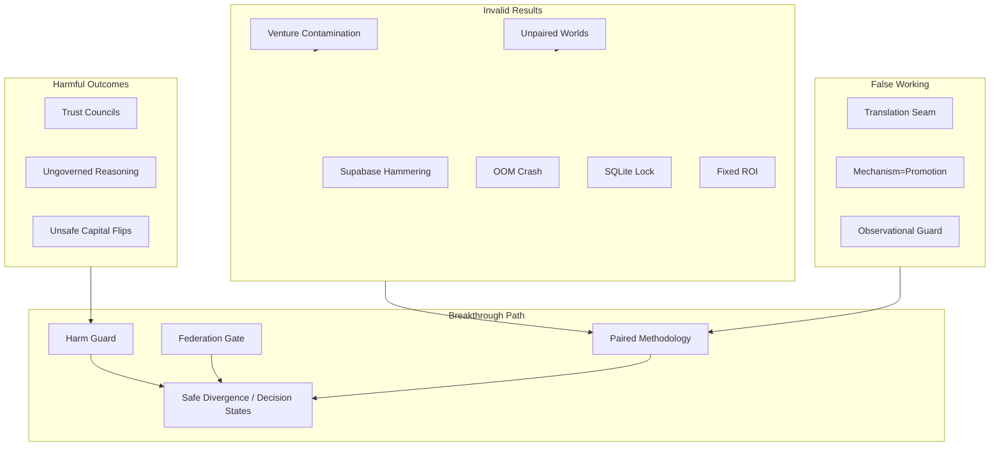

# Blvckshell Failure Archive

**Classification:** Permanent failure record — brutally honest  
**Purpose:** Every dead end, wrong assumption, and costly mistake from V1  
**Audience:** Researchers, future engineers, due diligence reviewers  
**Principle:** Failures are assets. Hidden failures are liabilities.  
**Companion:** [`BLVCKSHELL_JUDGMENT_ENGINE_RESEARCH.md`](./BLVCKSHELL_JUDGMENT_ENGINE_RESEARCH.md) § Failure Registry

---

## How to Read This Archive

Each entry follows:

```text
ID → Name
Hypothesis (why we believed it)
What happened (observable outcome)
Root cause (mechanism, not blame)
Fix (what changed)
Validation (how we know)
What V2 inherits (non-negotiable rule)
Evidence paths
```

**Severity:** 🔴 Harmful (caused wrong promotion or safety risk) | 🟠 Invalidating (voided experiment results) | 🟡 Delaying (slowed research) | 🔵 Instructive (expected dead end)

---

# CATEGORY A — METHODOLOGY FAILURES

## FA-01: Lesson-Only Organizational Learning

| Field | Detail |
|-------|--------|
| **Severity** | 🔴 Harmful belief |
| **Phase** | G2 |
| **Hypothesis** | If each brain learns from lessons and a civilization accumulates lessons over time, the learning civilization will outperform a control civilization on ROI and success rate. |
| **Why we believed it** | G1 proved 15/15 single-brain lesson influence. Natural extrapolation: scale to multi-run civilization. |
| **What happened** | Learning civilization **worse** than control: ROI −11.0%, success −27.3pp. |
| **Root cause** | Lesson accumulation changed behavior without judgment structure to discriminate helpful vs harmful recall; no paired attribution; no harm classification. |
| **Fix** | Did not "fix" learning — reframed scope. G1 = mechanism proof. G2 = org hypothesis **rejected**. |
| **Validation** | `docs/audits/ADAPTATION_PROOF_REPORT.md`, `docs/audits/BRUTAL_TRUTH_REPORT.md` |
| **V2 inherits** | Single-brain learning ≠ organizational intelligence. Promotion requires civilization-scale paired proof. |

---

## FA-02: Unpaired Experiments

| Field | Detail |
|-------|--------|
| **Severity** | 🟠 Invalidating |
| **Phase** | G5.0 |
| **Hypothesis** | G5 opportunity intelligence improves outcomes vs G4 baseline. |
| **Why we believed it** | G5 unpaired run showed +20pp success, +0.350 ROI — dramatic improvement. |
| **What happened** | **0% decision divergence.** Control and threshold ran on different world generators. |
| **Root cause** | Control used matrix worlds; G5 used opportunity-enriched worlds. Outcome delta was world delta, not layer delta. |
| **Fix** | G5.1A/B paired retest with identical world seeds per pair. |
| **Validation** | G5.1A: 13.3% divergence, +0.095 ROI — real but insufficient (Verdict C). `docs/audits/G5_ADAPTATION_REPORT.md`, `G5_1_PAIRED_RETEST_REPORT.md` |
| **V2 inherits** | Paired experiments are mandatory infrastructure, not best practice. Experiment platform enforces pairing. |

---

## FA-03: Mechanism Proof Treated as Promotion

| Field | Detail |
|-------|--------|
| **Severity** | 🟡 Delaying |
| **Phase** | G3, G4 |
| **Hypothesis** | If ledger generation/recall works (G3) or forecast penalties work (G4), the layer is ready to ship. |
| **Why we believed it** | Mechanism audits passed with clear traces and material influence. |
| **What happened** | G3 100-run: Verdict B (no measurable outcome difference). G4.1: 52.7% divergence, **worse ROI**. |
| **Root cause** | Conflated "can influence a decision" with "improves outcomes under paired control." |
| **Fix** | Separated mechanism validation from promotion gates. G5.4A+ required divergence + ROI + harm=0. |
| **Validation** | `G3_100_RUN_ADAPTATION_REPORT.md`, `G4_ADAPTATION_RETEST_REPORT.md` |
| **V2 inherits** | Two-stage gate: (1) mechanism wired, (2) paired outcome promotion. Never skip stage 2. |

---

## FA-04: Divergence as Success Metric (Uncritical)

| Field | Detail |
|-------|--------|
| **Severity** | 🔴 Harmful belief |
| **Phase** | G4.1, early G5.4C |
| **Hypothesis** | High decision divergence means the layer is "working." |
| **Why we believed it** | Early promotion drafts used >10% divergence as threshold. |
| **What happened** | G4.1: 52.7% divergence, ROI −0.5705. G5.4C initial: 29% divergence, ROI −0.6%. |
| **Root cause** | Divergence measures change, not value. No harm/benefit classification. |
| **Fix** | G5.4C.8 cohort classification: safe_beneficial, safe_neutral, harmful, blocked. Promotion requires beneficial > harmful, harmful=0 preferred. |
| **Validation** | `G5_4C_SAFE_DIVERGENCE_PROMOTION_REPORT.md` — 28% divergence, 7 beneficial, 0 harmful |
| **V2 inherits** | Divergence is diagnostic. ROI Δ + harm classification is promotion. |

---

## FA-05: Validator Scope Mismatch

| Field | Detail |
|-------|--------|
| **Severity** | 🟡 Delaying |
| **Phase** | G3.0 |
| **Hypothesis** | G3A pass requires full influenced lifecycle run to pass. |
| **Why we believed it** | Comprehensive validation feels rigorous. |
| **What happened** | G3A failed exit code 1 despite all ledger assertions passing — council `consensus=null` on all runs. |
| **Root cause** | `pass = errors.length === 0 && influencedRun.pass` coupled unrelated council gate. |
| **Fix** | Decouple: G3A pass = decision + memory + materialInfluence only. |
| **Validation** | `docs/audits/G3_FINAL_FAILURE_ANALYSIS.md` |
| **V2 inherits** | Every validator declares proof scope explicitly. No unrelated lifecycle gates. |

---

# CATEGORY B — EXPERIMENT SURFACE FAILURES

## FB-01: Venture Contamination (90%)

| Field | Detail |
|-------|--------|
| **Severity** | 🟠 Invalidating |
| **Phase** | G5.4C (pre-federation) |
| **Hypothesis** | Varied world mechanics produce varied brain decisions across domains. |
| **Why we believed it** | World matrix varied customerDemand, competition, etc. across 8 world kinds. |
| **What happened** | 90% of scenarios were `ai_consulting`; same venture launch question injected into all fastBatch brains; `ventureProceed` as sole metric; 0% reasoning divergence. |
| **Root cause** | `scenarioTypeForKind()` returned same type for 7/8 kinds; `decisionClass: 'venture_assessment'` hardcoded; only 6/15 brains in fastBatch. **World diversity ≠ question diversity.** |
| **Fix** | Federation Decision Suite: 32 brain-native scenarios (8 brains × 4 decisions); single-brain lifecycle; hard gate before G5.4C. |
| **Validation** | Post-gate G5.4C.8.2: 28% divergence, +2.1% ROI. `G5_SCENARIO_DIVERSITY_TRACE.md`, `G5_FEDERATION_DECISION_SUITE_SPEC.md` |
| **V2 inherits** | Federation suite gate is permanent. No layer eval on contaminated surfaces. |

---

## FB-02: Decision Surface Too Easy

| Field | Detail |
|-------|--------|
| **Severity** | 🟡 Delaying |
| **Phase** | G5.4C.6 |
| **Hypothesis** | Federation surface would produce natural decision tension. |
| **Why we believed it** | Tension calibration spec defined margin bands. |
| **What happened** | 36% of sims returned default confidence 0.5 — lifecycle incomplete on surface. People+ brains clustered at 0.900 confidence. |
| **Root cause** | Brain confidence priors too high; incomplete lifecycle paths; tension calibration not fully applied before first valid runs. |
| **Fix** | G5-SURFACE-1 tension calibration; brain priors; federation proceed threshold on world object. |
| **Validation** | `G5_SURFACE_1_DECISION_TENSION_CALIBRATION.md`, `G5_4C_DECISION_SURFACE_AUDIT.md` |
| **V2 inherits** | Proceed rate gates (35–65%) on experiment surfaces. Flippable margin ≥25%. |

---

## FB-03: Invalid G5.2A / G5.3A / G5.4A Proof Surfaces

| Field | Detail |
|-------|--------|
| **Severity** | 🔵 Instructive |
| **Phase** | G5.2A, G5.3A, G5.4A (initial) |
| **Hypothesis** | Knowledge layer (G5.2), assumption intelligence (G5.3), adversarial challenge (G5.4) will produce decision movement. |
| **What happened** | G5.2A: 0.7% divergence. G5.3A: 3.3%. G5.4A: 0% (zero challenges). |
| **Root cause** | Combined venture contamination + layers not reaching decision boundary + insufficient weight on pre-decision path. |
| **Fix** | Federation gate + G5.4A weight tuning + decision boundary fix. |
| **V2 inherits** | Layer proof requires native scenario + boundary integration + tuned weights — all three. |

---

# CATEGORY C — ARCHITECTURE / WIRING FAILURES

## FC-01: Reasoning Translation Seam

| Field | Detail |
|-------|--------|
| **Severity** | 🟠 Invalidating (appeared working) |
| **Phase** | G5.4C.4 |
| **Hypothesis** | Reasoning stack changes decisions when traces show influence. |
| **Why we believed it** | Case influence 0.055, debate 0.076; 29% divergence on initial stack. |
| **What happened** | After tuning: 1.3% divergence despite 61.3% case attribution. Reasoning internal confidence 0.920 vs final 0.823. |
| **Root cause** | Reasoning confidence/threshold not merged into final decision path; caps and trust blend consumed signal. |
| **Fix** | `mergeDecisionConfidence()` + `mergeProceedThreshold()` wired in `execute-lifecycle.ts` (G5.4C.5). |
| **Validation** | `G5_4C_DECISION_BOUNDARY_AUDIT.md` — seam fixed |
| **V2 inherits** | Every layer declares integration point. Decision boundary trace is mandatory audit artifact. |

---

## FC-02: Observational Harm Guard

| Field | Detail |
|-------|--------|
| **Severity** | 🔴 Harmful |
| **Phase** | G5.4C.8 pre-7 |
| **Hypothesis** | Logging harm signals is sufficient; final decision can remain unchanged for audit. |
| **Why we believed it** | Early guard logged blocks but did not override final proceed. |
| **What happened** | Harm guard logged capital blocks; final decision stayed PROCEED. Unsafe flips counted in metrics. |
| **Root cause** | Guard was observational, not authoritative. |
| **Fix** | `applyHarmAwareDecisionOverride()` — blocked flips force HOLD with capped confidence. |
| **Validation** | G5.4C.7: 3 blocks, 0 capital flips, 0 unsafe HOLD→PROCEED. |
| **V2 inherits** | Harm governance is authoritative override, never observational-only. |

---

## FC-03: Binary-Only Judgment Ceiling

| Field | Detail |
|-------|--------|
| **Severity** | 🟡 Delaying → breakthrough |
| **Phase** | G5.4C.8 pre-spec |
| **Hypothesis** | Threshold tuning can produce beneficial reasoning divergence within proceed/hold. |
| **Why we believed it** | Exploration layer used threshold deltas successfully. |
| **What happened** | Post-harm-guard: 5 threshold crossings, 0 decision changes, 0% divergence. Or: harmful capital flips pre-guard. |
| **Root cause** | Binary vocabulary cannot express "proceed with reduced exposure" or "evidence gap without hold failure." |
| **Fix** | Four-outcome model + safe divergence allowlist (G5.4C.8 spec). |
| **Validation** | G5.4C.8.2 PROMOTED: all 7 divergences PROCEED→STAGED_PROCEED, +2.1% ROI. |
| **V2 inherits** | Decision states are constitutional. Binary is legacy simulation mapping only until native execution. |

---

## FC-04: Council Consensus as Decision Gate

| Field | Detail |
|-------|--------|
| **Severity** | 🟡 Delaying |
| **Phase** | G0–G3 |
| **Hypothesis** | Council consensus indicates decision quality. |
| **Why we believed it** | Multi-advisor council is core architecture. |
| **What happened** | G0: consensus null on all 15 brains. G3: blocked validator. |
| **Root cause** | Council layer not producing consensus on live probes; unrelated to ledger proof. |
| **Fix** | Decoupled validators; council remains advisor layer, not promotion gate. |
| **Validation** | G0 report, G3 failure analysis |
| **V2 inherits** | Councils advise; judgment lifecycle decides. Consensus is signal, not gate. |

---

# CATEGORY D — INFRASTRUCTURE FAILURES

## FD-01: Supabase Hammering (Runtime Reads)

| Field | Detail |
|-------|--------|
| **Severity** | 🟠 Invalidating |
| **Phase** | Pre-G-INFRA |
| **Hypothesis** | Supabase as cognition store enables persistent learning during sim. |
| **Why we believed it** | Hosted persistence was production target. |
| **What happened** | ~7,800 reads + ~3,000 writes per 50-pair run; lessons fetched every cycle. |
| **Root cause** | Store factory ignored simulation mode; lesson recall remote-first. |
| **Fix** | G-INFRA: preload-once → SQLite → flush-once. 0 runtime reads. |
| **Validation** | `G_INFRA_1_PROOF_REPORT.md`, `ARCHITECTURE_COMPLIANCE_AUDIT.md` |
| **V2 inherits** | Runtime remote cognition reads forbidden in hot path. |

---

## FD-02: Out-of-Memory (Experiment Retention)

| Field | Detail |
|-------|--------|
| **Severity** | 🟠 Invalidating |
| **Phase** | G5.4A.3, G5.4C |
| **Hypothesis** | Retain full run objects for comprehensive reporting. |
| **What happened** | Crash at sim 21/100 (~6 GB heap). |
| **Root cause** | Full lifecycle objects, trace arrays, control+treatment arrays in memory. |
| **Fix** | Streaming accumulators, `DivergenceRunSlice`, journal chunk flush, artifact offload. |
| **Validation** | `G_INFRA_2_1_MEMORY_HYGIENE_REPORT.md` |
| **V2 inherits** | Peak heap gate: 1200 + pairs×60 MB. Store conclusions, not thoughts. |

---

## FD-03: SQLite Lock Contention

| Field | Detail |
|-------|--------|
| **Severity** | 🟠 Invalidating |
| **Phase** | G-INFRA-2.3 |
| **Hypothesis** | Compacting ledger versions on every save maintains hygiene. |
| **What happened** | ERR_SQLITE_BUSY at scenario 27/32. |
| **Root cause** | Bulk DELETE compaction during concurrent simulation writes. |
| **Fix** | WAL + busy_timeout; defer compaction during sim; write serializer. |
| **Validation** | `G_INFRA_2_3_SQLITE_CONTENTION_FIX.md` |
| **V2 inherits** | Compaction is session-end, not per-write during batch. |

---

## FD-04: Supabase Flush Hang

| Field | Detail |
|-------|--------|
| **Severity** | 🟡 Delaying |
| **Phase** | G5.4C experiments |
| **Hypothesis** | Single session-end flush is sufficient. |
| **What happened** | Experiments hung 90+ minutes at teardown; statement timeouts on ledger versions. |
| **Root cause** | Unbounded journal + ledger version bloat + single bulk flush. |
| **Fix** | Chunked flush; hot-window compaction; defer heavy compaction; kill/recover runner lock protocol. |
| **Validation** | Operational — flush deferred warnings in G-INFRA logs |
| **V2 inherits** | Flush is chunked batch with retention policy. |

---

## FD-05: In-Memory Journal Bloat

| Field | Detail |
|-------|--------|
| **Severity** | 🟡 Delaying |
| **Phase** | G-INFRA-2.2 |
| **Hypothesis** | Journal can accumulate in RAM until session end. |
| **What happened** | Journal payload >1 MB regression signal. |
| **Root cause** | All upsert payloads held in memory. |
| **Fix** | Disk-backed NDJSON journal; `simulationWriteJournalSize()` returns 0 in compliant runs. |
| **Validation** | `G_INFRA_2_2_MEMORY_ARCHITECTURE_REPORT.md` |
| **V2 inherits** | Durable journal on disk; ephemeral traces to artifact spill. |

---

# CATEGORY E — ALGORITHM / LAYER FAILURES

## FE-01: Trust-Weighted Councils at Scale

| Field | Detail |
|-------|--------|
| **Severity** | 🔴 Harmful outcome |
| **Phase** | G4.1 |
| **Hypothesis** | Trust-weighted cross-brain councils improve aggregate decision quality. |
| **Why we believed it** | G4 forecast accountability worked; trust scores available per brain. |
| **What happened** | 52.7% divergence; ROI −0.5705 vs G3.1; success +1pp only. |
| **Root cause** | Trust weighting increased decision churn without outcome benefit; no harm guard; no staged vocabulary. |
| **Fix** | NOT re-promoted. Deferred to V2 federation governance redesign. |
| **Validation** | `G4_ADAPTATION_RETEST_REPORT.md` |
| **V2 inherits** | Cross-brain aggregation requires V2 governance model — not V1 trust blend. |

---

## FE-02: Multi-Ledger Knowledge Layer (G5.2A)

| Field | Detail |
|-------|--------|
| **Severity** | 🔵 Instructive |
| **Phase** | G5.2A |
| **Hypothesis** | Brain-owned knowledge ledgers increase decision differentiation. |
| **What happened** | 0.7% divergence; architectures indistinguishable in outcomes. |
| **Root cause** | Knowledge existed; pre-decision retrieval did not move decisions meaningfully on invalid surface. |
| **Fix** | Absorbed into foundation/ledger influence path; not promoted as separate layer. |
| **V2 inherits** | Knowledge must declare decision integration or remain archival. |

---

## FE-03: Assumption Intelligence (G5.3A)

| Field | Detail |
|-------|--------|
| **Severity** | 🔵 Instructive |
| **Phase** | G5.3A |
| **Hypothesis** | Explicit assumption tracking improves judgment quality. |
| **What happened** | 40 assumptions recorded; 3.3% divergence — FAIL. |
| **Root cause** | Assumption traces post-outcome; causal review heuristic; no pre-decision movement on surface. |
| **Fix** | Assumption survival absorbed into G5.4A foundation stack (post-outcome). |
| **V2 inherits** | Assumptions are pre-decision commitments with post-decision validation — both required. |

---

## FE-04: Adversarial Challenge Layer (G5.4A Initial)

| Field | Detail |
|-------|--------|
| **Severity** | 🔵 Instructive |
| **Phase** | G5.4A proof |
| **Hypothesis** | Pre-commitment adversarial challenges change decisions. |
| **What happened** | 0 challenge reviews; 0% divergence. |
| **Root cause** | Venture surface + challenge not wired to decision boundary on native scenarios. |
| **Fix** | Debate in reasoning stack + boundary merge; separate G5.4 adversarial path optional. |
| **V2 inherits** | Challenge is a lifecycle stage, not optional module. |

---

## FE-05: Reasoning Stack Initial (G5.4C)

| Field | Detail |
|-------|--------|
| **Severity** | 🔴 Harmful outcome |
| **Phase** | G5.4C completion |
| **Hypothesis** | Case + recursive + debate on foundation+exploration improves ROI. |
| **What happened** | 29% divergence, ROI −0.6% — NOT PROMOTED. |
| **Root cause** | Ungoverned reasoning on invalid/contaminated surface; no harm guard; binary-only outcomes. |
| **Fix** | Federation gate + harm guard + safe divergence + boundary merge → G5.4C.8.2 PROMOTED. |
| **Validation** | `G5_4C_COMPLETION_REPORT.md` → `G5_4C_SAFE_DIVERGENCE_PROMOTION_REPORT.md` |
| **V2 inherits** | Reasoning without governance is worse than no reasoning. |

---

## FE-06: Contradiction Overweighting

| Field | Detail |
|-------|--------|
| **Severity** | 🟡 Delaying |
| **Phase** | G5.4A initial stack |
| **Hypothesis** | Strong contradiction penalties improve belief accuracy. |
| **Why we believed it** | Contradictions feel like high-signal events. |
| **What happened** | Contradiction dominated attribution; distorted belief updates; required G5.4A.3b retune. |
| **Root cause** | `contradictionPenaltyLimit` and volume caps too aggressive; no balance with forecast/assumption. |
| **Fix** | G5.4A.3b weight tuning; `maxContradictionAttributionShare`; capped contradictions per decision. |
| **Validation** | `G5_4A_WEIGHT_TUNING_REPORT.md` — PROMOTED after balance |
| **V2 inherits** | All influence shares normalized; no single signal may dominate attribution. |

---

## FE-07: Narrow Divergence Gates (Over-Tightening)

| Field | Detail |
|-------|--------|
| **Severity** | 🔵 Instructive |
| **Phase** | G5.4C.8.1–8.2 iteration |
| **Hypothesis** | 4–8% divergence is optimal; tighten until band hit. |
| **What happened** | 8.1: 20% beneficial. 8.2 too tight: 0% divergence, 0 beneficial. Final 8.2 with pre-reasoning margin: 28% all beneficial. |
| **Root cause** | Gate written before observing that **classified beneficial divergence** correlates with positive ROI. |
| **Fix** | Promotion gates updated: 10–30% divergence, harmful=0, ROI ≥1%, beneficial > harmful. |
| **Validation** | User + research review 2026-06-14 |
| **V2 inherits** | Gates follow behavior classification, not arbitrary divergence aesthetics. |

---

# CATEGORY F — SIMULATION VALIDITY FAILURES

## FF-01: Fixed Abort ROI

| Field | Detail |
|-------|--------|
| **Severity** | 🟠 Invalidating |
| **Phase** | G2.1 |
| **Hypothesis** | Simulation validity can be tested with any ROI distribution. |
| **What happened** | 10 runs, identical ROI −0.1500, 100% failure. |
| **Root cause** | Fixed abort ROI −0.15 regardless of world; lesson penalty below proceed threshold. |
| **Fix** | World-varying abort costs; threshold 0.35; decisions from world params. |
| **Validation** | `SIMULATION_VALIDITY_GATE.md` |
| **V2 inherits** | Sim validity gate before any adaptation experiment. |

---

# FAILURE INTERACTION MAP



---

# DEAD ENDS — EXPLICITLY ABANDONED

| Approach | Why abandoned | Evidence |
|----------|---------------|----------|
| Lesson-only org learning | Worse than control at scale | G2 |
| Trust-weighted councils (V1 design) | High divergence, worse ROI | G4.1 |
| Venture launch as universal question | 0% valid reasoning signal | G5 scenario trace |
| Binary-only reasoning promotion | Harmful or zero signal post-guard | G5.4C.7–8 |
| 4–8% divergence aesthetic gate | Rejected beneficial 28% run | G5.4C.8.2 promotion review |
| Runtime Supabase during sim | Invalid timing/cost | G-INFRA |
| Per-save ledger compaction | SQLite lock | G-INFRA-2.3 |
| Council consensus as validator gate | Unrelated to layer proof | G3 |

---

# WHAT V2 MUST NEVER REPEAT

1. Run layer experiments without federation suite gate.
2. Promote on mechanism proof without paired ROI.
3. Treat divergence as success without harm classification.
4. Ship observational guards that do not override decisions.
5. Allow runtime remote reads in cognition hot path.
6. Retain full lifecycle objects in experiment memory.
7. Use binary-only vocabulary for organizational commitment.
8. Conflate world diversity with decision question diversity.
9. Aggregate cross-brain trust without governance model.
10. Hide failures from archive — this document exists because we didn't.

---

*For experiment chronology, see [`BLVCKSHELL_EXPERIMENT_LEDGER.md`](./BLVCKSHELL_EXPERIMENT_LEDGER.md). For ontology rules derived from these failures, see [`BLVCKSHELL_COGNITIVE_CONSTITUTION.md`](./BLVCKSHELL_COGNITIVE_CONSTITUTION.md).*
