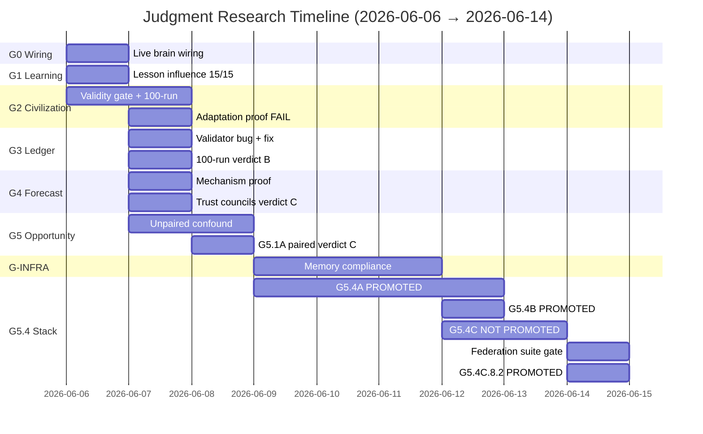
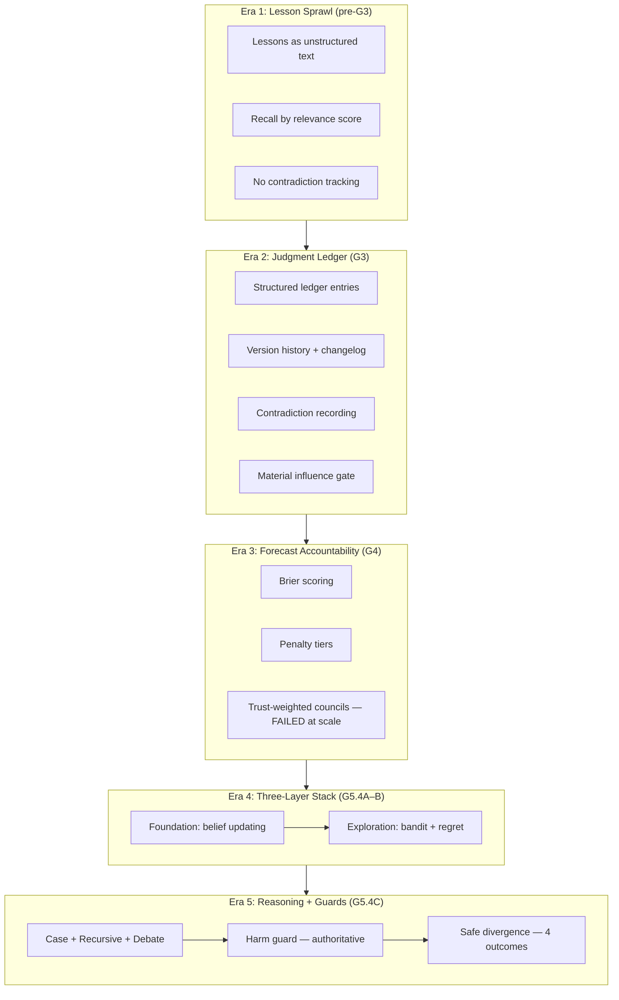
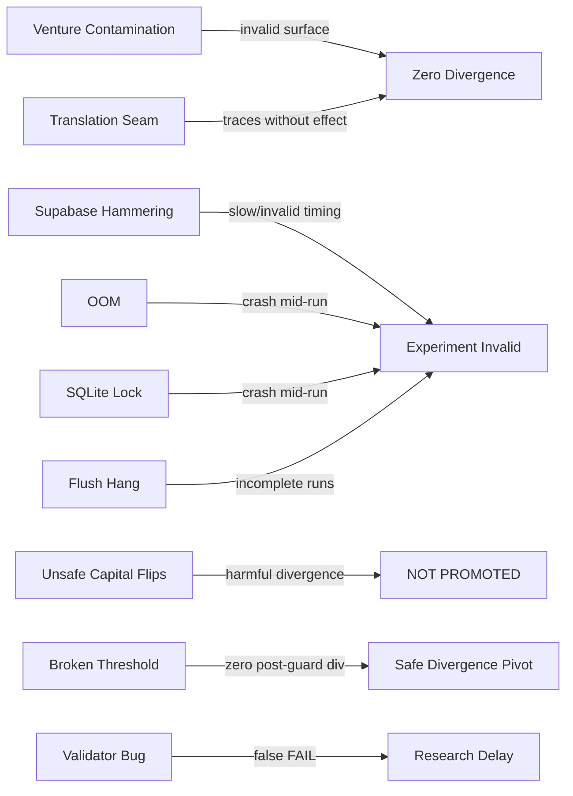
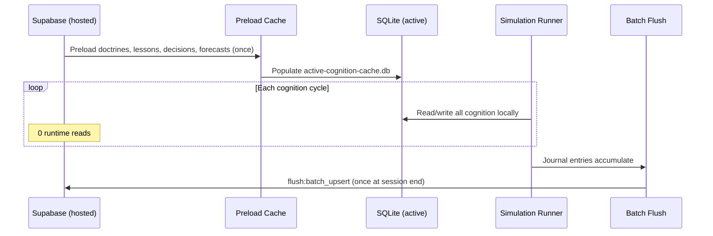
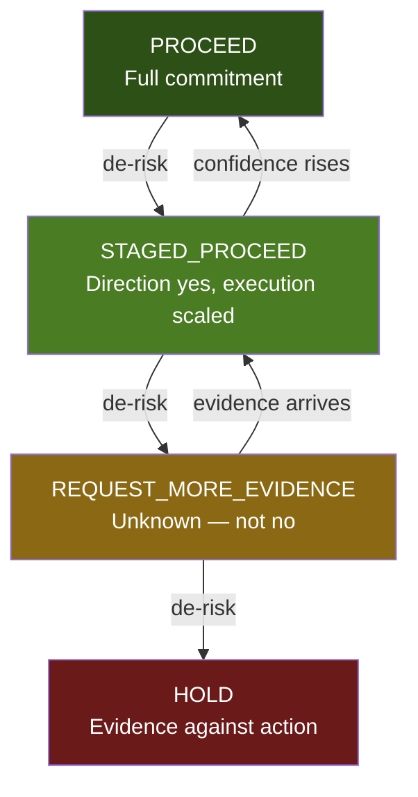
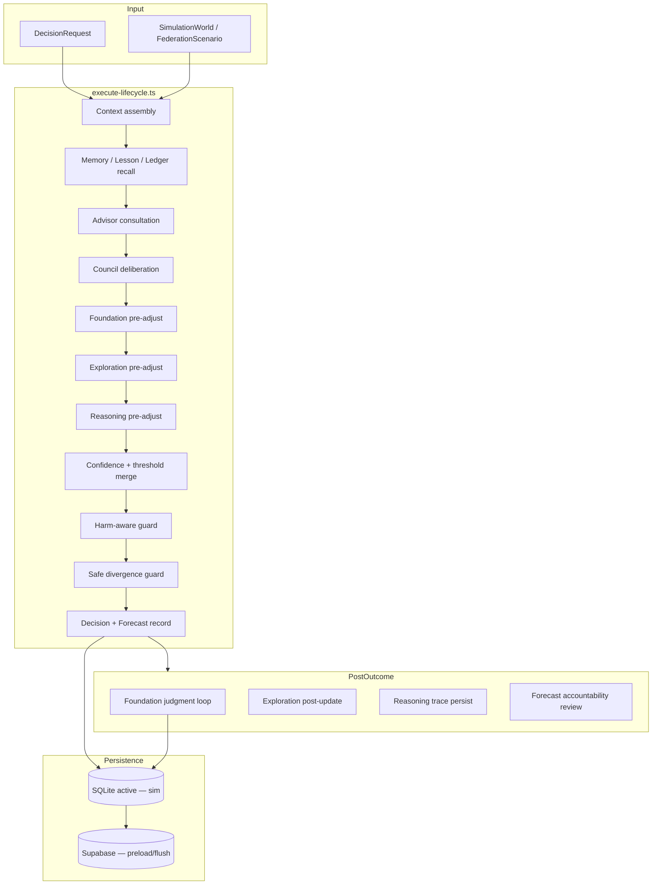

# Blvckshell Judgment Engine — Research Archive

**Classification:** Permanent historical record  
**Scope:** Blvckshell OS V1 judgment research program (G0–G5.4C)  
**Generated:** 2026-06-14  
**Status:** Authoritative archive — supersedes informal summaries  
**Companion documents:**
- [`BLVCKSHELL_EXPERIMENT_LEDGER.md`](./BLVCKSHELL_EXPERIMENT_LEDGER.md) — immutable experiment index
- [`BLVCKSHELL_ALGORITHM_ENCYCLOPEDIA.md`](./BLVCKSHELL_ALGORITHM_ENCYCLOPEDIA.md) — algorithm catalog
- [`BLVCKSHELL_OS_V2_ARCHITECTURE_BIBLE.md`](./BLVCKSHELL_OS_V2_ARCHITECTURE_BIBLE.md) — forward architecture
- [`BLVCKSHELL_JUDGMENT_THEORY.md`](./BLVCKSHELL_JUDGMENT_THEORY.md) — founding thesis (read first for non-engineers)
- [`BLVCKSHELL_FAILURE_ARCHIVE.md`](./BLVCKSHELL_FAILURE_ARCHIVE.md) — complete failure record
- [`BLVCKSHELL_COGNITIVE_CONSTITUTION.md`](./BLVCKSHELL_COGNITIVE_CONSTITUTION.md) — RFC 0 ontology

**Principle:** Executable proof overrides documentation. Every claim cites a file path, audit report, or npm script.

---

## Executive Summary

Between 2026-06-06 and 2026-06-14, Blvckshell OS executed a phased research program to answer one question: **Can federated department brains make decisions that improve over time, measurably, under controlled experiment design?**

The answer is **layered**, not binary.

| Layer | Verdict | Evidence |
|-------|---------|----------|
| Single-brain learning (G1) | **PROVEN** | 15/15 brains pass lesson influence (`docs/audits/LESSON_INFLUENCE_AUDIT.md`) |
| Organizational intelligence (G2) | **NOT PROVEN** | Learning civilization −11% ROI vs control (`docs/audits/ADAPTATION_PROOF_REPORT.md`) |
| Judgment ledger mechanism (G3) | **PROVEN** | Generation, recall, influence after validator fix (`platform/cognition-lifecycle/g3-judgment-ledger.ts`) |
| Judgment ledger outcomes at 100-run scale (G3.4) | **NOT PROMOTED** | Verdict B — no measurable difference (`docs/audits/G3_100_RUN_ADAPTATION_REPORT.md`) |
| Forecast accountability mechanism (G4) | **PROVEN** | Penalty tiers, scorecards (`docs/audits/G4_FORECAST_ACCOUNTABILITY_PROOF.md`) |
| Trust-weighted councils at scale (G4.1) | **NOT PROMOTED** | Verdict C — 52.7% divergence, worse ROI (`docs/audits/G4_ADAPTATION_RETEST_REPORT.md`) |
| Opportunity intelligence unpaired (G5.0) | **INVALID** | 0% divergence — world confound (`docs/audits/G5_ADAPTATION_REPORT.md`) |
| Opportunity intelligence paired (G5.1A/B) | **NOT PROMOTED** | Verdict C — 13.3% divergence (`docs/audits/G5_1_PAIRED_RETEST_REPORT.md`) |
| Foundation judgment stack (G5.4A) | **PROMOTED** | 48.7% divergence, +1.7% ROI (`docs/audits/G5_4A_WEIGHT_TUNING_REPORT.md`) |
| Exploration layer (G5.4B) | **PROMOTED** | 20.7% divergence, +0.3% ROI (`docs/audits/G5_4B_EXPLORATION_STACK_REPORT.md`) |
| Reasoning layer initial (G5.4C) | **NOT PROMOTED** | 29% divergence, −0.6% ROI (`docs/audits/G5_4C_COMPLETION_REPORT.md`) |
| Harm guard (G5.4C.7) | **PROVEN** | 0 capital HOLD→PROCEED flips (`docs/audits/G5_4C_HARM_AWARE_RETUNE_REPORT.md`) |
| Safe divergence (G5.4C.8.2) | **PROMOTED** | 28% divergence, +2.1% ROI, 7 safe_beneficial, 0 harmful (`docs/audits/G5_4C_SAFE_DIVERGENCE_PROMOTION_REPORT.md`) |

**Canonical promoted stack (2026-06-14):**

```text
Foundation (G5.4A)
  + Exploration (G5.4B)
  + Reasoning (case + recursive + debate)
  + Harm-aware guard (G5.4C.7)
  + Safe divergence guard (G5.4C.8.2)
```

**Orchestrator:** `platform/cognition-lifecycle/execute-lifecycle.ts`  
**Config entry:** `G5_4C_8_SAFE_DIVERGENCE_CONFIG` in `platform/simulation/types.ts`  
**Valid experiment surface:** Federation Decision Suite only — gate required (`docs/audits/G5_FEDERATION_DECISION_SUITE_SPEC.md`)

The central research finding is methodological: **judgment algorithms without paired experiments, federation-valid surfaces, and outcome-classified promotion gates produce false positives.** High divergence frequently correlates with harm, not improvement (G4.1). The breakthrough of G5.4C.8.2 is not binary proceed/hold flipping but a **four-outcome decision vocabulary** (`platform/judgment/reasoning-judgment/judgment-outcome-v2.ts`) where reasoning acts as a **staged-risk reducer** — converting overconfident PROCEED into STAGED_PROCEED on borderline tension scenarios.

Infrastructure discoveries (G-INFRA) were prerequisites, not optional polish: without preload-once → SQLite → flush-once, no G5.4A+ result is trustworthy (`docs/audits/G_INFRA_1_PROOF_REPORT.md`, `docs/audits/ARCHITECTURE_COMPLIANCE_AUDIT.md`).

---

## Research Timeline (G0–G5)

### Phase map



### G0 — Live Brain Wiring (2026-06-06)

**Goal:** Prove 15 department brains execute the full cognition lifecycle with live Qwen and persist verifiable artifacts.

| Artifact | Path |
|----------|------|
| Phase doc | `docs/PHASE_G0_BRAIN_WIRING.md` |
| Report | `docs/audits/G0_LIVE_REASONING_EVIDENCE_REPORT.md` |
| Script | `npm run audit:g0-live-evidence` |
| Lifecycle | `platform/cognition-lifecycle/execute-lifecycle.ts` |

**Results:** 15/15 live Qwen success; confidence clustered at 0.82; council consensus null on all probes; Claude/GPT/Gemini/DeepSeek stubbed.

**Interpretation:** Infrastructure baseline established. Council consensus layer inactive on all probes — this would later block G3A validation until decoupled.

### G1 — Lesson Influence (2026-06-06)

**Goal:** Decision A → outcome → lesson → Decision B loads, cites, changes behavior.

| Artifact | Path |
|----------|------|
| Phase doc | `docs/PHASE_G1_LESSON_INFLUENCE.md` |
| Report | `docs/audits/LESSON_INFLUENCE_AUDIT.md` |
| Script | `npm run validate:g1-lesson-influence` |
| Modules | `platform/cognition-lifecycle/lesson-recall.ts`, `decision-influence.ts`, `g1-lesson-influence.ts` |

**Results:** 15/15 PASS; confidence 0.82→0.76; recommendation changed on all brains.

**Verdict:** **PROVEN** — learning at single-brain level. Does not prove org-level improvement.

### G2 — Civilization Simulation (2026-06-06–07)

**Goal:** Prove a learning civilization outperforms a control civilization at organizational scale.

| Artifact | Path |
|----------|------|
| Phase doc | `docs/PHASE_G2_CIVILIZATION_SIMULATION.md` |
| Validity gate | `docs/audits/SIMULATION_VALIDITY_GATE.md` |
| 100-run audit | `docs/audits/SIMULATION_AUDIT_100.md` |
| Adaptation proof | `docs/audits/ADAPTATION_PROOF_REPORT.md` |
| Control baseline | `docs/audits/CONTROL_GROUP_REPORT.md` |
| Runner | `platform/simulation/civilization-runner/` |

**G2.1 Validity gate:** Initial simulator returned identical ROI (−0.15) on all runs. Root cause: lesson penalty pushed confidence below proceed threshold 0.50; fixed abort ROI; decisions ignored world params. Fix: threshold 0.35, world-varying abort costs, extract decisions from world params. Gate PASS — 10 unique worlds/ROIs.

**G2.3 Adaptation proof:** 90 control + 90 learning runs. Learning **worse**: ROI −11.0%, success −27.3pp vs control.

**Verdict:** **NOT PROVEN** — organizational intelligence. Lesson accumulation without judgment structure can harm outcomes.

### G3 — Judgment Ledger (2026-06-07)

**Goal:** Structured ledger replaces lesson sprawl; prove generation, recall, influence, contradiction handling.

| Artifact | Path |
|----------|------|
| Core module | `platform/cognition-lifecycle/g3-judgment-ledger.ts` |
| Migration | `supabase/migrations/20250621100000_phase_g3_judgment_ledgers.sql` |
| Architecture | `docs/audits/LEDGER_LIFECYCLE_ARCHITECTURE.md` |
| Failure analysis | `docs/audits/G3_FINAL_FAILURE_ANALYSIS.md` |
| 100-run report | `docs/audits/G3_100_RUN_ADAPTATION_REPORT.md` |
| Efficiency | `docs/audits/G3B_BASELINE_VALIDATION.md` |
| Contradiction | `docs/audits/CONTRADICTION_PROOF_REPORT.md` |

**G3.0 Validator bug:** G3A pass coupled to `influencedRun.pass` which required council `consensus !== null`. All G3-specific assertions passed; council step failed with `consensus=null`. Fix: decouple G3A pass to decision+memory steps + `materialInfluence` only.

**G3.4 100-run adaptation:** Success 30% vs 29%; ROI −0.4801 vs −0.498; **Verdict B — No Measurable Difference**.

**Verdict:** Mechanism **PROVEN**; outcome promotion **NOT PROMOTED** at 100-run scale.

### G4 — Forecast Accountability (2026-06-07)

**Goal:** Forecasts become accountable — penalty tiers, scorecards, review cycles.

| Artifact | Path |
|----------|------|
| Proof | `docs/audits/G4_FORECAST_ACCOUNTABILITY_PROOF.md` |
| Architecture | `docs/audits/FORECAST_ACCOUNTABILITY_ARCHITECTURE.md` |
| Retest | `docs/audits/G4_ADAPTATION_RETEST_REPORT.md` |
| Scoring | `platform/judgment/forecast-accountability/score-prediction.ts` |

**G4.1 mechanism:** **PROVEN** — 15 brain scorecards, 3 forecast reviews, penalty tiers validated.

**G4.2 adaptation retest (trust-weighted councils):** Divergence 52.7%; success 31% vs 29%; ROI −0.5705 (worse than G3.1). **Verdict C — NOT PROMOTED**.

**Lesson:** High divergence ≠ improvement. Trust weighting changed decisions but harmed ROI.

### G5 — Opportunity Intelligence (2026-06-07–08)

**Goal:** Multi-ledger knowledge, assumptions, adversarial layers improve organizational decisions.

| Artifact | Path |
|----------|------|
| Unpaired | `docs/audits/G5_ADAPTATION_REPORT.md` |
| G5.1A paired | `docs/audits/G5_1_PAIRED_RETEST_REPORT.md` |
| G5.1B namespace | `docs/audits/G5_1B_PAIRED_RETEST_REPORT.md`, `G5_1B_WIRING_REPORT.md` |
| G5.2 knowledge | `docs/audits/G5_2_KNOWLEDGE_ARCHITECTURE_REPORT.md` |
| G5.2A 50-pair | `docs/audits/G5_2A_50_PAIR_REPORT.md` |
| G5.3A assumptions | `docs/audits/G5_3A_PROOF_REPORT.md` |
| G5.4A initial | `docs/audits/G5_4A_PROOF_REPORT.md` |

**G5.0 unpaired:** Success +20pp, ROI +0.350 — but divergence **0%**. World confound invalidates attribution.

**G5.1A paired retest:** Divergence 13.3%, ROI +0.095. **Verdict C — Insufficient Proof** (below 20% promotion target).

**G5.2A multi-ledger:** Divergence 0.7%, ROI +0.0003 — **FAIL**.

**G5.3A assumptions:** Divergence 3.3%, 40 assumptions traced — **FAIL**. Assumption traces without decision movement = inactive layer.

### G-INFRA — Simulation Infrastructure (2026-06-09+)

Hard prerequisite for all G5.4A+ experiments.

| Report | Path |
|--------|------|
| G-INFRA-1 compliance | `docs/audits/G_INFRA_1_PROOF_REPORT.md` |
| Scale readiness | `docs/audits/G_INFRA_2_SCALE_READINESS_REPORT.md` |
| Memory hygiene | `docs/audits/G_INFRA_2_1_MEMORY_HYGIENE_REPORT.md` |
| Memory architecture | `docs/audits/G_INFRA_2_2_MEMORY_ARCHITECTURE_REPORT.md` |
| SQLite contention | `docs/audits/G_INFRA_2_3_SQLITE_CONTENTION_FIX.md` |
| Pre-fix audit | `docs/audits/ARCHITECTURE_COMPLIANCE_AUDIT.md` |

**Pattern:** Preload once → SQLite active cognition → simulation → flush once. Pre-fix: ~7,800 reads + ~3,000 writes per 50-pair run. Post-fix: 2,119 queries, 100% cache hit, 0 runtime reads during sim.

### G5.4A — Foundation Judgment (2026-06-09–12)

| Report | Path |
|--------|------|
| Architecture | `docs/audits/G5_4A_FOUNDATION_ARCHITECTURE.md` |
| Wiring | `docs/audits/G5_4A_FOUNDATION_WIRING_REPORT.md` |
| Weight tuning (promoted) | `docs/audits/G5_4A_WEIGHT_TUNING_REPORT.md` |
| Completion | `docs/audits/G5_4A_COMPLETION_REPORT.md` |
| Module | `platform/judgment/foundation-judgment/` |

**Promotion:** 48.7% divergence, +1.7% ROI, 3/4 influence sources in range, 0 runtime Supabase reads. First positive evidence: learning→decision→outcome under paired control.

### G5.4B — Exploration Layer (2026-06-12)

| Report | Path |
|--------|------|
| Architecture | `docs/audits/G5_4B_EXPLORATION_ARCHITECTURE.md` |
| Stack (promoted) | `docs/audits/G5_4B_EXPLORATION_STACK_REPORT.md` |
| Module | `platform/judgment/exploration-judgment/` |

**Promotion:** 20.7% divergence, +0.3% ROI, 200 pre-decision traces, G-INFRA PASS.

### G5.4C — Reasoning + Safe Divergence (2026-06-12–14)

| Report | Path |
|--------|------|
| Initial stack | `docs/audits/G5_4C_REASONING_STACK_REPORT.md` |
| Completion | `docs/audits/G5_4C_COMPLETION_REPORT.md` |
| Boundary audit | `docs/audits/G5_4C_DECISION_BOUNDARY_AUDIT.md` |
| Surface audit | `docs/audits/G5_4C_DECISION_SURFACE_AUDIT.md` |
| Harm retune | `docs/audits/G5_4C_HARM_AWARE_RETUNE_REPORT.md` |
| Threshold fast | `docs/audits/G5_4C_THRESHOLD_FAST_REPORT.md` |
| Safe divergence spec | `docs/specs/G5_4C_8_SAFE_DIVERGENCE_DISCOVERY.md` |
| Promotion | `docs/audits/G5_4C_SAFE_DIVERGENCE_PROMOTION_REPORT.md` |
| Module | `platform/judgment/reasoning-judgment/` |

**Initial (G5.4C.2):** 29% divergence, −0.6% ROI — **NOT PROMOTED**, `retune_reasoning_layer`.

**G5.4C.8.2 final:** 28% divergence, +2.1% ROI, 7 safe_beneficial, 0 harmful — **PROMOTED**.

---

## Judgment Architecture Evolution

Judgment architecture did not arrive as a single design. It evolved through five distinct eras, each correcting failures of the prior era.



### Pre-G3: Lesson-only learning

G1 proved lessons **can** influence decisions when explicitly recalled (`platform/cognition-lifecycle/lesson-recall.ts`). G2 proved lesson accumulation **without structure** harms organizational outcomes (−11% ROI). The lesson-only path was insufficient.

### G3: Structured judgment ledger

The ledger introduced typed entries, version evolution, contradiction tracking, and material influence measurement (`platform/cognition-lifecycle/g3-judgment-ledger.ts`). Persistence via `platform/brain-framework/persistence/judgment-domain.ts`. Hosted schema: `supabase/migrations/20250621100000_phase_g3_judgment_ledgers.sql`.

Key architectural decision: ledger recall injects into advisor/council prompts before decision, not after. Influence measured by confidence delta ≥0.05, recommendation change, or proceed flip.

### G4: Forecast accountability + failed trust layer

G4 added Brier scoring and penalty tiers (`platform/judgment/forecast-accountability/`). Trust-weighted councils (`docs/audits/TRUST_WEIGHTED_COUNCIL_ARCHITECTURE.md`) produced 52.7% divergence but **worse ROI** — establishing the rule that **decision movement without outcome improvement is a failure mode**, not a success signal.

### G5.4A: Foundation judgment loop

Post-outcome belief updating: forecast calibration, assumption survival, contradiction influence, Bayesian updating (`platform/judgment/foundation-judgment/foundation-judgment-loop.ts`). Pre-decision influence via forecast pre-adjustment (`forecast-predecision.ts`).

Pipeline documented in `docs/audits/G5_4A_FOUNDATION_ARCHITECTURE.md`:

```text
Decision (local SQLite)
  ↓
Outcome recorded (reviewOutcome → G4 auto)
  ↓
Foundation Judgment Loop
  ├─ Forecast Calibration
  ├─ Assumption Survival
  ├─ Contradiction Influence
  └─ Bayesian Update
  ↓
Batch flush (G-INFRA journaled store)
```

### G5.4B: Exploration pre-adjustment

Pre-decision exploration bonus addressing caution bias (`platform/judgment/exploration-judgment/exploration-judgment-loop.ts`). Four algorithms: UCB bandit, opportunity cost, regret minimization, doctrine Elo. Post-outcome updates bandit arms and regret ledger.

### G5.4C: Reasoning + guards

Three reasoning components (`platform/judgment/reasoning-judgment/reasoning-judgment-loop.ts`):
- Case-based reasoning (`case-retrieval-service.ts`, `case-similarity-service.ts`)
- Recursive judgment (`recursive-judgment-service.ts`)
- Adversarial debate (`debate-service.ts`)

Two guards with **precedence over reasoning output**:
1. **Harm-aware guard** (`harm-aware-reasoning-guard.ts`) — blocks unsafe capital HOLD→PROCEED
2. **Safe divergence guard** (`safe-divergence-guard.ts`) — maps binary proceed/hold to four-outcome vocabulary

Integration point in lifecycle (`execute-lifecycle.ts` lines ~765–807):

```text
exploration-adjusted confidence
  ↓ reasoning merge (decision-confidence-merge.ts)
  ↓ harm override (applyHarmAwareDecisionOverride)
  ↓ safe divergence guard (applySafeDivergenceGuard)
  ↓ judgmentOutcomeV2 + roiMultiplier
```

### Translation seam fix (G5.4C.5)

Prior G5.4C.4 failure: reasoning confidence/threshold computed but not reaching final decision. Root cause: **translation seam** — reasoning signals not merged into `finalConfidenceBeforeTrust`. Fix: merge into `finalConfidenceBeforeTrust` in `execute-lifecycle.ts` via `decision-confidence-merge.ts`. Documented in `docs/audits/G5_4C_DECISION_BOUNDARY_AUDIT.md`.

---

## Algorithm Encyclopedia (Summary)

The full algorithm catalog lives in [`BLVCKSHELL_ALGORITHM_ENCYCLOPEDIA.md`](./BLVCKSHELL_ALGORITHM_ENCYCLOPEDIA.md). Below is the research-phase index organized by layer, promotion status, and module path.

### Layer 0 — Infrastructure algorithms

| Algorithm | Status | Module |
|-----------|--------|--------|
| Preload-once cognition cache | PROMOTED (G-INFRA) | `platform/simulation/infrastructure/simulation-context.ts` |
| Journaled batch flush | PROMOTED (G-INFRA) | `platform/brain-framework/persistence/create-brain-store.ts` |
| Streaming experiment accumulators | PROMOTED (G-INFRA-2.1) | `platform/cognition-lifecycle/g5.4a-weight-tuning-experiment.ts` |
| SQLite WAL + write serializer | PROMOTED (G-INFRA-2.3) | `platform/brain-framework/persistence/brain-database.ts`, `sqlite-write-serializer.ts` |
| Federation decision suite builder | PROMOTED (gate) | `platform/simulation/federation-decision-suite/build-suite.ts` |
| Decision tension calibration | PROMOTED (gate) | `platform/simulation/federation-decision-suite/decision-tension-calibration.ts` |

### Layer 1 — Learning algorithms (G1–G2)

| Algorithm | Status | Module |
|-----------|--------|--------|
| Lesson relevance recall | PROVEN (G1) | `platform/cognition-lifecycle/lesson-recall.ts` |
| Decision influence adjustment | PROVEN (G1) | `platform/cognition-lifecycle/decision-influence.ts` |
| Lesson penalty on confidence | ACTIVE (sim) | `platform/simulation/civilization-runner/decision-flow.ts` |

### Layer 2 — Ledger algorithms (G3)

| Algorithm | Status | Module |
|-----------|--------|--------|
| Ledger generation + evolution | PROVEN | `platform/cognition-lifecycle/g3-judgment-ledger.ts` |
| Contradiction recording | PROVEN | `platform/judgment/judgment-ledger/contradiction-ledger.ts` |
| Material influence gate | PROVEN | `g3-judgment-ledger.ts` (Δ≥0.05 OR rec change OR proceed flip) |
| Ledger version compaction | ACTIVE | `platform/brain-framework/persistence/judgment-domain.ts` |
| Doctrine promotion from ledger | DESIGNED | `platform/judgment/doctrine-from-ledger.ts` |

### Layer 3 — Forecast algorithms (G4)

| Algorithm | Status | Module |
|-----------|--------|--------|
| Brier score prediction | PROVEN | `platform/judgment/forecast-accountability/score-prediction.ts` |
| Forecast penalty tiers | PROVEN | `docs/audits/G4_FORECAST_ACCOUNTABILITY_PROOF.md` |
| Trust-weighted council blend | NOT PROMOTED | `docs/audits/TRUST_WEIGHTED_COUNCIL_ARCHITECTURE.md` |
| Belief quality gate | NOT PROMOTED | G4.1 retest — 29% acceptance, worse ROI |

### Layer 4 — Foundation algorithms (G5.4A)

| Algorithm | Status | Module |
|-----------|--------|--------|
| Forecast calibration | PROMOTED | `platform/judgment/foundation-judgment/forecast-calibration-service.ts` |
| Assumption survival | PROMOTED | `platform/judgment/foundation-judgment/assumption-survival-service.ts` |
| Contradiction influence | PROMOTED | `platform/judgment/foundation-judgment/contradiction-influence-service.ts` |
| Bayesian belief update | PROMOTED | `platform/judgment/foundation-judgment/bayesian-belief-updater.ts` |
| Influence attribution | PROMOTED | `platform/judgment/foundation-judgment/decision-influence-analysis.ts` |
| Forecast pre-decision adjust | PROMOTED | `platform/judgment/foundation-judgment/forecast-predecision.ts` |

Variant configuration: `platform/judgment/foundation-judgment/config.ts` — six variants from control through `foundation_stack`.

### Layer 5 — Exploration algorithms (G5.4B)

| Algorithm | Status | Module |
|-----------|--------|--------|
| UCB bandit (UCB-lite) | PROMOTED | `platform/judgment/exploration-judgment/bandit-exploration-service.ts` |
| Opportunity cost of caution | PROMOTED | `platform/judgment/exploration-judgment/opportunity-cost-service.ts` |
| Regret minimization | PROMOTED | `platform/judgment/exploration-judgment/regret-minimization-service.ts` |
| Doctrine Elo ratings | PROMOTED | `platform/judgment/exploration-judgment/doctrine-elo-service.ts` |

Variant configuration: `platform/judgment/exploration-judgment/config.ts`.

### Layer 6 — Reasoning algorithms (G5.4C)

| Algorithm | Status | Module |
|-----------|--------|--------|
| Case retrieval + similarity | PROMOTED | `case-retrieval-service.ts`, `case-similarity-service.ts` |
| Recursive judgment | PROMOTED | `recursive-judgment-service.ts` |
| Adversarial debate | PROMOTED | `debate-service.ts` |
| Decision confidence merge | PROMOTED | `decision-confidence-merge.ts` |
| Component attribution | PROMOTED | `reasoning-component-attribution.ts` |
| Harm-aware reasoning guard | PROVEN (authoritative) | `harm-aware-reasoning-guard.ts` |
| Safe divergence guard | PROMOTED | `safe-divergence-guard.ts` |
| Safe divergence transitions | PROMOTED | `safe-divergence-transitions.ts` |
| Safe divergence classification | PROMOTED | `safe-divergence-classification.ts` |
| Judgment outcome V2 mapper | PROMOTED | `judgment-outcome-v2.ts` |

### Layer 7 — Failed / inactive algorithms

| Algorithm | Status | Evidence |
|-----------|--------|----------|
| Multi-ledger knowledge (G5.2A) | FAIL | 0.7% divergence |
| Assumption intelligence traces (G5.3A) | FAIL | 3.3% divergence, no decision movement |
| Adversarial proof on venture surface (G5.4A initial) | FAIL | 0% divergence, 0 challenges |
| Threshold-only reasoning (G5.4C.8 pre-harm) | RETUNE | 8% divergence, −8.7% ROI, 2 changed_worse |
| Trust-weighted councils (G4.1) | NOT PROMOTED | 52.7% div, worse ROI |

For per-algorithm trace schemas, weight tables, and variant matrices, see the companion encyclopedia and layer-specific architecture docs cited above.

---

## Experimental Ledger (Summary)

The immutable experiment ledger is [`BLVCKSHELL_EXPERIMENT_LEDGER.md`](./BLVCKSHELL_EXPERIMENT_LEDGER.md). Every experiment entry follows:

```text
Experiment ID → npm script → batch/report path → goal → config → sample → results → promotion → lessons
```

### Promotion codes

| Code | Meaning |
|------|---------|
| `PROMOTED` | Layer added to canonical stack with outcome proof |
| `NOT_PROMOTED` | Mechanism may work; outcomes insufficient |
| `PROVEN` | Mechanism validated; not necessarily outcome-promoted |
| `RETUNE` | Partial signal; requires parameter or wiring adjustment |
| `FAIL` | No signal or negative signal |
| `INCONCLUSIVE` | Insufficient sample or confound |
| `BLOCKED` | Hard gate failure (e.g., federation suite) |

### Key experiment scripts

| Phase | Script |
|-------|--------|
| G0 | `npm run audit:g0-live-evidence` |
| G1 | `npm run validate:g1-lesson-influence` |
| G2 validity | `npm run validate:g2:10` |
| G2 adaptation | `npm run validate:g2-adaptation` |
| G3 ledger | `npm run validate:g3-judgment-ledger` |
| G3 100-run | `npm run validate:g3-100-adaptation` |
| G4 forecast | `npm run validate:g4-forecast-accountability` |
| G4 retest | `npm run validate:g4-adaptation-retest` |
| G5.1 paired | `npm run validate:g5.1-paired-retest` |
| G-INFRA | `npm run validate:g-infra-1-compliance` |
| G5.4A weight tuning | `npm run experiment:g5-4a-weight-tuning` |
| G5.4B stack | `npm run experiment:g5-4b-exploration-stack` |
| G5.4C reasoning stack | `npm run experiment:g5-4c-reasoning-stack` |
| G5.4C safe divergence | `npm run experiment:g5-4c-safe-divergence-discovery` |
| Federation gate | `npm run audit:g5-federation-decision-suite` |

### Raw pair table index

| Report | Pairs | Batch pattern |
|--------|-------|---------------|
| `G5_4A_WEIGHT_TUNING_REPORT.md` | 50 | `g5_4a_wt_*` |
| `G5_4B_EXPLORATION_STACK_REPORT.md` | 50 | `g5_4b_*` |
| `G5_4C_REASONING_STACK_REPORT.md` | 50 | `g5_4c_*` |
| `G5_4C_SAFE_DIVERGENCE_DISCOVERY_REPORT.md` | 25 | `g5_4c_safe_*` |
| `G4_ADAPTATION_RETEST_REPORT.md` | 100 | divergence examples |

Journal artifacts: `generated/simulation/journal/*.ndjson`

---

## Failure Registry

Every documented failure with root cause, fix, and evidence path. Failures are research assets — they define what V2 must avoid.

### F1 — Simulation Validity Gate (G2.1)

| Field | Value |
|-------|-------|
| **Symptom** | 10 simulations, identical ROI (−0.1500), 100% failure rate |
| **Root cause** | (1) Lesson penalty pushed confidence below proceed threshold 0.50; (2) abort path returned fixed ROI regardless of world; (3) decisions extracted from fixed startupCapital=150_000 |
| **Fix** | Proceed threshold 0.35; world-varying abort costs; extract decisions from world params |
| **Evidence** | `docs/audits/SIMULATION_VALIDITY_GATE.md` |
| **Lesson** | Threshold calibration dominates sim outcomes; fixed constants invalidate experiments |

### F2 — G3 Validator Bug (G3.0)

| Field | Value |
|-------|-------|
| **Symptom** | G3A exit code 1 despite all ledger assertions passing |
| **Root cause** | `pass = errors.length === 0 && influencedRun.pass` coupled G3A to council `consensus !== null` |
| **Fix** | Decouple to `decision` + `memory` steps + `materialInfluence` only |
| **Evidence** | `docs/audits/G3_FINAL_FAILURE_ANALYSIS.md`, `platform/cognition-lifecycle/g3-judgment-ledger.ts:490` |
| **Lesson** | Validator scope must match proof scope; unrelated lifecycle steps create false failures |

### F3 — Supabase Hammering (pre-G-INFRA)

| Field | Value |
|-------|-------|
| **Symptom** | ~7,800 reads + ~3,000 writes per 50-pair run; repeated `GET /rest/v1/lessons` every cycle |
| **Root cause** | `createBrainJsonStore()` always returned `SupabaseCognitionStore` when env set; `getActivePersistenceProvider()` reported sqlite but store ignored it; lesson recall always hit Supabase before cache merge |
| **Fix** | G-INFRA: preload-once → SQLite → flush-once; `useHostedCognitionPersistence` journaled mode |
| **Evidence** | `docs/audits/ARCHITECTURE_COMPLIANCE_AUDIT.md`, `docs/audits/G_INFRA_1_PROOF_REPORT.md` |
| **Lesson** | Runtime Supabase reads during simulation invalidate experiment timing, cost, and isolation |

### F4 — Out-of-Memory (G5.4A.3 / G5.4C)

| Field | Value |
|-------|-------|
| **Symptom** | Process crash at sim 21/100 (~6 GB heap); G5.4A.3 reported 7218 MB delta |
| **Root cause** | Full `SimulationRunResult` objects retained until report; `brainRecords[]` with full lifecycle prompts; foundation trace arrays; control + tuned arrays in one process |
| **Fix** | G-INFRA-2.1: streaming accumulators, `DivergenceRunSlice`, journal chunk flush every 500 entries, drop heavy per-run objects |
| **Evidence** | `docs/audits/G_INFRA_2_1_MEMORY_HYGIENE_REPORT.md`, `docs/audits/G5_4C_REASONING_MEMORY_AUDIT.md` |
| **Lesson** | Peak heap gate: `1200 + pairs × 60` MB; do not rely on `--max-old-space-size=8192` |

### F5 — SQLite Lock (G-INFRA-2.3)

| Field | Value |
|-------|-------|
| **Symptom** | `ERR_SQLITE_BUSY` / `database is locked` at scenario 27/32 during federation audit |
| **Root cause** | Ledger version compaction (bulk DELETE) on every `saveLedger` during simulation, contending with concurrent upserts |
| **Fix** | WAL + busy_timeout=30000; defer compaction during active sim; per-DB write serializer |
| **Evidence** | `docs/audits/G_INFRA_2_3_SQLITE_CONTENTION_FIX.md`, `platform/brain-framework/persistence/judgment-domain.ts` |
| **Lesson** | Compaction is a session-end operation, not a per-save operation during batch sim |

### F6 — Venture Contamination (90%)

| Field | Value |
|-------|-------|
| **Symptom** | G5.4C experiments showed 0% reasoning divergence; 100% proceed rate |
| **Root cause** | `scenarioTypeForKind()` returns `ai_consulting` for 7/8 world kinds (90% of indices); same venture launch question injected into all 6 fastBatch brains; `decisionClass: 'venture_assessment'` hardcoded; metrics used `ventureProceed` only |
| **Fix** | Federation Decision Suite: 32 brain-native scenarios, single-brain lifecycle, hard gate before G5.4C |
| **Evidence** | `docs/audits/G5_SCENARIO_DIVERSITY_TRACE.md`, `docs/audits/G5_FEDERATION_DECISION_SUITE_SPEC.md` |
| **Lesson** | Experiment surface contamination invalidates all runs; domain diversity in world mechanics ≠ domain diversity in decision questions |

### F7 — Reasoning Translation Seam (G5.4C.4)

| Field | Value |
|-------|-------|
| **Symptom** | Reasoning traces active (case 0.055, debate 0.076 influence) but 1.3% divergence after tuning; reasoning internal confidence 0.920 vs final 0.823 |
| **Root cause** | Reasoning confidence/threshold not merged into `finalConfidenceBeforeTrust`; cap at 0.9; trust-weight blend further reduced signal |
| **Fix** | `mergeDecisionConfidence()` in `decision-confidence-merge.ts`; wired in `execute-lifecycle.ts` (G5.4C.5) |
| **Evidence** | `docs/audits/G5_4C_DECISION_BOUNDARY_AUDIT.md`, `docs/audits/G5_4C_REASONING_PROMOTION_REPORT.md` |
| **Lesson** | Algorithm output without lifecycle integration = inactive layer regardless of trace volume |

### F8 — Unsafe Capital Flips (G5.4C.8 pre-harm)

| Field | Value |
|-------|-------|
| **Symptom** | Threshold reasoning changed capital hold→proceed on pairs 3–4; ROI Δ −0.598 and −1.598 |
| **Root cause** | Reasoning threshold delta lowered effective threshold below hold confidence on capital scenarios without capital-risk guard |
| **Fix** | `harm-aware-reasoning-guard.ts` + `applyHarmAwareDecisionOverride()` — blocks HOLD→PROCEED when case evidence not positive, recursive risk above cap, expected ROI not positive |
| **Evidence** | `docs/audits/G5_4C_THRESHOLD_FAST_REPORT.md`, `docs/audits/G5_4C_HARM_AWARE_RETUNE_REPORT.md` |
| **Lesson** | Harm guard precedence is non-negotiable; divergence without harm classification is insufficient for promotion |

### F9 — Broken Threshold Translation (G5.4C.8)

| Field | Value |
|-------|-------|
| **Symptom** | Post-harm-guard: 5 threshold crossings but 0 decision changes; divergence 0% |
| **Root cause** | Harm guard consumed all unsafe flips; remaining threshold deltas insufficient to cross final proceed/hold boundary at current caps |
| **Fix** | Pivot from binary threshold flipping to four-outcome safe divergence (G5.4C.8 spec) |
| **Evidence** | `docs/audits/G5_4C_HARM_AWARE_RETUNE_REPORT.md`, `docs/specs/G5_4C_8_SAFE_DIVERGENCE_DISCOVERY.md` |
| **Lesson** | Binary-only judgment cannot express beneficial de-risking; STAGED_PROCEED is the productive divergence mode |

### F10 — Supabase Flush Hang

| Field | Value |
|-------|-------|
| **Symptom** | Long-running experiments appear to hang at session end during batch persistence to hosted Supabase |
| **Root cause** | Flush phase sends all journaled cognition rows via `flush:batch_upsert` in single session teardown; large 50–100 pair runs accumulate thousands of rows; hosted statement timeouts exacerbated by ledger version bloat (147+ versions pre-compaction) |
| **Fix** | G-INFRA journaled flush with chunking; ledger hot-window compaction (25 versions per ledger); defer heavy compaction to session end; SQLite as active store eliminates per-cycle remote writes |
| **Evidence** | `docs/audits/G_INFRA_1_PROOF_REPORT.md` (flush:batch_upsert), `docs/audits/LEDGER_LIFECYCLE_ARCHITECTURE.md` (147→52 version compaction), `docs/audits/ARCHITECTURE_COMPLIANCE_AUDIT.md` |
| **Lesson** | Flush is a batch operation requiring chunking and retention policy; unbounded version history blocks session completion |

### Failure interaction diagram



---

## Infrastructure Discoveries

### G-INFRA memory pattern

The canonical simulation cognition pattern, proven in G-INFRA-1:



| Metric | Pre-fix (50-pair est.) | Post-fix (G-INFRA-1) |
|--------|------------------------|----------------------|
| Supabase queries | ~7,800 reads + ~3,000 writes | 2,119 total |
| Runtime reads during sim | Every cycle | **0** |
| Cache hit rate | N/A | 100% |
| Provider during sim | supabase (incorrect) | sqlite (correct) |

Implementation paths:
- `platform/simulation/infrastructure/simulation-context.ts`
- `platform/brain-framework/persistence/create-brain-store.ts`
- `platform/simulation/infrastructure/with-simulation-runner.ts`

### Memory hygiene (G-INFRA-2.1)

Principle from `docs/audits/G_INFRA_2_2_MEMORY_ARCHITECTURE_REPORT.md`: **Store conclusions, not thoughts.**

| Retained during sim | Discarded after aggregate |
|---------------------|---------------------------|
| DivergenceRunSlice (decision + hash) | Full brainRecords with prompts |
| InfluenceTotalsAccumulator | Per-run influence analyses |
| FoundationProofAccumulator scalars | Foundation trace arrays |
| Journal chunks (500-entry flush) | Full SimulationRunResult |

### Scale readiness (G-INFRA-2)

100-pair run: 0 runtime reads, 0 crashes, p95 47625ms (`docs/audits/G_INFRA_2_SCALE_READINESS_REPORT.md`).

---

## Federation Discoveries

### Venture-dominated experiment surface (pre-gate)

Documented exhaustively in `docs/audits/G5_SCENARIO_DIVERSITY_TRACE.md`:

- 100% venture launch questions
- 90% `ai_consulting` scenario type
- 6/15 brains in `fastBatch` (`platform/simulation/civilization-runner/decision-flow.ts`)
- `ventureProceed = ventureConfidence >= proceedThreshold` as sole decision metric
- Other brain outputs are derived numeric side effects, not independent domain decisions

### Federation Decision Suite (post-gate)

Spec: `docs/audits/G5_FEDERATION_DECISION_SUITE_SPEC.md`

**32 scenarios = 8 brains × 4 native decisions:**

| Brain | Decision class | Example actions |
|-------|----------------|-----------------|
| Capital | `allocation` | allocate / hold / reduce / hedge |
| People | `staffing` | hire / reject / promote / terminate |
| Sentinel | `operational` | ignore / monitor / escalate / quarantine |
| Revenue | `campaign` / `investment` / `rejection` | discount / pursue / abandon / upsell |
| Community | `policy` | warn / ban / allow / escalate |
| Operations | `operational` | delay / execute / reroute / stop |
| Venture | `venture_assessment` | launch / hold / pivot / kill |
| Commander | `approval` | approve / reject / request evidence / staged approve |

Implementation:
- Catalog: `platform/simulation/federation-decision-suite/catalog.ts`
- Suite builder: `build-suite.ts`
- Single-brain runner: `run-scenario.ts`
- Gate: `gate.ts` → `generated/audit/federation-suite-gate.json`
- G5.4C block: experiments exit if gate not passed

### Decision tension calibration (G5-SURFACE-1)

Partial run showed 100% proceed, ~4% flippable. Fix: `tensionClass` per scenario (`clear_proceed`, `weak_proceed`, `borderline`, `weak_hold`, `clear_hold`) with target margins and brain confidence priors.

Document: `docs/audits/G5_SURFACE_1_DECISION_TENSION_CALIBRATION.md`  
Module: `platform/simulation/federation-decision-suite/decision-tension-calibration.ts`

Hard targets:
- Proceed rate: 35–65%
- Flippable: ≥25%
- Max brain share: ≤20%
- Max archetype share: ≤15%

### Federation cooperation model (ecosystem)

From `docs/ORGANIZATIONAL_COGNITION_ARCHITECTURE_DIRECTIVE.md` (ecosystem root):
- Each department owns memory, lessons, doctrine independently
- Brains cooperate via `shared.*` contracts only — no cross-schema queries
- Model outputs are evidence, not decisions (`docs/MODEL_FEDERATION_ARCHITECTURE_DIRECTIVE.md`)
- Revenue must not think like Capital — differences are source of intelligence

---

## Four Outcome Model

Introduced in G5.4C.8 as first non-binary judgment vocabulary. Canonical types in `platform/judgment/reasoning-judgment/judgment-outcome-v2.ts`:

```typescript
export const JUDGMENT_OUTCOME_V2_VALUES = [
  'PROCEED',
  'STAGED_PROCEED',
  'REQUEST_MORE_EVIDENCE',
  'HOLD',
] as const;
```

### Semantic hierarchy



| Outcome | Conviction rank | Simulation mapping |
|---------|-----------------|-------------------|
| PROCEED | 4 (highest) | binaryProceed=true, roiMultiplier=1.0 |
| STAGED_PROCEED | 3 | binaryProceed=true, roiMultiplier=0.6 |
| REQUEST_MORE_EVIDENCE | 2 | binaryProceed=false, isEvidenceGap=true |
| HOLD | 1 (lowest) | binaryProceed=false, countsAsHoldFailure=true |

Mapping: `JUDGMENT_OUTCOME_SIMULATION_MAP` in `judgment-outcome-v2.ts`.  
Evaluator: `platform/simulation/federation-decision-suite/lifecycle-proceed-evaluator.ts`.

### Transition rules

Authoritative transition matrix: `platform/judgment/reasoning-judgment/safe-divergence-transitions.ts`

**Allowed reasoning-initiated transitions (G5.4C.8):**
- PROCEED → STAGED_PROCEED (primary beneficial pattern — 7/7 divergences in G5.4C.8.2)
- PROCEED → REQUEST_MORE_EVIDENCE
- STAGED_PROCEED → REQUEST_MORE_EVIDENCE
- HOLD → REQUEST_MORE_EVIDENCE (evidence gap upgrade)

**Blocked transitions:**
- HOLD → PROCEED (harm guard)
- HOLD → STAGED_PROCEED (harm guard)
- Capital HOLD → STAGED_PROCEED (capital stays binary until V2 calibration)
- Any skip-level upgrade without rule match

### Classification taxonomy

From `safe-divergence-classification.ts`:

| Class | Meaning |
|-------|---------|
| `safe_beneficial` | Divergence improved or neutral ROI with no harm |
| `safe_neutral` | Divergence with no material ROI effect |
| `harmful` | Divergence worsened ROI or violated guard |
| `blocked` | Guard prevented transition |

G5.4C.8.2 promotion required: harmful=0, safe_beneficial > harmful, capital flips=0.

### Commander as canonical V2 owner

Federation catalog includes Commander archetypes: `approve`, `reject`, `request_evidence`, `staged_approve` (`docs/audits/G5_FEDERATION_DECISION_SUITE_SPEC.md`). Future V2 recall loops for REQUEST_MORE_EVIDENCE and staged execution branch for STAGED_PROCEED are Commander-owned (`docs/specs/G5_4C_8_SAFE_DIVERGENCE_DISCOVERY.md` §10).

---

## Promotion Registry

Complete promotion state as of 2026-06-14. Source: `BLVCKSHELL_EXPERIMENT_LEDGER.md` promotion registry + audit reports.

### Promoted / proven capabilities

| Capability | Status | Date | Key metrics | Evidence |
|------------|--------|------|-------------|----------|
| G1 single-brain learning | PROVEN | 2026-06-06 | 15/15 pass | `LESSON_INFLUENCE_AUDIT.md` |
| G3 ledger mechanism | PROVEN | 2026-06-07 | influence confirmed | `G3B_BASELINE_VALIDATION.md` |
| G4 forecast accountability | PROVEN | 2026-06-07 | penalty tiers | `G4_FORECAST_ACCOUNTABILITY_PROOF.md` |
| G-INFRA simulation memory | PASS (gate) | 2026-06-09 | 0 runtime reads | `G_INFRA_1_PROOF_REPORT.md` |
| Federation decision suite | PASS (static+behavioral) | 2026-06-14 | 32 scenarios | `G5_FEDERATION_DECISION_SUITE_AUDIT.md` |
| G5.4A foundation stack | **PROMOTED** | 2026-06-12 | 48.7% div, +1.7% ROI | `G5_4A_WEIGHT_TUNING_REPORT.md` |
| G5.4B exploration layer | **PROMOTED** | 2026-06-12 | 20.7% div, +0.3% ROI | `G5_4B_EXPLORATION_STACK_REPORT.md` |
| G5.4C harm guard | **PROVEN** | 2026-06-14 | 0 capital flips, 3 blocks | `G5_4C_HARM_AWARE_RETUNE_REPORT.md` |
| G5.4C reasoning + safe divergence | **PROMOTED** | 2026-06-14 | 28% div, +2.1% ROI, 7 safe_beneficial, 0 harmful | `G5_4C_SAFE_DIVERGENCE_PROMOTION_REPORT.md` |

### Not promoted / failed

| Capability | Status | Key metrics | Evidence |
|------------|--------|-------------|----------|
| G2 org intelligence | NOT PROVEN | −11% ROI vs control | `ADAPTATION_PROOF_REPORT.md` |
| G3.4 100-run outcomes | NOT PROMOTED | Verdict B | `G3_100_RUN_ADAPTATION_REPORT.md` |
| G4.1 trust councils | NOT PROMOTED | Verdict C, 52.7% div | `G4_ADAPTATION_RETEST_REPORT.md` |
| G5 unpaired opportunity | NOT PROMOTED | 0% divergence | `G5_ADAPTATION_REPORT.md` |
| G5.1A/B paired | NOT PROMOTED | Verdict C, 13.3% div | `G5_1_PAIRED_RETEST_REPORT.md` |
| G5.2A multi-ledger | FAIL | 0.7% divergence | `G5_2A_50_PAIR_REPORT.md` |
| G5.3A assumptions | FAIL | 3.3% divergence | `G5_3A_PROOF_REPORT.md` |
| G5.4C initial reasoning | NOT PROMOTED | 29% div, −0.6% ROI | `G5_4C_COMPLETION_REPORT.md` |

### Promotion gate template (established by G5.4C.8.2)

| Gate | Requirement |
|------|-------------|
| Paired design | Control and treatment on identical world hash |
| Federation surface | Suite gate passed — no venture contamination |
| Divergence band | 10–30% (signal, not target) |
| ROI delta | ≥ +1% vs control |
| Harm | harmful = 0 |
| Capital safety | unsafe HOLD→PROCEED = 0 |
| G-INFRA | 0 runtime Supabase reads |
| Classification | safe_beneficial > harmful |

---

## Remaining Unknowns

Research closed several questions and opened others. These are explicitly **not resolved** by G5.4C.8.2 promotion.

### Organizational scale

1. **Does the promoted stack improve 100-run civilization outcomes?** G5.4A–C promotions used 25–50 pair federation cohorts. G3.4 at 100-run scale showed Verdict B for ledger alone. No 100-run test of full Foundation+Exploration+Reasoning+SafeDivergence stack exists.

2. **Does learning compound over 30/90 day windows?** G1 proved single A→B influence. G2 disproved naive compounding. Long-horizon accumulation untested under promoted stack.

3. **Cross-brain lesson/ledger isolation at scale:** G5.1B verified namespace isolation with identical metrics to G5.1A. Full 15-brain federation with independent decision surfaces not yet simulated concurrently.

### Council and model federation

4. **Council consensus inactive:** G0 showed `consensus=null` on all probes. Trust-weighted councils failed at scale (G4.1). Unknown: does a redesigned council layer add value on top of promoted stack?

5. **Live multi-model advisor divergence:** G0 stubbed Claude/GPT/Gemini/DeepSeek. Unknown whether live model federation improves decisions vs Qwen-only under paired experiment design.

### Four-outcome execution

6. **STAGED_PROCEED execution simulator:** G5.4C.8 uses ROI multiplier 0.6 in simulation. Production partial execution path does not exist. Unknown: real-world staged commitment behavior.

7. **REQUEST_MORE_EVIDENCE recall loop:** Simulated as delayed hold. V2 must implement follow-up lifecycle triggering additional evidence gathering. Unknown: optimal recall depth and timeout.

8. **Capital four-outcome calibration:** Capital blocked from STAGED_PROCEED until V2 calibration (`safe-divergence-transitions.ts`). Unknown: capital-specific staged allocation semantics.

### Experiment methodology

9. **Optimal pair count for promotion:** Promotions used 25–50 pairs. Statistical power analysis not formalized. Unknown: minimum pairs for stable ROI delta detection per layer.

10. **Child-process isolation:** G-INFRA-2.1 notes future separate child processes per arm — not implemented. Unknown: whether parent-process streaming introduces subtle coupling.

### Depth and REAL gate

11. **Department brain REAL status:** 15 brains pass composition validation (`docs/DEPARTMENT_BRAINS.md`) but domain depth <70% for most. Unknown: whether promoted judgment algorithms translate to production department decisions without simulation world calibration.

12. **Hosted Postgres migration:** Simulation uses SQLite active memory. Unknown: performance characteristics of promoted stack on hosted Supabase at production query volumes.

---

## Final Judgment Engine V1 Architecture

This section defines the **as-built** judgment engine at research program close (2026-06-14). V2 redesign is specified in [`BLVCKSHELL_OS_V2_ARCHITECTURE_BIBLE.md`](./BLVCKSHELL_OS_V2_ARCHITECTURE_BIBLE.md).

### System context



### Layer stack and precedence

```text
Priority (highest override first):
  1. Harm-aware guard (G5.4C.7) — blocks unsafe flips
  2. Safe divergence guard (G5.4C.8.2) — four-outcome mapping
  3. Reasoning layer (G5.4C) — case + recursive + debate
  4. Exploration layer (G5.4B) — pre-decision adjust
  5. Foundation layer (G5.4A) — pre + post belief updating
  6. Ledger recall (G3) — prompt injection
  7. Lesson recall (G1) — prompt injection
  8. Base confidence from advisors + council
```

Harm guard and safe divergence are **not optional observational layers**. They are authoritative overrides on final outcome (`execute-lifecycle.ts`).

### Configuration entry points

| Config | Path | Purpose |
|--------|------|---------|
| `LearningConfig.foundationJudgment` | experiment configs | Foundation variant selection |
| `LearningConfig.explorationJudgment` | experiment configs | Exploration variant selection |
| `LearningConfig.reasoningJudgment` | experiment configs | Reasoning + guard toggles |
| `G5_4C_8_SAFE_DIVERGENCE_CONFIG` | `platform/simulation/types.ts` | Promoted safe divergence parameters |
| Federation gate | `generated/audit/federation-suite-gate.json` | Experiment surface authorization |

### Decision outputs

Each lifecycle produces:

| Output | Location |
|--------|----------|
| `decision.confidence` | `org.learning.recordDecision` |
| `ventureConfidence` / brain-specific confidence | simulation runner |
| `finalProceed` (binary) | `execute-lifecycle.ts` |
| `judgmentOutcomeV2` | `execute-lifecycle.ts` (sim only) |
| `judgmentRoiMultiplier` | safe divergence guard |
| Foundation traces | `{brainId}_foundation_judgment_traces` SQLite |
| Exploration traces | `{brainId}_exploration_judgment_traces` SQLite |
| Reasoning traces | `{brainId}_reasoning_judgment_traces` SQLite |

### Valid experiment contract

Any judgment experiment claiming promotion must satisfy:

1. **Paired worlds** — identical world hash between control and treatment
2. **Federation gate** — `npm run audit:g5-federation-decision-suite` passed
3. **G-INFRA compliance** — 0 runtime Supabase reads during sim
4. **Outcome gates** — divergence band, ROI delta, harm=0, classification
5. **Trace evidence** — causal traces per algorithm, not aggregate metrics alone

### npm validation surface

```bash
# Full promoted stack wiring check
npm run validate:g5-4a-foundation-wiring
npm run validate:g5-4b-exploration-wiring
npm run validate:g5-4c-reasoning-wiring

# Federation gate (required before any G5.4C experiment)
npm run audit:g5-federation-decision-suite

# Promoted stack experiment
npm run experiment:g5-4c-safe-divergence-discovery

# Infrastructure gate
npm run validate:g-infra-1-compliance
```

### What V1 is not

Per research findings, Judgment Engine V1 explicitly **does not** claim:

- Organizational intelligence at civilization scale (G2 failed)
- Ledger-only outcome improvement at 100-run scale (G3.4 Verdict B)
- Trust-weighted council improvement (G4.1 Verdict C)
- Binary proceed/hold optimization as sufficient decision vocabulary
- Validity of venture-contaminated experiment surfaces
- Production-ready STAGED_PROCEED or REQUEST_MORE_EVIDENCE execution paths

V1 is a **research-validated algorithm stack** with a **promotion-gated experiment platform** and a **four-outcome vocabulary probe**. Production judgment requires V2 lifecycle integration documented in the companion architecture bible.

---

## Annex: Research Principles (Extracted)

These principles were earned through failures, not assumed at program start:

1. **Executable proof overrides documentation.**
2. **Paired experiments or no attribution.**
3. **Federation-valid surfaces or no layer evaluation.**
4. **Divergence without ROI improvement is failure** (G4.1).
5. **Divergence without harm classification is insufficient** (G5.4C.8).
6. **Algorithm traces without lifecycle translation are inactive** (G5.4C.5).
7. **Runtime Supabase reads invalidate simulation** (G-INFRA).
8. **Harm guard precedence is non-negotiable** (G5.4C.7).
9. **Four outcomes express de-risking that binary judgment cannot** (G5.4C.8.2).
10. **Store conclusions, not thoughts** (G-INFRA-2.2).

---

## Annex B: G5.4C Safe Divergence Iteration Log (Complete)

Full iteration history from `docs/archive/BLVCKSHELL_EXPERIMENT_LEDGER.md` and `docs/audits/G5_4C_SAFE_DIVERGENCE_DISCOVERY_REPORT.md`:

| Run | Config | Divergence | ROI Δ | safe_beneficial | harmful | Outcome |
|-----|--------|------------|-------|-----------------|---------|---------|
| G5.4C.8 initial | Broad staged eligibility | 32% | +1.9% | 7 | 1 | FAIL — narrow_eligibility (1 harmful) |
| G5.4C.8.1 | Narrow staged (margin/contradiction) | 20% | +1.7% | 5 | 0 | FAIL — old 8–12% divergence gate |
| G5.4C.8.2 zero | Tension + margin too tight | 0% | +0.1% | 0 | 0 | FAIL — too tight, no signal |
| G5.4C.8.2 final | Tension + pre-reasoning margin | 28% | +2.1% | 7 | 0 | **PROMOTED** |

Promoted batch: `g5_4c_safe_1781453648217_d07b68`. Config: `G5_4C_8_SAFE_DIVERGENCE_CONFIG` in `platform/simulation/types.ts`.

All 7 promoted divergences were `PROCEED → STAGED_PROCEED` on borderline or weak_proceed tension scenarios. Zero `HOLD → PROCEED`. Zero capital unsafe flips. This confirms the productive divergence mode for V2 is **de-risking**, not **conviction flipping**.

Script: `npm run experiment:g5-4c-safe-divergence-discovery`  
CLI: `platform/cognition-lifecycle/cli/experiment-g5.4c-safe-divergence-discovery-cli.ts`  
Experiment runner: `platform/cognition-lifecycle/g5.4c-safe-divergence-experiment.ts`

---

## Annex C: Cognition Lifecycle Step Reference

Universal lifecycle from `docs/PHASE_G0_BRAIN_WIRING.md`, implemented in `platform/cognition-lifecycle/execute-lifecycle.ts`:

| Step | Function | Pass criteria (G0) | G3 decoupled |
|------|----------|-------------------|--------------|
| input | Request validation | Required fields present | — |
| context | `org.context.assemble` | Context packet built | — |
| memory | Lesson + ledger recall | Entries retrieved if enabled | **G3A gates this** |
| advisors | Provider router consultation | 3/3 advisors respond | — |
| council | Council deliberation | consensus !== null (G0) | **Excluded from G3A pass** |
| decision | Confidence merge + guards | Decision recorded | **G3A gates this** |
| forecast | Forecast propose | Forecast persisted | — |
| persistence | Supabase/SQLite write | All artifacts saved | — |

G5.4 stack inserts additional pre-decision stages inside the decision path:
- Foundation forecast pre-adjust (before exploration)
- Exploration pre-adjust (after foundation, before reasoning)
- Reasoning pre-adjust (case + recursive + debate)
- Confidence/threshold merge (`decision-confidence-merge.ts`)
- Harm-aware override (`applyHarmAwareDecisionOverride`)
- Safe divergence guard (`applySafeDivergenceGuard`)

Post-outcome path via `apply-outcome` and `foundation-judgment-loop.ts`:
- Foundation post-outcome belief updating
- Exploration bandit/regret/Elo updates
- Reasoning trace persistence
- G4 forecast accountability auto-review on `reviewOutcome`

---

## Annex D: Complete Module Path Index

### Cognition lifecycle

| Module | Path |
|--------|------|
| Lifecycle orchestrator | `platform/cognition-lifecycle/execute-lifecycle.ts` |
| Lesson recall | `platform/cognition-lifecycle/lesson-recall.ts` |
| Decision influence | `platform/cognition-lifecycle/decision-influence.ts` |
| G1 proof | `platform/cognition-lifecycle/g1-lesson-influence.ts` |
| G3 ledger proof | `platform/cognition-lifecycle/g3-judgment-ledger.ts` |
| Apply outcome | `platform/cognition-lifecycle/apply-outcome.ts` |
| G5.4A experiments | `platform/cognition-lifecycle/g5.4a-weight-tuning-experiment.ts` |
| G5.4B experiments | `platform/cognition-lifecycle/g5.4b-exploration-stack-experiment.ts` |
| G5.4C experiments | `platform/cognition-lifecycle/g5.4c-reasoning-stack-experiment.ts` |
| Safe divergence experiment | `platform/cognition-lifecycle/g5.4c-safe-divergence-experiment.ts` |
| Federation audit | `platform/cognition-lifecycle/g5-federation-decision-suite-audit.ts` |

### Simulation

| Module | Path |
|--------|------|
| Civilization runner | `platform/simulation/civilization-runner/run-single.ts` |
| Decision flow | `platform/simulation/civilization-runner/decision-flow.ts` |
| Varied worlds | `platform/simulation/world/varied-scenario-worlds.ts` |
| Scenario templates | `platform/simulation/scenarios/templates.ts` |
| Federation catalog | `platform/simulation/federation-decision-suite/catalog.ts` |
| Federation gate | `platform/simulation/federation-decision-suite/gate.ts` |
| Tension calibration | `platform/simulation/federation-decision-suite/decision-tension-calibration.ts` |
| Lifecycle proceed evaluator | `platform/simulation/federation-decision-suite/lifecycle-proceed-evaluator.ts` |
| Simulation context | `platform/simulation/infrastructure/simulation-context.ts` |
| Simulation runner wrapper | `platform/simulation/infrastructure/with-simulation-runner.ts` |

### Brain framework persistence

| Module | Path |
|--------|------|
| Brain store factory | `platform/brain-framework/persistence/create-brain-store.ts` |
| Supabase cognition store | `platform/brain-framework/persistence/supabase-cognition-store.ts` |
| Judgment domain | `platform/brain-framework/persistence/judgment-domain.ts` |
| Brain database (WAL) | `platform/brain-framework/persistence/brain-database.ts` |
| Write serializer | `platform/brain-framework/persistence/sqlite-write-serializer.ts` |
| Domain factory | `platform/brain-framework/persistence/domains.ts` |

### Judgment layers

| Layer | Directory |
|-------|-----------|
| Foundation | `platform/judgment/foundation-judgment/` |
| Exploration | `platform/judgment/exploration-judgment/` |
| Reasoning | `platform/judgment/reasoning-judgment/` |
| Forecast accountability | `platform/judgment/forecast-accountability/` |
| Assumption intelligence | `platform/judgment/assumption-intelligence/` |
| Judgment ledger | `platform/judgment/judgment-ledger/` |
| Doctrine from ledger | `platform/judgment/doctrine-from-ledger.ts` |

---

## Annex E: G3 and G4 Extended Narrative

### G3 — Why mechanism proof survived validator failure

The G3 validator bug (`docs/audits/G3_FINAL_FAILURE_ANALYSIS.md`) is a case study in **scope contamination**. The diagnostic run on brain `people` showed:

- `g3aErrors: []` — all ledger-specific assertions passed
- `materialInfluence: true` — recommendation changed, confidence 0.82→0.85
- `influencedRun.pass: false` — only because council step reported `consensus=no`

The council step logic at `execute-lifecycle.ts:364-367` requires `councilOutcome.consensus !== null`. G0 established council consensus is null on all live probes. G3A was therefore **structurally flaky** until decoupled.

The fix at `g3-judgment-ledger.ts:490` replaced:
```typescript
const pass = errors.length === 0 && influencedRun.pass;
```
with gating on decision+memory steps, decision record existence, and materialInfluence only.

Post-fix: `npm run validate:g3-judgment-ledger` exits 0. Council still reports no consensus — correctly excluded from G3A criteria.

G3B efficiency (`docs/audits/G3B_BASELINE_VALIDATION.md`) confirmed prompt −45.1%, retrieval weight −13.5% with material influence — establishing ledger as **more efficient** than lesson sprawl even before outcome improvement.

G3.4 100-run (`docs/audits/G3_100_RUN_ADAPTATION_REPORT.md`) then tested organizational outcomes: success 30% vs 29%, ROI −0.4801 vs −0.498. Verdict B — statistically indistinguishable. This established the pattern repeated in G4.1 and G5.1A: **mechanism active, outcome flat or negative**.

### G4 — Forecast accountability vs trust-weighted councils

G4.1 mechanism proof (`docs/audits/G4_FORECAST_ACCOUNTABILITY_PROOF.md`) validated:
- Brier scoring via `platform/judgment/forecast-accountability/score-prediction.ts`
- Penalty tiers applied on forecast review
- 15 brain scorecards generated
- 3 forecast reviews with measurable error

G4.2 added trust-weighted councils (`docs/audits/TRUST_WEIGHTED_COUNCIL_ARCHITECTURE.md`) and belief quality gate to the ledger arm. Results (`docs/audits/G4_ADAPTATION_RETEST_REPORT.md`):
- 52.7% decision divergence — highest in program until G5.4A
- Capital allocation diverged 100% of comparisons
- Venture proceed diverged 0% — trust weighting changed derived scalars, not venture gate
- ROI −0.5705 vs G3.1 ledger −0.498 — **worse**

Verdict C established a permanent rule: **divergence rate is a diagnostic, not a success metric**. G5.4A would later achieve 48.7% divergence with +1.7% ROI — proving divergence can co-occur with improvement when algorithms are outcome-calibrated, not trust-calibrated.

---

## Annex F: G5 Layer Progression Narrative

The G5.4 sub-program followed a strict **sequential promotion** discipline — each layer required promotion before the next began:

```text
G5.4A Foundation (belief updating)
  ↓ PROMOTED 48.7% div, +1.7% ROI
G5.4B Exploration (caution bias correction)
  ↓ PROMOTED 20.7% div, +0.3% ROI — control arm is G5.4A, not raw control
G5.4C Reasoning (case + recursive + debate)
  ↓ NOT PROMOTED initial — 29% div, −0.6% ROI
G5.4C.5 Translation seam fix
G5.4C.7 Harm guard — PROVEN authoritative
G5.4C.8 Safe divergence
  ↓ PROMOTED G5.4C.8.2 — 28% div, +2.1% ROI
```

G5.4B control arm being Foundation Stack (not raw G2 control) is critical: each layer measures **incremental value over the promoted prior stack**, not over naive baseline. This prevents re-proving G5.4A on every G5.4C run.

G5.4C progression within reasoning (`docs/audits/G5_4C_SAFE_DIVERGENCE_PROMOTION_REPORT.md`):

```text
Reasoning ignored (G5.4C.4 translation seam)
  ↓
Reasoning connected (G5.4C.5 boundary audit PASS)
  ↓
Reasoning unsafe (G5.4C.8 threshold fast — capital hold→proceed)
  ↓
Harm guard authoritative (G5.4C.7 — 3 blocks, 0 flips)
  ↓
Safe divergence wired (G5.4C.8 spec + audit A0–A9 PASS)
  ↓
Staged-risk reducer (G5.4C.8.2 — 7 safe_beneficial PROCEED→STAGED_PROCEED)
```

---

## Annex G: Architecture Compliance Pre-G-INFRA (Extended)

`docs/audits/ARCHITECTURE_COMPLIANCE_AUDIT.md` traced every cognition-cycle read path when `BRAIN_PERSISTENCE_PROVIDER=supabase`:

**Estimated remote operations per 50-pair G5.4A sprint (100 runs × 6 brains):**
- ~7,800 Supabase reads
- ~3,000 Supabase writes
- Per brain lifecycle: ~13+ reads, ~5+ writes minimum

**Root cause chain:**
1. `createBrainJsonStore()` always returned `SupabaseCognitionStore` when env enabled
2. `getActivePersistenceProvider()` returned `sqlite` during sim but store factory ignored it
3. `loadLessonsFromSupabase()` always fetched remote before merging local cache
4. `listJson()` on ledgers did full table scan with no WHERE/LIMIT — called 2–3× per cycle
5. `org.learning.getMetrics` and `org.judgment.getMetrics` added 3× COUNT + listLedgers per cycle

**Intended architecture** (from `simulation-context.ts` comments):
```text
SQLite = active cognition
Supabase = preload + batch persistence only
```

G-INFRA-1 fix verified: 2,119 total queries for full session (preload + sim + flush), 0 runtime reads, 100% cache hit. This compliance level is now a **hard gate** — documented in every G5.4A+ audit report Architecture Compliance section.

---

## Annex H: Statistical and Methodological Notes

### Paired design requirements

Established by G5.0 failure and enforced from G5.1A onward:

1. **World hash lock** — control and treatment run on identical `buildVariedPairedWorld(index, seed)` or federation scenario tuple
2. **Same brain order** — when multi-brain sim used (legacy), identical brain execution sequence
3. **Namespace isolation** — G5.1B verified ledger/belief namespaces do not cross-contaminate (`docs/audits/G5_1B_WIRING_REPORT.md`)
4. **Same sample size** — 25, 50, or 100 pairs per arm; asymmetry invalidates comparison

G5.1A vs G5.1B: identical metrics (13.3% divergence, ROI +0.095) — namespace isolation confirmed as non-confound.

### Divergence as diagnostic

| Experiment | Divergence | ROI Δ | Verdict |
|------------|------------|-------|---------|
| G4.1 trust councils | 52.7% | worse | C — NOT PROMOTED |
| G5.1A paired | 13.3% | +0.095 | C — below 20% target |
| G5.4A foundation | 48.7% | +1.7% | PROMOTED |
| G5.4B exploration | 20.7% | +0.3% | PROMOTED |
| G5.4C initial | 29.0% | −0.6% | NOT PROMOTED |
| G5.4C.8.2 safe div | 28.0% | +2.1% | PROMOTED |

Divergence band for G5.4C.8 promotion: 10–30%. Below 10% = inactive layer. Above 30% without harm classification = suspect (G4.1 lesson).

### Influence attribution methodology

G5.4A influence balance targets (`docs/audits/G5_4A_WEIGHT_TUNING_REPORT.md`):
- contradiction: 25–40%
- bayesian: 15–30%
- assumption: 15–25%
- forecast: 15–25%

G5.4C reasoning attribution (`docs/audits/G5_4C_REASONING_STACK_REPORT.md`):
- case-based: 0.055 avg influence
- recursive: 0.0217
- debate: 0.076

Cross-layer normalization via `computeReasoningInfluenceAttribution` in `platform/judgment/reasoning-judgment/reasoning-component-attribution.ts` — sum=1.0 per decision.

### Proceed threshold evolution

| Phase | Threshold | Source |
|-------|-----------|--------|
| G2 pre-fix | 0.50 | Fixed — caused validity gate failure |
| G2 post-fix | 0.35 | `SIMULATION_VALIDITY_GATE.md` |
| G5.4C.5 example | 0.307 final | After exploration + reasoning threshold deltas |
| Federation suite | brain prior anchored | `proceedThresholdForScenario()` |

Threshold is not universal — V2 uses brain-native priors from federation tension calibration.

---

### Council consensus gap (unresolved)

G0 (`docs/audits/G0_LIVE_REASONING_EVIDENCE_REPORT.md`) documented council `consensus=null` on all 15 live probes. G3 validator bug exposed dependency on this step. G4 trust-weighted councils attempted to fix council influence at scale — failed (Verdict C).

V1 promoted stack operates with council as **Challenge stage input** but not as pass/fail gate. V2 Phase 3 must redesign council as structured challenge producer with explicit dissent recording, not binary consensus requirement.

Advisor stub status (G0): Claude, GPT, Gemini, DeepSeek stubbed until API keys configured. Live multi-model experiments remain unknown — listed in Remaining Unknowns section.

### Document maintenance protocol

This archive is append-only. Corrections require:
1. New executable evidence (npm script output + audit report)
2. Dated addendum section at document end
3. Cross-update to `BLVCKSHELL_EXPERIMENT_LEDGER.md`
4. If promotion state changes, update Promotion Registry section and canonical stack diagram

Algorithm additions require companion update to `BLVCKSHELL_ALGORITHM_ENCYCLOPEDIA.md` when that document is authored. Until then, Annex D module path index serves as interim catalog.

Research program close date: 2026-06-14. Promoted stack frozen at G5.4C.8.2 unless new paired experiment supersedes with dated promotion report.

**Summary count:** 10 documented failure modes (F1–F10), 9 promotion/proven capabilities, 8 not-promoted/failed capabilities, 12 remaining unknowns, 5 architectural eras, 4 four-outcome types, 3 promoted judgment layers plus 2 authoritative guards.

The research program consumed approximately 14 days of wall-clock experimentation from G0 live wiring (2026-06-06) through G5.4C.8.2 promotion (2026-06-14), producing 51+ audit reports in `docs/audits/`, 108+ G5-related platform files, and the immutable experiment ledger. Total simulation journal artifacts reside in `generated/simulation/journal/` with batch-prefixed NDJSON files traceable from each audit report's batch ID field.

For V2 forward architecture, see companion document `BLVCKSHELL_OS_V2_ARCHITECTURE_BIBLE.md` in this same archive directory.

---

*End of Judgment Engine Research Archive. Append-only in principle; corrections require dated addenda with new executable evidence.*
