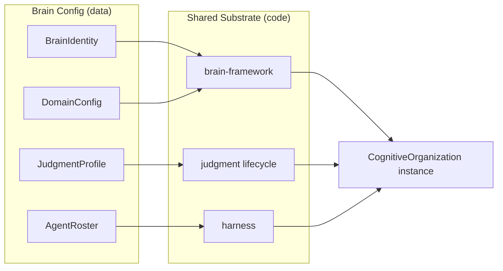
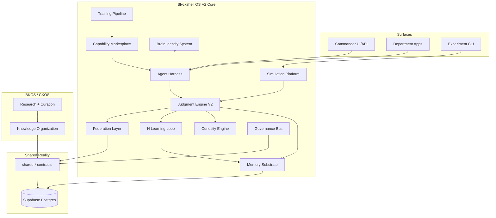
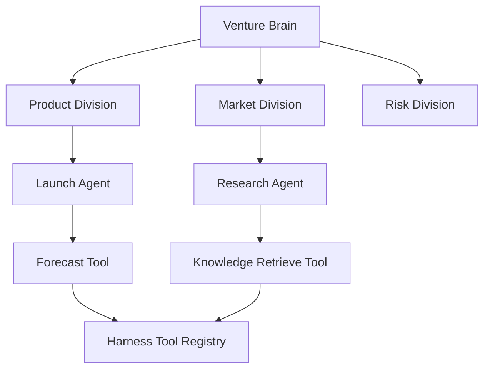
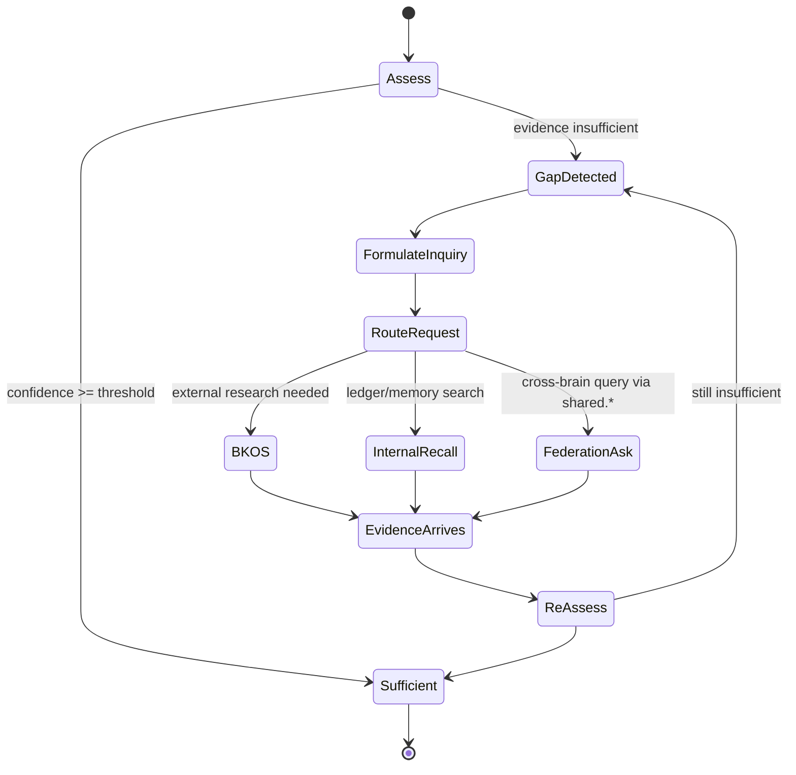
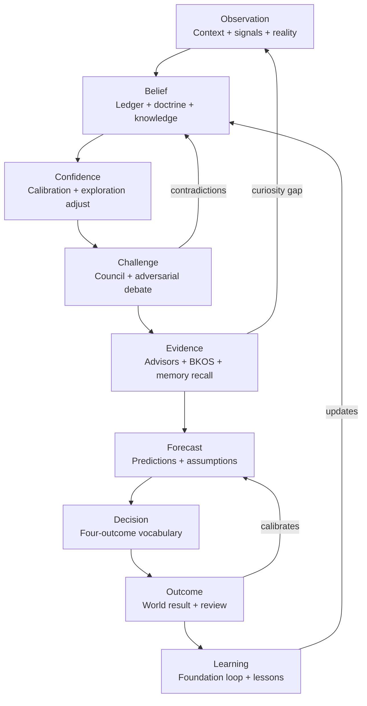
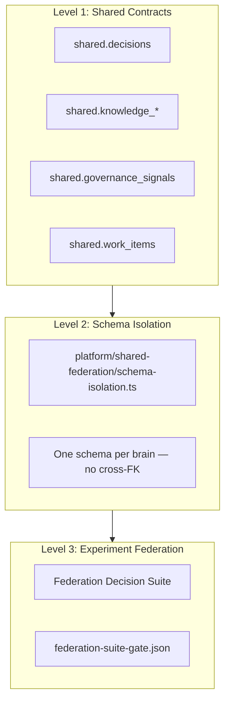
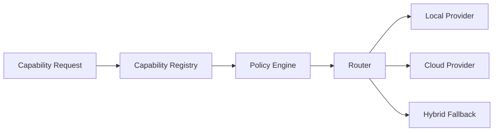
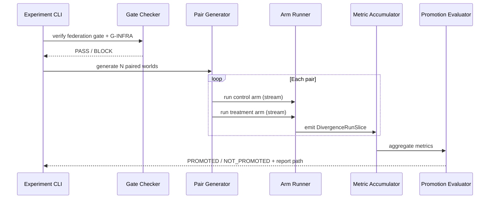
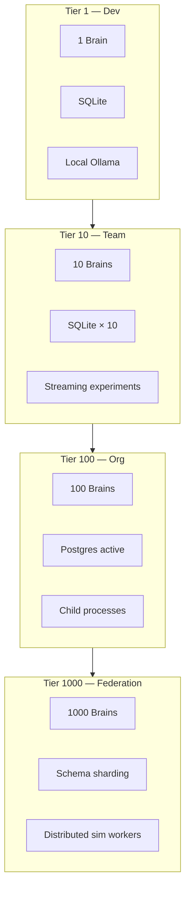
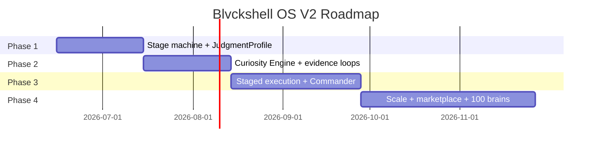

# Blvckshell OS V2 — Architecture Bible

**Version:** 2.0.0-draft  
**Date:** 2026-06-14  
**Status:** Forward architecture — inherits V1 research, replaces V1 judgment pile  
**Prerequisite reading:**
- [`BLVCKSHELL_JUDGMENT_ENGINE_RESEARCH.md`](./BLVCKSHELL_JUDGMENT_ENGINE_RESEARCH.md) — V1 research archive
- [`BLVCKSHELL_EXPERIMENT_LEDGER.md`](./BLVCKSHELL_EXPERIMENT_LEDGER.md) — experiment history
- [`../ARCHITECTURE.md`](../ARCHITECTURE.md) — ecosystem constitution
- [`../../../docs/ORGANIZATIONAL_COGNITION_ARCHITECTURE_DIRECTIVE.md`](../../../docs/ORGANIZATIONAL_COGNITION_ARCHITECTURE_DIRECTIVE.md) — authoritative cognition model
- [`../../../ECOSYSTEM_ARCHITECTURE_BIBLE.md`](../../../ECOSYSTEM_ARCHITECTURE_BIBLE.md) — ecosystem reference

**Classification:** Permanent archive quality — design intent with evidence citations where V1 artifacts exist.

---

## Purpose of This Document

Blvckshell OS V1 proved that **specific judgment algorithms, under strict experiment design, can improve paired decision outcomes**. V1 also proved that **algorithm accumulation without lifecycle integration, valid experiment surfaces, and harm-aware promotion gates produces false positives and organizational harm**.

Blvckshell OS V2 is not "V1 plus more algorithms." V2 is a **redesign of the operating system** around:

1. **Brains as configuration** — infinite deployable cognitive organizations sharing substrates
2. **Judgment as a lifecycle** — not an algorithm pile
3. **Evidence-first promotion** — nothing ships without paired outcome proof
4. **Federation-native experiment surfaces** — no venture contamination
5. **Four-outcome decision vocabulary** — PROCEED, STAGED_PROCEED, REQUEST_MORE_EVIDENCE, HOLD

This bible defines V2 architecture. Implementation phases are at document end.

---

## Lessons Learned From V1

Every V2 principle below is grounded in a documented V1 failure or success. Citations point to the research archive.

### Lesson 1 — Single-brain learning ≠ organizational intelligence

G1 proved 15/15 brains pass lesson influence (`docs/audits/LESSON_INFLUENCE_AUDIT.md`). G2 proved a learning civilization performs **worse** than control: ROI −11.0%, success −27.3pp (`docs/audits/ADAPTATION_PROOF_REPORT.md`).

**V2 implication:** Learning is a substrate capability. Organizational intelligence requires judgment lifecycle structure, not lesson volume.

### Lesson 2 — Mechanism proof ≠ outcome promotion

G3 ledger mechanism proven after validator fix (`docs/audits/G3_FINAL_FAILURE_ANALYSIS.md`). G3.4 100-run adaptation: Verdict B — no measurable difference (`docs/audits/G3_100_RUN_ADAPTATION_REPORT.md`). G4 forecast mechanism proven; G4.1 trust councils Verdict C with 52.7% divergence and worse ROI (`docs/audits/G4_ADAPTATION_RETEST_REPORT.md`).

**V2 implication:** Separate mechanism validation from promotion gates. Promotion requires paired ROI improvement and harm=0.

### Lesson 3 — Unpaired experiments produce false positives

G5.0 unpaired: +20pp success, +0.350 ROI, **0% divergence** — world confound (`docs/audits/G5_ADAPTATION_REPORT.md`).

**V2 implication:** Paired experiments are mandatory infrastructure, not methodology preference. Enforced by experiment platform.

### Lesson 4 — Experiment surface contamination invalidates all results

90% `ai_consulting`, same venture question to all brains, `ventureProceed` as sole metric (`docs/audits/G5_SCENARIO_DIVERSITY_TRACE.md`).

**V2 implication:** Federation Decision Suite gate is permanent infrastructure (`docs/audits/G5_FEDERATION_DECISION_SUITE_SPEC.md`). No layer evaluation on contaminated surfaces.

### Lesson 5 — Runtime Supabase reads invalidate simulation

~7,800 reads per 50-pair run pre-G-INFRA (`docs/audits/ARCHITECTURE_COMPLIANCE_AUDIT.md`). Post-G-INFRA: 0 runtime reads (`docs/audits/G_INFRA_1_PROOF_REPORT.md`).

**V2 implication:** G-INFRA pattern is production-adjacent architecture: local active cognition, remote durable store, batch sync. Runtime remote reads forbidden in experiment and production cognition hot paths.

### Lesson 6 — Algorithm traces without lifecycle translation are inactive

G5.4C.4: reasoning influence 0.055–0.076 but 1.3% divergence — translation seam (`docs/audits/G5_4C_DECISION_BOUNDARY_AUDIT.md`).

**V2 implication:** Every cognitive layer must declare integration point in lifecycle with consumed/rejected signal audit. No orphan algorithms.

### Lesson 7 — Binary judgment cannot express beneficial de-risking

G5.4C.8.2 breakthrough: 7/7 divergences were PROCEED→STAGED_PROCEED, all safe_beneficial, +2.1% ROI (`docs/audits/G5_4C_SAFE_DIVERGENCE_PROMOTION_REPORT.md`).

**V2 implication:** Four-outcome model is core vocabulary, not simulation shim. Defined in `platform/judgment/reasoning-judgment/judgment-outcome-v2.ts`.

### Lesson 8 — Harm guard precedence is non-negotiable

G5.4C.8 pre-harm: capital hold→proceed, ROI −0.598/−1.598 (`docs/audits/G5_4C_THRESHOLD_FAST_REPORT.md`). Post-harm: 3 blocks, 0 capital flips (`docs/audits/G5_4C_HARM_AWARE_RETUNE_REPORT.md`).

**V2 implication:** Harm guard is authoritative override, not observational metric. V2 must avoid observational guards that log but do not block.

### Lesson 9 — Memory architecture determines experiment feasibility

OOM at sim 21/100 (~6 GB); fixed by streaming accumulators (`docs/audits/G_INFRA_2_1_MEMORY_HYGIENE_REPORT.md`). SQLite lock at scenario 27/32 (`docs/audits/G_INFRA_2_3_SQLITE_CONTENTION_FIX.md`).

**V2 implication:** Store conclusions, not thoughts (`docs/audits/G_INFRA_2_2_MEMORY_ARCHITECTURE_REPORT.md`). Durable vs ephemeral memory split is architectural.

### Lesson 10 — Validator scope must match proof scope

G3A coupled to council consensus unrelated to ledger proof (`docs/audits/G3_FINAL_FAILURE_ANALYSIS.md`).

**V2 implication:** Experiment platform validates layer-specific gates, not full lifecycle pass/fail monolith.

### V1 promoted stack — what V2 inherits

```text
Foundation (G5.4A)     → platform/judgment/foundation-judgment/
Exploration (G5.4B)    → platform/judgment/exploration-judgment/
Reasoning (G5.4C)      → platform/judgment/reasoning-judgment/
Harm guard (G5.4C.7)   → harm-aware-reasoning-guard.ts
Safe divergence (G5.4C.8.2) → safe-divergence-guard.ts
G-INFRA pattern        → platform/simulation/infrastructure/
Federation suite       → platform/simulation/federation-decision-suite/
Four-outcome model     → judgment-outcome-v2.ts
Paired experiment design → all G5.4A+ promotion reports
```

### V1 anti-patterns — what V2 must avoid

| Anti-pattern | V1 evidence | V2 rule |
|--------------|-------------|---------|
| Venture contamination | `G5_SCENARIO_DIVERSITY_TRACE.md` | Federation suite gate only |
| Runtime Supabase reads | `ARCHITECTURE_COMPLIANCE_AUDIT.md` | G-INFRA everywhere |
| Algorithm piles without outcome proof | G5.2A, G5.3A FAIL | Evidence-first promotion |
| Binary-only judgment | G5.4C.8 spec | Four-outcome vocabulary |
| Observational guards | Pre-G5.4C.7 threshold flips | Authoritative harm guard |
| Trust-weighted councils at scale | G4.1 Verdict C | Redesign before reintroduction |
| Lesson sprawl without ledger | G2 −11% ROI | Structured judgment substrate |
| Full object retention in experiments | OOM reports | Streaming accumulators |

---

## V2 Core Principles

### Principle 1 — Brains are configuration

A department brain is not a separate codebase per cognitive feature. A brain is:

```text
BrainIdentity (id, sub-brains, schema, doctrine seeds)
  + DomainConfig (per-domain parameters)
  + JudgmentProfile (which lifecycle stages enabled, weights, guards)
  + AgentRoster (0..n workers — optional)
  = CognitiveOrganization instance
```

Implementation today: `platform/brain-framework/core/organization.ts` defines `CognitiveOrganization` with 13 domains. V2 extends this with **JudgmentProfile** as first-class config, not hardcoded experiment flags.

**Evidence base:** 15 brains validated with framework modifications = 0 (`docs/DEPARTMENT_BRAINS.md`).



### Principle 2 — Infinite brains, finite substrates

V2 targets **1 / 10 / 100 / 1000 brain** scaling tiers (see Scaling Model). New brains are created by:

1. Defining `BrainIdentity` + manifest (`departments/{dept}/manifest.ts`)
2. Configuring judgment profile (not copying algorithm code)
3. Registering in federation schema isolation (`platform/shared-federation/schema-isolation.ts`)
4. Passing brain validation gates (`npm run validate:department-brains`)

No new brain requires new algorithm implementations. Differentiation is **domain content, doctrine, sub-brain emphasis, judgment profile** — per `docs/ORGANIZATIONAL_COGNITION_ARCHITECTURE_DIRECTIVE.md`: "Revenue must not think like Capital."

### Principle 3 — Shared substrates

All brains share:

| Substrate | Path | Role |
|-----------|------|------|
| Universal Brain Framework | `platform/brain-framework/` | 13 cognitive domains |
| Cognition lifecycle | `platform/cognition-lifecycle/execute-lifecycle.ts` | Universal decision path |
| Judgment layers | `platform/judgment/` | Foundation, exploration, reasoning |
| Agent harness | `platform/harness/` | Execution, tools, providers |
| Simulation infrastructure | `platform/simulation/` | Experiment platform |
| Shared contracts | `supabase/migrations/*shared*` | Cross-brain communication |
| Hosted reality | Supabase Postgres | Shared world state |

Brains do **not** share: memory, lessons, doctrine, ledger entries, internal worldview. Federation via `shared.*` only.

### Principle 4 — Judgment is a lifecycle, not a pile

V1 ended with five algorithm layers stacked by precedence. V2 reframes these as **stages in a unified judgment cycle** (see Judgment Engine V2). Algorithms are **stage implementations**, not independent features.

### Principle 5 — Evidence-first promotion

Nothing enters default brain config without:

- Paired experiment on federation suite
- G-INFRA compliance
- Promotion gates (divergence band, ROI Δ, harm=0)
- Audit report in `docs/audits/` or `docs/archive/`

Experiment platform enforces programmatically, not by policy document.

### Principle 6 — Models are advisors, not decisions

Per `docs/MODEL_FEDERATION_ARCHITECTURE_DIRECTIVE.md`: model output = classified evidence; department brain = decision maker. V2 harness routes model calls; judgment lifecycle consumes evidence, never raw model text as decision.

---

## System Map

High-level V2 system map. Components marked **IMPLEMENTED** exist in V1 codebase; **V2-PLANNED** are specified herein.



### Component registry

| Component | Status | Primary path | Responsibility |
|-----------|--------|--------------|----------------|
| Agent Harness | IMPLEMENTED | `platform/harness/` | Task execution, provider routing, tool registry |
| Federation | PARTIAL | `platform/shared-federation/`, `shared.*` | Cross-brain contracts, schema isolation |
| Judgment Engine V2 | PARTIAL | `platform/judgment/`, `execute-lifecycle.ts` | Unified judgment lifecycle |
| Memory | IMPLEMENTED | `platform/brain-framework/memory/`, persistence | Tiered memory, SQLite/Supabase |
| Curiosity Engine | V2-PLANNED | — | Evidence gap detection, inquiry generation |
| Learning | IMPLEMENTED | `platform/brain-framework/learning/` | Decision → outcome → lesson |
| Governance | IMPLEMENTED | `platform/governance/`, `shared.governance_signals` | Audit, signals, approvals |
| Capability | PARTIAL | `platform/harness/`, `shared.provider_configs` | Provider + tool capabilities |
| Simulation | IMPLEMENTED | `platform/simulation/` | Civilization + federation experiments |
| Training | V2-PLANNED | — | Doctrine promotion, profile tuning |
| Identity | IMPLEMENTED | `platform/brain-framework/core/types.ts`, brain-kit | BrainIdentity, sub-brains |
| BKOS | EXTERNAL | CKOS repository | Knowledge organization, research |

Architecture docs per component: `docs/harness/HARNESS_ARCHITECTURE.md`, `docs/intelligence/INTELLIGENCE_ARCHITECTURE.md`, `docs/GOVERNANCE_CONTRACTS_ARCHITECTURE.md`, `docs/LEDGER_ARCHITECTURE.md`.

---

## Agent Architecture

### Brain / Division / Agent / Tool hierarchy

```text
Brain (CognitiveOrganization)
  └── Division (SubBrain — domain specialization)
        └── Agent (0..n workers via harness)
              └── Tool (registry-invoked capability)
```

**Brain:** Persistent cognitive organization. 15 implemented (`docs/DEPARTMENT_BRAINS.md`). Entry: `departments/{dept}/brain.ts` → `build{Dept}Brain()`.

**Division (SubBrain):** Internal specialization within a brain. Example: People brain has 9 sub-brains (performance, hiring, culture, etc.). Defined in `platform/brain-framework/core/sub-brain.ts`.

**Agent:** Replaceable worker inside department repo. Not the organizational boundary. Per `docs/AGENTS_AND_PROVIDERS.md`: agents request capabilities; provider layer decides execution location (local/cloud/hybrid/dynamic).

**Tool:** Registered handler invoked only through harness tool registry — never direct agent calls. Entry: `platform/harness/index.ts`.



### Harness execution flow

From `docs/harness/HARNESS_ARCHITECTURE.md`:

1. Department registers capabilities via `registerDepartmentHarness()`
2. Task submitted to `HarnessExecutor.runTask()`
3. Planner decomposes goal
4. Provider router selects Ollama/OpenAI/Anthropic
5. Approval gate if tool policy requires
6. Tool registry invokes handler
7. Audit + telemetry recorded
8. Result returned — department persists business truth separately

**Forbidden in departments:** custom workflow runtimes, direct provider SDK calls, direct tool invocation bypassing registry.

### V2 agent rules

- Agents are **config**, not architecture. Adding an agent never requires framework modification.
- Agents produce **evidence artifacts** consumed by judgment lifecycle.
- Agents never write cross-department authoritative data — only via `shared.*` contracts.
- Deployment modes 1–4 mandatory: local, cloud, hybrid, dynamic routing.

---

## Memory Architecture

### Three-tier model (V2 formalization of G-INFRA discoveries)

| Tier | Storage | Lifetime | Contents |
|------|---------|----------|----------|
| **Ephemeral** | Process heap | Single lifecycle / task | Full prompts, raw advisor outputs, trace arrays |
| **Active** | SQLite per brain | Session / sim batch | Decisions, ledger entries, lessons, working memory |
| **Durable** | Supabase per schema | Permanent | Authoritative records, shared reality, audit |

Pattern proven in G-INFRA-1 (`docs/audits/G_INFRA_1_PROOF_REPORT.md`):

```text
Preload Once → SQLite Active → Work → Flush Once
```

### Domain memory (brain-framework)

`CognitiveOrganization.memory` — `platform/brain-framework/memory/domain.ts`

Memory tiers per `docs/departments/{dept}/MEMORY_MODEL.md` (Phase E specs):

- **Hypothesis** — unverified candidate
- **Working** — active context
- **Confirmed** — validated by outcome
- **Doctrine** — promoted principle (high confidence, multi-update)

Promotion criteria for doctrine from ledger (`docs/audits/LEDGER_LIFECYCLE_ARCHITECTURE.md`):
- Minimum confidence 0.85
- Minimum 5 updates
- Max 2 contradicting lessons
- 0 open contradictions on entry

### V2 memory rules

1. **Store conclusions, not thoughts** — G-INFRA-2.2 principle
2. **No cross-brain memory access** — federation via `shared.*` and `brain.reality` only
3. **Compaction is session-end** — not per-write during batch operations (G-INFRA-2.3)
4. **Streaming accumulators in experiments** — never retain full `SimulationRunResult` arrays
5. **Ledger hot window** — 25 versions per ledger, 100 changelog entries per brain

### Memory vs judgment ledger

| Concept | Purpose | Module |
|---------|---------|--------|
| Memory tiers | What the brain remembers | `brain-framework/memory/` |
| Judgment ledger | Structured belief evolution | `brain-framework/persistence/judgment-domain.ts` |
| Lessons | Narrative learning from outcomes | `brain-framework/learning/` |
| Knowledge entries | Typed facts and assumptions | `brain-framework/knowledge/` |

V2 judgment lifecycle reads from all four; writes conclusions back to appropriate tier.

---

## BKOS Architecture

**BKOS** (Blvckshell Knowledge OS) refers to the **CKOS knowledge organization** — the ecosystem's research and knowledge brain. CKOS is a **separate repository** and source of truth; not rebuilt inside Blvckshell-OS per `docs/ARCHITECTURE.md` and `.cursor/rules/blvckshell-os-architecture.mdc`.

### Role in V2

| Function | Owner | Contract |
|----------|-------|----------|
| Research acquisition | CKOS repo | `shared.knowledge_requests` |
| Knowledge responses | CKOS repo | `shared.knowledge_responses` |
| Normalization + curation | CKOS repo | `ckos.*` schema |
| Gap detection | CKOS agents | signals → Commander |
| Evidence supply | CKOS → all brains | via shared bus |

### Integration pattern

```text
Department Brain
  → shared.knowledge_requests (question, context, urgency)
  → CKOS (research, normalize, cite)
  → shared.knowledge_responses (evidence package, confidence, sources)
  → Judgment Engine V2 (evidence stage)
```

No department queries `ckos.*` directly. Per `docs/ARCHITECTURE.md` Shared contract catalog.

### BKOS vs department knowledge

- **BKOS/CKOS:** Cross-ecosystem research, external sources, curated knowledge base
- **Department knowledge domain:** Brain-local facts, assumptions, domain expertise (`brain-framework/knowledge/`)

V2 Curiosity Engine (planned) emits `shared.knowledge_requests` when judgment cycle reaches REQUEST_MORE_EVIDENCE or evidence gap detected.

### V2 BKOS requirements

1. Evidence packages must include: source, confidence, assumption list, expiry
2. Responses classified as evidence type before judgment consumption
3. CKOS remains independent repo — Blvckshell-OS carries contracts + client libraries only
4. Graph integration via Graphify metadata export to harness planning context (`docs/GRAPHIFY_INTEGRATION_ARCHITECTURE.md`)

---

## Curiosity Engine

**Status:** V2-PLANNED — architectural intent derived from G5.4C.8 REQUEST_MORE_EVIDENCE outcome and G5.3A assumption failure (traces without decision movement).

### Problem statement

G5.3A recorded 40 assumptions with 3.3% divergence (`docs/audits/G5_3A_PROOF_REPORT.md`) — assumptions without curiosity-driven action are inert. G5.4C.8 introduced REQUEST_MORE_EVIDENCE as judgment outcome (`judgment-outcome-v2.ts`) but V1 simulates it as delayed hold without recall loop (`docs/specs/G5_4C_8_SAFE_DIVERGENCE_DISCOVERY.md` §10).

### V2 definition

The Curiosity Engine is the **sub-system that converts evidence gaps into structured inquiry actions**. It is not exploration (which addresses caution bias pre-decision — `platform/judgment/exploration-judgment/`). Curiosity operates **post-assessment** when confidence is insufficient.



### Curiosity outputs

| Output | Consumer |
|--------|----------|
| `InquiryRequest` | BKOS via `shared.knowledge_requests` |
| `RecallDirective` | Memory + judgment ledger search |
| `FederationQuestion` | `shared.work_items` or domain-specific contract |
| `CuriosityTrace` | Audit + experiment platform |

### V2 constraints

- Curiosity never bypasses harm guard
- Inquiry cost tracked (exploration opportunity cost integration)
- Maximum recall depth configurable per JudgmentProfile
- REQUEST_MORE_EVIDENCE without curiosity action = lifecycle stall (logged, escalated to Commander)

---

## Judgment Engine V2

### Design thesis

V1 ended with five algorithm layers and two guards stacked by precedence. V2 unifies these into a **single cyclic lifecycle** where each stage has defined inputs, outputs, and promotion criteria.

**Not an algorithm pile.** Each stage may host multiple algorithms (as V1 foundation stack hosts four), but the **cycle** is the unit of architecture.

### The cycle

```text
Observation
  → Belief
  → Confidence
  → Challenge
  → Evidence
  → Forecast
  → Decision
  → Outcome
  → Learning
  → (feeds Observation)
```



### Stage mapping from V1 promoted stack

| V2 Stage | V1 Implementation | Path |
|----------|-------------------|------|
| Observation | Context assembly + simulation world | `org.context.assemble`, federation scenario |
| Belief | Ledger recall + Bayesian update | `g3-judgment-ledger.ts`, `bayesian-belief-updater.ts` |
| Confidence | Foundation pre-adjust + exploration | `forecast-predecision.ts`, `exploration-judgment-loop.ts` |
| Challenge | Council + adversarial debate | `councils/domain.ts`, `debate-service.ts` |
| Evidence | Advisor consultation + case retrieval | `execute-lifecycle.ts`, `case-retrieval-service.ts` |
| Forecast | Forecast propose + accountability | `forecasting/domain.ts`, G4 scoring |
| Decision | Harm guard + safe divergence + merge | `execute-lifecycle.ts`, guards |
| Outcome | Simulation / production review | `reviewOutcome`, federation evaluator |
| Learning | Foundation post-loop + lessons | `foundation-judgment-loop.ts`, `learning/domain.ts` |

### Four-outcome decision stage

Canonical outcomes (`judgment-outcome-v2.ts`):

| Outcome | V2 behavior |
|---------|-------------|
| PROCEED | Full execution authorized |
| STAGED_PROCEED | Partial execution with monitoring — V2 requires execution simulator branch |
| REQUEST_MORE_EVIDENCE | Triggers Curiosity Engine recall loop — not terminal hold |
| HOLD | Negative recommendation or harm guard veto |

Precedence (inherited from V1, permanent in V2):

```text
1. Harm guard (authoritative block)
2. Safe divergence mapping
3. Reasoning adjust
4. Exploration adjust
5. Foundation adjust
6. Base confidence
```

### V2 additions over V1

| Capability | V1 state | V2 requirement |
|------------|----------|----------------|
| Full cycle orchestrator | Partial (execute-lifecycle) | Explicit stage machine with trace per stage |
| REQUEST_MORE_EVIDENCE loop | Simulated as hold | Curiosity Engine integration |
| STAGED_PROCEED execution | ROI multiplier 0.6 | Partial execution simulator + monitoring |
| Council consensus | Inactive (G0) | Redesign as Challenge stage — not gating unrelated proofs |
| JudgmentProfile config | Experiment flags | First-class brain config |
| Stage-level promotion | Layer-level only | Promote stage algorithms independently |

### Judgment Engine V2 — not algorithm pile ( enforcement)

V2 experiment platform rejects:
- New algorithm without declared lifecycle stage
- Stage without consumed/output signal audit
- Promotion without paired federation suite outcome
- Binary-only decision output (must map to four outcomes)

---

## Brain Identity System

### BrainIdentity structure

From `platform/brain-framework/core/types.ts` and `docs/DEPARTMENT_BRAINS.md`:

```typescript
// Conceptual — see brain-kit for authoritative types
interface BrainIdentity {
  readonly brainId: string;
  readonly displayName: string;
  readonly schema: string;           // Postgres schema name
  readonly subBrains: SubBrainDefinition[];
  readonly doctrineSeeds: DoctrineSeed[];
  readonly advisorPanel: AdvisorPanelConfig;
  readonly judgmentProfile: JudgmentProfile;  // V2 addition
}
```

### Sub-brain federation

Each brain may define multiple sub-brains — domain specializations sharing persistence and judgment profile. People: 9 sub-brains. Capital: 6. Venture: 6.

Sub-brains are **not separate brains**. They are divisions with scoped memory queries and council participants.

### JudgmentProfile (V2)

```typescript
// V2-PLANNED type — config not code
interface JudgmentProfile {
  readonly foundationVariant: FoundationJudgmentVariant;
  readonly explorationVariant: ExplorationJudgmentVariant;
  readonly reasoningVariant: ReasoningJudgmentVariant;
  readonly harmGuardEnabled: boolean;
  readonly safeDivergenceEnabled: boolean;
  readonly outcomeVocabulary: 'binary' | 'v2_four';  // V2 default: v2_four
  readonly confidenceCeiling: number;
  readonly promotionBatch: string;  // evidence link
}
```

V1 variants defined in:
- `platform/judgment/foundation-judgment/config.ts`
- `platform/judgment/exploration-judgment/config.ts`
- `platform/judgment/reasoning-judgment/config.ts`

### Identity validation gates

```bash
npm run validate:brain-framework
npm run validate:department-brains
npm run audit:brain-depth
```

V2 adds:

```bash
npm run validate:judgment-profile  # V2-PLANNED
```

### Brain creation flow (V2)

```text
1. Charter department (manifest.ts)
2. Define BrainIdentity + sub-brains
3. Select JudgmentProfile from promoted library
4. Configure advisor panel (model federation)
5. Register shared.* contracts
6. Validate + audit depth
7. Deploy — separate repo (Option A) or package (Option B/C)
```

---

## Federation Governance

### Architecture

Federation operates at three levels:



### Ownership rules (non-negotiable)

From `docs/ARCHITECTURE.md`:

1. Every table has exactly one owner (one department / one repository)
2. Only owner writes authoritative rows in its schema
3. Others reference via `shared.*` — never cross-schema queries
4. No cross-schema foreign keys between business departments

### Governance signals

24 signal types in `shared.governance_signal_types` (`docs/GOVERNANCE_CONTRACTS_ARCHITECTURE.md`). Producers: Audit, Sentinel. Consumers: Commander, Operations, Counsel, People, Ledger, Revenue, Capital, Community, Events, Publisher.

V2 adds judgment-specific signals (PLANNED):
- `JudgmentOutcomeRecorded`
- `HarmGuardActivated`
- `EvidenceGapDetected`
- `StagedProceedInitiated`

### Federation Decision Suite as permanent gate

Inherited from V1 — cannot be disabled for layer promotion experiments.

Spec: `docs/audits/G5_FEDERATION_DECISION_SUITE_SPEC.md`

32 scenarios, 8 brains × 4 tensions. Hard gates: proceed 35–65%, flippable ≥25%, max brain share ≤20%.

Implementation: `platform/simulation/federation-decision-suite/`

### Commander role

Commander consumes truth via APIs and Shared — does not own departmental business data (`docs/ARCHITECTURE.md`). V2 Commander owns:
- Cross-brain approval archetypes (approve, reject, request_evidence, staged_approve)
- Escalation on judgment stalls
- Federation-level priority, not domain decisions

---

## Capability Marketplace

### Concept

Departments and agents request **capabilities** (reasoning, embedding, image generation, tool execution). The marketplace matches requests to registered providers based on policy, cost, latency, and availability.

V1 foundation: `docs/AGENTS_AND_PROVIDERS.md`, `shared.provider_configs` contract.

### V2 architecture



| Component | Path | Status |
|-----------|------|--------|
| Harness executor | `platform/harness/index.ts` | IMPLEMENTED |
| Provider router | harness bootstrap | IMPLEMENTED |
| Tool registry | `platform/harness/` | IMPLEMENTED |
| Capability registry | V2-PLANNED | `platform/capability/` |
| Policy engine | V2-PLANNED | cost/approval/routing rules |
| Provider configs | `shared.provider_configs` | DESIGNED |

### Marketplace rules

1. Capabilities are registered, versioned, auditable
2. Departments never bind to provider SDKs directly
3. Four deployment modes mandatory (local, cloud, hybrid, dynamic)
4. Model outputs classified as evidence before judgment consumption
5. Tool invocation always through registry — audit trail required

### V2 capability types

| Capability | Examples |
|------------|----------|
| Reasoning | Qwen, GPT, Claude, DeepSeek |
| Embedding | Local nomic, OpenAI ada |
| Image | ComfyUI local, cloud SD |
| Tool execution | Registry handlers per department |
| Simulation | Federation suite, civilization runner |
| Judgment stage | Pluggable stage algorithms with promotion evidence |

---

## Experiment Platform

### Inherited from V1 (mandatory)

| Feature | Path |
|---------|------|
| Paired world design | `platform/simulation/world/varied-scenario-worlds.ts` |
| Federation suite | `platform/simulation/federation-decision-suite/` |
| G-INFRA compliance | `platform/simulation/infrastructure/` |
| Streaming accumulators | G-INFRA-2.1 pattern |
| Promotion gates | `docs/specs/G5_4C_8_SAFE_DIVERGENCE_DISCOVERY.md` gate table |
| Experiment ledger | `docs/archive/BLVCKSHELL_EXPERIMENT_LEDGER.md` |
| Harm classification | `safe-divergence-classification.ts` |

### V2 experiment platform architecture

```text
ExperimentSpec
  → GateChecker (federation + G-INFRA)
  → PairGenerator (world hash lock)
  → ArmRunner (control + treatment streaming)
  → MetricAccumulator (divergence, ROI, harm, classification)
  → PromotionEvaluator (gate table)
  → AuditReport (docs/audits/ auto-generated)
  → LedgerAppend (BLVCKSHELL_EXPERIMENT_LEDGER.md)
```



### V2 experiment rules

1. **No unpaired experiments** for promotion claims
2. **No venture-contaminated surfaces** — federation suite only
3. **No runtime Supabase reads** — G-INFRA enforced programmatically
4. **Harm=0 required** — not negotiable
5. **Classification required** — safe_beneficial vs harmful per divergence
6. **Stage-level experiments** — test one lifecycle stage change at a time when possible
7. **Append-only ledger** — corrections via dated addenda

### CLI surface (V1 + V2)

```bash
# Gates
npm run audit:g5-federation-decision-suite
npm run validate:g-infra-1-compliance

# Layer experiments (V1 — inherited)
npm run experiment:g5-4a-weight-tuning
npm run experiment:g5-4b-exploration-stack
npm run experiment:g5-4c-safe-divergence-discovery

# V2-PLANNED
npm run experiment:v2-judgment-cycle
npm run experiment:v2-curiosity-loop
npm run validate:judgment-profile
```

---

## Security Model

### Schema isolation

- One Supabase project, schema per department (`docs/ARCHITECTURE.md`)
- RLS scoped per schema/role
- No cross-schema FK between business departments
- Shared contracts carry opaque IDs, not domain payloads (`docs/GOVERNANCE_CONTRACTS_ARCHITECTURE.md`)

### Cognition security

| Threat | V1 evidence | V2 control |
|--------|-------------|------------|
| Unsafe capital flips | G5.4C.8 threshold fast | Harm guard authoritative |
| Cross-brain data leak | Architecture rules | Schema isolation + no cross-query |
| Model prompt injection as decision | Model federation directive | Evidence classification |
| Supabase hammering / DoS self | ARCHITECTURE_COMPLIANCE | G-INFRA local active |
| Ledger bloat / timeout | LEDGER_LIFECYCLE (147 versions) | Hot window + session-end compaction |
| Venture contamination as false proof | G5_SCENARIO_DIVERSITY | Federation gate |

### Harm guard as security control

`platform/judgment/reasoning-judgment/harm-aware-reasoning-guard.ts` — blocks transitions when:
- `case_evidence_not_positive`
- `recursive_risk_above_cap`
- `expected_roi_not_positive`

V2: harm guard runs **before** any outcome promotion. Cannot be disabled in production profiles.

### Audit trail

- `shared.audit_events` — immutable bus
- Cognition lifecycle logs steps in `execute-lifecycle.ts`
- Judgment traces in SQLite → flush to `cognition_events`
- Experiment reports in `docs/audits/` with batch IDs linking to `generated/simulation/journal/*.ndjson`

### Approval gates

Harness approval gate for sensitive tools (`docs/harness/HARNESS_ARCHITECTURE.md`). `shared.approvals` for cross-department authorization. STAGED_PROCEED in V2 requires approval workflow integration (PLANNED).

---

## Scaling Model

### Tier definitions

| Tier | Brains | Agents/brain | Sim pairs | Infrastructure |
|------|--------|--------------|-----------|----------------|
| **1** | 1 | 0–3 | 10–25 | Single SQLite, local Ollama |
| **10** | 10 | 3–10 | 50 | SQLite per brain, streaming experiments |
| **100** | 100 | 10–50 | 100+ | Postgres active memory, child process arms |
| **1000** | 1000 | 50+ | Sampled pairs | Sharded schemas, distributed sim workers |

### V1 proven limits

| Scale | Result | Evidence |
|-------|--------|----------|
| 15 brains G0 | 15/15 pass | `G0_LIVE_REASONING_EVIDENCE_REPORT.md` |
| 50-pair promotion | PASS with streaming | `G5_4A_WEIGHT_TUNING_REPORT.md` |
| 100-pair G-INFRA | 0 crashes, p95 47s | `G_INFRA_2_SCALE_READINESS_REPORT.md` |
| 32-scenario federation | PASS post-SQLite fix | `G_INFRA_2_3_SQLITE_CONTENTION_FIX.md` |

### V2 scaling principles

1. ** Brains are config** — scaling brain count does not scale code complexity
2. **Active memory local** — SQLite or brain-local Postgres at 10–100 tier; Supabase durable async
3. **Streaming mandatory** at 50+ pairs — G-INFRA-2.1 pattern
4. **Child process per arm** — V2-PLANNED for 100+ pairs (noted in G-INFRA-2.1 report)
5. **Compaction session-end only** — G-INFRA-2.3
6. **Federation suite samples** — not every brain runs every experiment at 1000 tier; stratified sampling with minimum gate coverage
7. **Peak heap gate** — `1200 + pairs × 60` MB

### Scaling diagram



---

## Roadmap Phases 1–4

### Phase 1 — V2 Foundation (inherit V1, formalize cycle)

**Goal:** Judgment lifecycle stage machine with V1 promoted stack integrated. No new algorithms.

| Deliverable | Source |
|-------------|--------|
| Stage machine in execute-lifecycle | Refactor `execute-lifecycle.ts` |
| JudgmentProfile config type | Extend brain-kit |
| Four-outcome default | `judgment-outcome-v2.ts` everywhere |
| Federation gate permanent | Already in `gate.ts` |
| G-INFRA production path | Extend beyond simulation |
| Experiment ledger automation | Append from CLI |

**Exit criteria:**
- All V1 promotion npm scripts pass on federation suite
- JudgmentProfile selectable per brain without code change
- Stage trace emitted for every lifecycle

### Phase 2 — Curiosity + Evidence Loops

**Goal:** REQUEST_MORE_EVIDENCE triggers real recall, not simulated hold.

| Deliverable | Dependency |
|-------------|------------|
| Curiosity Engine module | Phase 1 stage machine |
| BKOS request integration | `shared.knowledge_requests` |
| Recall depth limits | JudgmentProfile |
| Re-assessment cycle | Judgment lifecycle loop |
| Paired experiment | `experiment:v2-curiosity-loop` |

**Exit criteria:**
- REQUEST_MORE_EVIDENCE produces ≥1 evidence artifact before re-decision
- Paired experiment shows non-zero safe_beneficial classification
- No increase in harmful divergences

### Phase 3 — Staged Execution + Commander Integration

**Goal:** STAGED_PROCEED drives partial execution with monitoring.

| Deliverable | Dependency |
|-------------|------------|
| Execution simulator branch | `brain-framework/execution/` |
| Commander approval workflow | `shared.approvals` |
| STAGED_PROCEED monitoring | Governance signals |
| Capital four-outcome calibration | `safe-divergence-transitions.ts` extension |
| Council redesign (Challenge stage) | Inactive since G0 |

**Exit criteria:**
- STAGED_PROCEED produces auditable partial execution record
- Commander archetypes in federation suite pass behavioral gates
- Capital staged semantics defined and harm-guard compatible

### Phase 4 — Scale + Marketplace + 100-Brain Federation

**Goal:** Operate 100+ brains with capability marketplace and distributed experiments.

| Deliverable | Dependency |
|-------------|------------|
| Capability marketplace registry | `platform/capability/` |
| Child process experiment arms | G-INFRA-2.1 note |
| 100-brain stratified federation sampling | Federation suite extension |
| Hosted Postgres active memory | Phase F–G from DEPARTMENT_BRAINS |
| Cross-brain judgment signals | `shared.governance_signals` |
| 100-run promoted stack civilization test | G2 methodology with V2 stack |

**Exit criteria:**
- 100 brains validate without framework modification
- 100-run paired experiment of full V2 cycle — ROI Δ ≥ 0 with harm=0 or documented Verdict
- Capability marketplace routes 4 deployment modes
- Commander receives judgment signals from all active brains

### Roadmap timeline (indicative)



---

## V2 Architecture Summary

Blvckshell OS V2 transforms the V1 research program from a **stack of proven algorithms** into an **operating system for federated organizational intelligence**:

```text
Shared substrates (framework, harness, shared.*, Supabase reality)
  + Infinite brains (config: identity, judgment profile, agents)
  + Judgment lifecycle (Observation → … → Learning)
  + Four-outcome decisions (PROCEED / STAGED_PROCEED / REQUEST_MORE_EVIDENCE / HOLD)
  + Curiosity-driven evidence loops
  + Evidence-first experiment platform (paired, federation-gated, G-INFRA compliant)
  + Harm guard precedence (authoritative, not observational)
  = Federated organizational intelligence OS
```

### Inheritance checklist

| V1 asset | V2 status |
|----------|-----------|
| Paired experiments | **Required** — experiment platform |
| G-INFRA pattern | **Required** — all cognition paths |
| Federation decision suite | **Required** — promotion gate |
| Four-outcome model | **Default** — judgment vocabulary |
| Harm guard precedence | **Required** — authoritative |
| Evidence-first promotion | **Required** — no algorithm without proof |
| Foundation + Exploration + Reasoning + SafeDivergence | **Default promoted profile** |
| Venture contamination surfaces | **Forbidden** |
| Runtime Supabase reads | **Forbidden** |
| Algorithm piles | **Forbidden** — lifecycle stages only |
| Binary-only judgment | **Forbidden** — four outcomes required |
| Observational guards | **Forbidden** — guards must block |

### Key file index (V2 starting points)

| Concern | Path |
|---------|------|
| Lifecycle orchestrator | `platform/cognition-lifecycle/execute-lifecycle.ts` |
| Brain composition | `platform/brain-framework/core/organization.ts` |
| Brain builder | `platform/departments/brain-kit/` |
| Foundation judgment | `platform/judgment/foundation-judgment/` |
| Exploration judgment | `platform/judgment/exploration-judgment/` |
| Reasoning + guards | `platform/judgment/reasoning-judgment/` |
| Four outcomes | `platform/judgment/reasoning-judgment/judgment-outcome-v2.ts` |
| Federation suite | `platform/simulation/federation-decision-suite/` |
| Simulation infra | `platform/simulation/infrastructure/` |
| Agent harness | `platform/harness/index.ts` |
| Shared contracts | `platform/shared/contracts/definitions/index.ts` |
| Governance signals | `platform/governance/governance-signals.ts` |
| Ecosystem constitution | `docs/ARCHITECTURE.md` |
| Cognition directive | `docs/ORGANIZATIONAL_COGNITION_ARCHITECTURE_DIRECTIVE.md` |
| V1 research archive | `docs/archive/BLVCKSHELL_JUDGMENT_ENGINE_RESEARCH.md` |
| Experiment ledger | `docs/archive/BLVCKSHELL_EXPERIMENT_LEDGER.md` |

---

## Annex A: Department Brain Catalog (15 Brains)

From `docs/DEPARTMENT_BRAINS.md` and `platform/shared-federation/schema-isolation.ts`:

| Brain | Sub-brains | Schema | Entrypoint | Validation |
|-------|------------|--------|------------|------------|
| Counsel | 8 | counsel | `departments/counsel/brain.ts` | `validate:counsel-brain` |
| People | 9 | people | `departments/people/brain.ts` | `validate:people-brain` |
| Capital | 6 | capital | `departments/capital/brain.ts` | `validate:department-brains` |
| Publisher | 6 | publisher | `departments/publisher/brain.ts` | ↑ |
| Venture | 6 | venture | `departments/venture/brain.ts` | ↑ |
| Secretariat | 5 | secretariat | `departments/secretariat/brain.ts` | ↑ |
| Community | 4–5 | community | `departments/community/brain.ts` | ↑ |
| Events | 4–5 | events | `departments/events/brain.ts` | ↑ |
| Revenue | 4–5 | revenue | `departments/revenue/brain.ts` | ↑ |
| Ledger | 4–5 | ledger | `departments/ledger/brain.ts` | ↑ |
| Operations | 4–5 | operations | `departments/operations/brain.ts` | ↑ |
| Audit | 4–5 | audit | `departments/audit/brain.ts` | ↑ |
| Sentinel | 4–5 | sentinel | `departments/sentinel/brain.ts` | ↑ |
| Commander | 4–5 | commander | `departments/commander/brain.ts` | ↑ |
| Property | 4–5 | property | `departments/property/brain.ts` | ↑ |

Build pattern (all brains):
```text
BrainIdentity → createPersistentDomains(JsonTableStore) → buildCognitiveOrganization
```

Framework: `platform/brain-framework/` — 13 domains in `CognitiveOrganization` (`platform/brain-framework/core/organization.ts`):
knowledge, memory, research, planning, simulation, forecasting, learning, judgment, evidence, governance, councils, execution, context, reality.

Validation: framework modifications = 0 across all 15 brains.

V2 adds `JudgmentProfile` to each brain's config without changing this composition pattern.

---

## Annex B: Shared Contract Catalog (Complete)

From `docs/ARCHITECTURE.md` and `docs/SHARED_CONTRACTS.md`:

| Contract | Table | Purpose |
|----------|-------|---------|
| `shared.apps` | apps | Registered department surfaces |
| `shared.entities` | entities | Cross-department entity references |
| `shared.assets` | assets | Asset pointers (not owner payloads) |
| `shared.audit_events` | audit_events | Platform audit trail |
| `shared.knowledge_requests` | knowledge_requests | Knowledge bus (BKOS inbound) |
| `shared.knowledge_responses` | knowledge_responses | Knowledge bus (BKOS outbound) |
| `shared.production_signals` | production_signals | Production lifecycle (Studio → Ledger) |
| `shared.financial_signals` | financial_signals | Revenue → Ledger/Capital |
| `shared.review_requests` | review_requests | Legal/compliance (Operations → Counsel) |
| `shared.review_responses` | review_responses | Counsel → Operations |
| `shared.work_items` | work_items | Cross-department work |
| `shared.notifications` | notifications | Notifications |
| `shared.decisions` | decisions | Recorded decisions |
| `shared.tasks` | tasks | Governance task tracking |
| `shared.approvals` | approvals | Approval workflow metadata |
| `shared.governance_signals` | governance_signals | Governance control bus |
| `shared.governance_signal_types` | governance_signal_types | 24 signal type lookup |
| `shared.provider_configs` | provider_configs | Agent provider routing |

Governance migration: `supabase/migrations/20250610100002_shared_governance_contracts.sql`

V2 judgment signals (PLANNED additions to governance_signal_types):
- `JudgmentOutcomeRecorded`
- `HarmGuardActivated`
- `EvidenceGapDetected`
- `StagedProceedInitiated`
- `CuriosityInquiryDispatched`

---

## Annex C: Intelligence Architecture Integration

Phase 15 intelligence workers (`docs/intelligence/INTELLIGENCE_ARCHITECTURE.md`) sit on harness, not as separate execution engines:

```text
Commercial / execution signals
  ↓
Department intelligence (Revenue, Ledger, Operations)
  ↓
Harness reasoning cycle (Observe → Assess → Recommend → Escalate → Execute → Review)
  ↓
Approvals gate + audit trail
  ↓
Recommendations / forecasts / alerts (via authorized contracts only)
```

Universal model types in `platform/harness/intelligence/`:
- `IntelligenceAgentGoal` — what the worker optimizes
- `AgentObservation` — inbound signal snapshot
- `AgentAssessment` — judgment on observation
- `AgentRecommendation` — actionable output (never direct ledger writes from Revenue)
- `AgentDecisionRequest` — approval integration
- `AgentEscalation` — cross-department escalation
- `AgentOutcome` — full cycle result

V2 integration: Intelligence workers produce **Observation stage inputs** to Judgment Engine V2. They do not make final decisions — department brain judgment cycle does.

Legacy Era 2 modules (Revenue, Ledger, Operations) retain decision-engine and workflow code under `platform/departments/{dept}/`. V2 migrates these incrementally to brain-framework composition per `docs/DEPARTMENT_BRAINS.md` Legacy code section.

Commands:
- `npm run validate:intelligence`
- `npm run intelligence:demo`

---

## Annex D: Training Pipeline (V2-PLANNED)

V1 proved learning at single-brain level (G1) and foundation post-outcome updating (G5.4A). V2 Training Pipeline formalizes **doctrine promotion, profile tuning, and model advisor calibration** as a distinct subsystem.

### Training inputs

| Input | Source |
|-------|--------|
| Outcome-labeled decisions | `org.learning` domain |
| Foundation judgment traces | `{brainId}_foundation_judgment_traces` |
| Exploration traces | `{brainId}_exploration_judgment_traces` |
| Reasoning traces | `{brainId}_reasoning_judgment_traces` |
| Forecast scorecards | G4 accountability |
| Experiment promotion reports | `docs/audits/`, `docs/archive/` |

### Training outputs

| Output | Consumer |
|--------|----------|
| Updated JudgmentProfile weights | Brain config |
| Doctrine promotion candidates | `doctrine-from-ledger.ts` criteria |
| Advisor trust calibration | Model federation router |
| Experiment hypotheses | Experiment platform queue |

### Training rules (from V1 lessons)

1. No training on venture-contaminated experiment data
2. No promotion without paired outcome proof
3. Doctrine promotion requires measurable criteria (confidence ≥0.85, updates ≥5 — `docs/audits/LEDGER_LIFECYCLE_ARCHITECTURE.md`)
4. Training runs offline — never mutates production brain config without experiment gate pass
5. Store training conclusions, not full trace replay (G-INFRA-2.2 principle)

### Training vs experiment platform

| Aspect | Experiment platform | Training pipeline |
|--------|----------------------|-------------------|
| Purpose | Prove/disprove layer promotion | Tune promoted layer parameters |
| Design | Paired control/treatment | Historical outcome fitting |
| Gate | Federation suite + harm=0 | Profile validation only |
| Output | PROMOTED / NOT_PROMOTED | Updated JudgmentProfile |

---

## Annex E: Identity and Sub-Brain Deep Dive

### BrainIdentity construction

From `platform/departments/brain-kit/` and `platform/brain-framework/core/types.ts`:

```text
build{Dept}Brain()
  → resolve BrainIdentity (id, schema, subBrains, doctrineSeeds, advisorPanel)
  → createPersistentDomains(store, config)  // brain-framework/persistence/
  → buildCognitiveOrganization(identity, domains)
  → return CognitiveOrganization
```

Sub-brain definition (`platform/brain-framework/core/sub-brain.ts`):
- Scoped memory queries
- Council participant identity
- Domain emphasis weights
- Not separate persistence — shared brain SQLite/Supabase schema

### Advisor panels (G0)

Every brain has 3-advisor panel via provider router (`docs/PHASE_G0_BRAIN_WIRING.md`):

| Brain | Advisors |
|-------|----------|
| People | Qwen, Claude, DeepSeek |
| Capital | Qwen, GPT, DeepSeek |
| Counsel | Claude, GPT, Qwen |
| Publisher | Qwen, Gemini, Claude |
| Venture | Qwen, Claude, GPT |
| Commander | Qwen, Claude, GPT |

V2: advisor outputs classified as evidence types before Challenge/Evidence stages. Model federation directive forbids binding brain identity to single model.

### Organizational learning hook

Per `docs/ORGANIZATIONAL_LEARNING_ACCUMULATION_DIRECTIVE.md` (ecosystem root), every brain implements 16-rule organizational learning loop via `platform/departments/brain-kit/organizational-learning.ts`:

```typescript
const learning = getPeopleOrganizationalLearning(org);
const decision = await learning.recordDecision({ /* prediction required */ });
```

V2 Learning stage of judgment cycle wraps this hook with foundation post-outcome updating and lesson generation.

---

## Annex F: Simulation Platform Detail

### Civilization runner vs federation suite

| Runner | Use case | Brains per sim | Question source |
|--------|----------|----------------|-----------------|
| Civilization (`civilization-runner/`) | G2 org intelligence, legacy G5 | 6 (fastBatch) or 7 | Venture template (contaminated) |
| Federation suite (`federation-decision-suite/`) | G5.4A+ promotion experiments | 1 (single-brain) | Brain-native catalog |

V2: civilization runner deprecated for promotion experiments. Federation suite is sole valid surface.

### World construction

Varied worlds (`platform/simulation/world/varied-scenario-worlds.ts`):
- 8 scenarioKind values (stochastic_luck, safe_pass_regret, etc.)
- Decision quality ≠ outcome quality labels
- Luck/execution/market/timing attribution factors

Federation worlds add tension calibration (`decision-tension-calibration.ts`):
- clear_proceed (+0.28 margin target)
- weak_proceed (+0.12)
- borderline (0)
- weak_hold (−0.12)
- clear_hold (−0.28)

### Simulation outcome mapping for four outcomes

`JUDGMENT_OUTCOME_SIMULATION_MAP` in `judgment-outcome-v2.ts`:
- PROCEED: roiMultiplier 1.0
- STAGED_PROCEED: roiMultiplier 0.6
- REQUEST_MORE_EVIDENCE: roiMultiplier 0.0, isEvidenceGap true
- HOLD: countsAsHoldFailure true

V2 Phase 3 replaces multiplier with execution simulator branch.

---

## Annex G: Phase Deliverables Checklist

### Phase 1 deliverables (detailed)

| # | Deliverable | Acceptance test |
|---|-------------|-----------------|
| 1.1 | Stage enum in execute-lifecycle | Every step emits stage name in trace |
| 1.2 | JudgmentProfile type in brain-kit | buildVentureBrain accepts profile override |
| 1.3 | Four-outcome default | No binary-only output in federation suite |
| 1.4 | G-INFRA in production path | Architecture compliance audit PASS outside sim |
| 1.5 | Auto ledger append | Experiment CLI appends to BLVCKSHELL_EXPERIMENT_LEDGER.md |
| 1.6 | Stage promotion gate template | Reusable gate table per stage |

### Phase 2 deliverables (detailed)

| # | Deliverable | Acceptance test |
|---|-------------|-----------------|
| 2.1 | CuriosityEngine module | Dispatches shared.knowledge_requests |
| 2.2 | Recall depth limit | JudgmentProfile.maxRecallDepth enforced |
| 2.3 | Re-assessment cycle | REQUEST_MORE_EVIDENCE → new evidence → re-decision |
| 2.4 | Paired curiosity experiment | safe_beneficial > 0, harmful = 0 |
| 2.5 | Stall detection | No evidence after N cycles → Commander escalation |

### Phase 3 deliverables (detailed)

| # | Deliverable | Acceptance test |
|---|-------------|-----------------|
| 3.1 | Partial execution simulator | STAGED_PROCEED creates staged execution record |
| 3.2 | Commander approval integration | shared.approvals linked to staged decisions |
| 3.3 | Capital four-outcome | Capital STAGED_PROCEED semantics defined + harm compatible |
| 3.4 | Council Challenge redesign | Council produces challenges, not pass/fail gate |
| 3.5 | Monitoring signals | Staged execution emits governance signals |

### Phase 4 deliverables (detailed)

| # | Deliverable | Acceptance test |
|---|-------------|-----------------|
| 4.1 | 100-brain validation | validate:department-brains at scale |
| 4.2 | Child process experiment arms | 100-pair without OOM |
| 4.3 | Capability marketplace | 4 deployment modes routed |
| 4.4 | 100-run V2 civilization | Paired ROI Δ ≥ 0 or documented verdict |
| 4.5 | Cross-brain judgment signals | All active brains emit JudgmentOutcomeRecorded |
| 4.6 | Hosted Postgres active memory | Phase F–G migration complete for greenfield |

---

## Annex H: Cross-Reference to Ecosystem Directives

V2 architecture is subordinate to ecosystem-level directives (ecosystem root `docs/`):

| Directive | Path | V2 relevance |
|-----------|------|--------------|
| Organizational cognition | `docs/ORGANIZATIONAL_COGNITION_ARCHITECTURE_DIRECTIVE.md` | Brains as independent organizations |
| Model federation | `docs/MODEL_FEDERATION_ARCHITECTURE_DIRECTIVE.md` | Models = advisors, not decisions |
| Learning accumulation | `docs/ORGANIZATIONAL_LEARNING_ACCUMULATION_DIRECTIVE.md` | 16-rule learning loop |
| Brain realization | `docs/BRAIN_REALIZATION_MASTER_PLAN.md` | REAL gate R1–R7 |
| Cross-brain compatibility | `docs/CROSS_BRAIN_COMPATIBILITY_REPORT.md` | Federation interoperability |
| Ecosystem bible | `ECOSYSTEM_ARCHITECTURE_BIBLE.md` | Authoritative ecosystem reference |

Blvckshell-OS repo role per `docs/ARCHITECTURE.md`: architecture docs, Shared contract specs, coordinated migrations, greenfield departments — **not** replacements for CKOS or Studio repositories.

Three Eras context:
- Era 1 — Architecture (schemas, contracts, signals)
- Era 2 — Departments (Revenue, Ledger, Operations legacy)
- Era 3 — Brains (cognition, memory, learning, org intelligence) ← V1 research completed here; V2 extends

Graph truth rule from ecosystem bible: architecture audits should cite `graphify-out/GRAPH_REPORT.md` baseline. Current baseline: 7,484 nodes · 20,497 edges · 456 communities (2026-06-06).

---

## Annex I: Judgment V2 Cycle — Stage Input/Output Contract (PLANNED)

Formal IO contract for V2 stage machine — extends V1 execute-lifecycle steps:

| Stage | Reads | Writes | V1 module |
|-------|-------|--------|-----------|
| Observation | reality, context, signals | ObservationTrace | context/domain.ts |
| Belief | ledger, doctrine, knowledge | BeliefState | g3-judgment-ledger.ts |
| Confidence | foundation pre, exploration pre | ConfidenceAdjustTrace | foundation-judgment/, exploration-judgment/ |
| Challenge | council positions, debate | ChallengeTrace | councils/, debate-service.ts |
| Evidence | advisors, cases, BKOS responses | EvidenceBundle | case-retrieval-service.ts |
| Forecast | forecasting domain, assumptions | ForecastRecord | forecasting/domain.ts |
| Decision | merged confidence, guards | DecisionRecord + judgmentOutcomeV2 | execute-lifecycle.ts |
| Outcome | world result, review | OutcomeRecord | apply-outcome.ts |
| Learning | outcome, traces | Lesson, ledger evolution, foundation post | foundation-judgment-loop.ts |

Each stage must emit `consumedSignals[]` and `ignoredSignals[]` for audit — pattern established in G5.4C.5 boundary audit (`docs/audits/G5_4C_DECISION_BOUNDARY_AUDIT.md`).

---

## Annex J: Revenue, Ledger, Operations — Legacy Integration Path

Era 2 departments retain specialized modules (`docs/DEPARTMENT_BRAINS.md` Legacy code section):

| Department | Legacy path | V2 migration target |
|------------|-------------|---------------------|
| Revenue | `platform/departments/revenue/decision-engine/`, `intelligence/` | buildRevenueBrain() + intelligence workers |
| Ledger | `platform/departments/ledger/` | buildLedgerBrain() + financial signals |
| Operations | `platform/departments/operations/intelligence/workflows/` | buildOperationsBrain() + harness tasks |

Revenue intelligence architecture (`docs/intelligence/INTELLIGENCE_ARCHITECTURE.md`):
- Revenue produces recommendations — never direct ledger writes
- Ledger owns financial truth (`docs/LEDGER_ARCHITECTURE.md`)
- Operations consumes governance signals for execution coordination

V2 migration rule: transfer domain depth into brain-framework domains incrementally. Do not delete legacy until depth ≥70% REAL gate per `docs/BRAIN_REALIZATION_MASTER_PLAN.md`.

Financial signal flow (from `docs/LEDGER_ARCHITECTURE.md`):
```text
Studio → shared.production_signals → Ledger
Revenue → shared.financial_signals → Ledger posts transactions
Ledger → shared.financial_signals → Capital (BudgetAvailable, CashPositionChanged)
```

Commander reads all via Shared — never writes `ledger.transactions` or `revenue.*`.

---

## Annex K: Sentinel, Audit, Counsel — Governance Brain Cluster

Governance cluster brains interact primarily via `shared.governance_signals` (`docs/GOVERNANCE_CONTRACTS_ARCHITECTURE.md`):

| Brain | Produces | Consumes |
|-------|----------|----------|
| Audit | governance_signals (majority of 24 codes), audit_events | decisions, tasks |
| Sentinel | security/risk signals, audit_events | operational signals |
| Counsel | review_responses | review_requests |
| Commander | priorities, alerts (planned) | all governance signals |

Federation suite includes Sentinel (`ignore/monitor/escalate/quarantine`) and Commander (`approve/reject/request_evidence/staged_approve`) native decisions — ensuring V2 judgment experiments cover governance brain surfaces, not only Venture/Capital.

Counsel remains Phase C reference brain with 8 sub-brains — framework modifications = 0 proof.

---

## Annex L: Property and Events — Experience Brain Integration

Property and Events brains (4–5 sub-brains each) participate in federation schema isolation but were excluded from G2 `fastBatch` (`docs/audits/G5_SCENARIO_DIVERSITY_TRACE.md`). V2 federation suite expansion (Phase 4) should add:
- Property: acquire / hold / divest / renovate archetypes
- Events: proceed / cancel / postpone / scale archetypes

Until added, judgment experiments for these brains rely on single-brain custom scenarios outside promotion gate — **not valid for layer promotion claims**.

Events architecture: `docs/EVENTS_ARCHITECTURE.md`  
Community architecture: `docs/COMMUNITY_ARCHITECTURE.md` — federation suite already includes Community (warn/ban/allow/escalate).

---

## Annex M: npm Script Reference (V1 Validated + V2 Planned)

### V1 validated scripts (executable proof exists)

| Script | Report output |
|--------|-----------------|
| `npm run validate:g0-brain-wiring` | G0 phase validation |
| `npm run validate:g1-lesson-influence` | `docs/audits/LESSON_INFLUENCE_AUDIT.md` |
| `npm run validate:g2:10` | `docs/audits/SIMULATION_VALIDITY_GATE.md` |
| `npm run validate:g2-adaptation` | `docs/audits/ADAPTATION_PROOF_REPORT.md` |
| `npm run validate:g3-judgment-ledger` | G3A proof |
| `npm run validate:g3-100-adaptation` | `docs/audits/G3_100_RUN_ADAPTATION_REPORT.md` |
| `npm run validate:g4-forecast-accountability` | `docs/audits/G4_FORECAST_ACCOUNTABILITY_PROOF.md` |
| `npm run validate:g4-adaptation-retest` | `docs/audits/G4_ADAPTATION_RETEST_REPORT.md` |
| `npm run validate:g5.1-paired-retest` | `docs/audits/G5_1_PAIRED_RETEST_REPORT.md` |
| `npm run validate:g-infra-1-compliance` | `docs/audits/G_INFRA_1_PROOF_REPORT.md` |
| `npm run validate:g5-4a-foundation-wiring` | `docs/audits/G5_4A_FOUNDATION_WIRING_REPORT.md` |
| `npm run validate:g5-4b-exploration-wiring` | `docs/audits/G5_4B_EXPLORATION_WIRING_REPORT.md` |
| `npm run validate:g5-4c-reasoning-wiring` | `docs/audits/G5_4C_REASONING_WIRING_REPORT.md` |
| `npm run experiment:g5-4a-weight-tuning` | `docs/audits/G5_4A_WEIGHT_TUNING_REPORT.md` |
| `npm run experiment:g5-4b-exploration-stack` | `docs/audits/G5_4B_EXPLORATION_STACK_REPORT.md` |
| `npm run experiment:g5-4c-reasoning-stack` | `docs/audits/G5_4C_REASONING_STACK_REPORT.md` |
| `npm run experiment:g5-4c-safe-divergence-discovery` | `docs/audits/G5_4C_SAFE_DIVERGENCE_PROMOTION_REPORT.md` |
| `npm run audit:g5-federation-decision-suite` | `docs/audits/G5_FEDERATION_DECISION_SUITE_AUDIT.md` |
| `npm run validate:department-brains` | All 15 brain composition |
| `npm run validate:brain-framework` | Framework substrate |

### V2 planned scripts

| Script | Phase | Purpose |
|--------|-------|---------|
| `npm run validate:judgment-profile` | 1 | JudgmentProfile config validation |
| `npm run experiment:v2-judgment-cycle` | 1 | Full cycle stage experiment |
| `npm run experiment:v2-curiosity-loop` | 2 | REQUEST_MORE_EVIDENCE recall proof |
| `npm run experiment:v2-staged-execution` | 3 | STAGED_PROCEED execution branch |
| `npm run validate:v2-100-brain` | 4 | Scale composition gate |

All V2 scripts must inherit G-INFRA compliance check and federation gate verification before arm execution — enforced in experiment platform, not optional CLI flags.

### Document authority and updates

This bible is forward architecture — implementation may lag specification. Status tags (IMPLEMENTED, V2-PLANNED, PARTIAL) must be updated when phases complete. Cross-references:

- V1 evidence → `BLVCKSHELL_JUDGMENT_ENGINE_RESEARCH.md`
- Experiment history → `BLVCKSHELL_EXPERIMENT_LEDGER.md`
- Ecosystem authority → `ECOSYSTEM_ARCHITECTURE_BIBLE.md`
- Cognition rules → `docs/ORGANIZATIONAL_COGNITION_ARCHITECTURE_DIRECTIVE.md`

Phase completion requires: npm script PASS, audit report in `docs/audits/`, ledger append, and status tag update in this document's component registry.

V2 design review gate: any proposed feature that adds algorithms without lifecycle stage assignment, or promotion without paired federation experiment, is rejected by definition — not by review discretion.

**V2 inherit count:** 6 mandatory inheritances (paired experiments, G-INFRA, federation suite, four-outcome model, harm guard precedence, evidence-first promotion). **V2 avoid count:** 6 forbidden anti-patterns (venture contamination, runtime Supabase reads, algorithm piles, binary-only judgment, observational guards, trust councils at scale without redesign).

For V1 research evidence backing this architecture, see companion document `BLVCKSHELL_JUDGMENT_ENGINE_RESEARCH.md` in this same archive directory.

---

*End of Blvckshell OS V2 Architecture Bible. This document defines forward architecture. Implementation status tracked per phase. Evidence citations reference V1 audit artifacts in `docs/audits/` and `docs/archive/`.*
