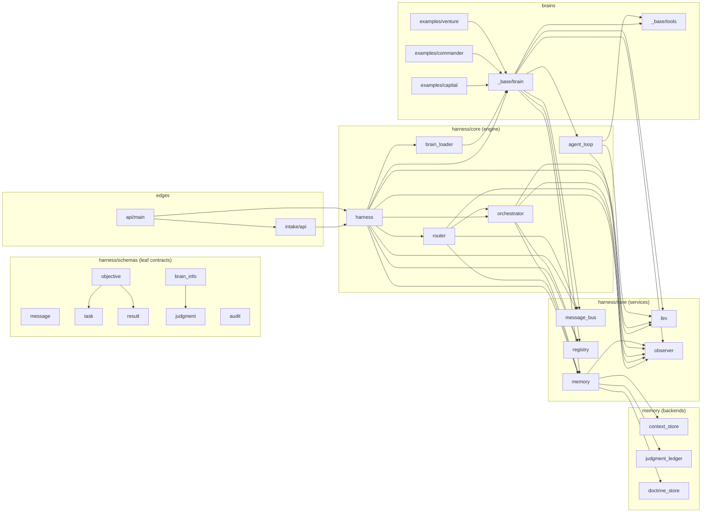
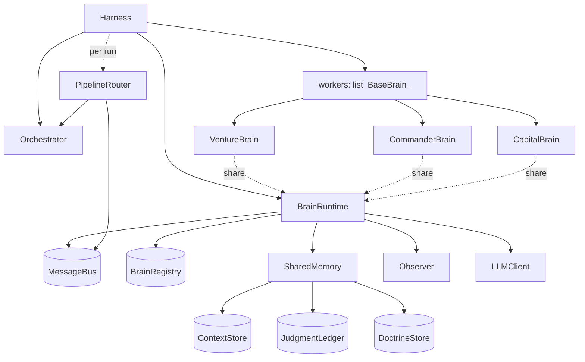
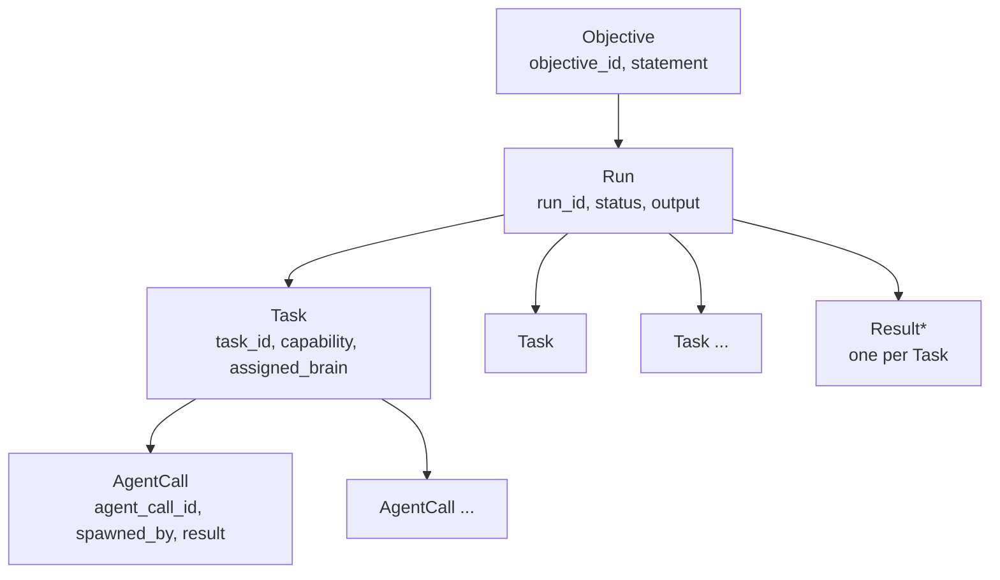
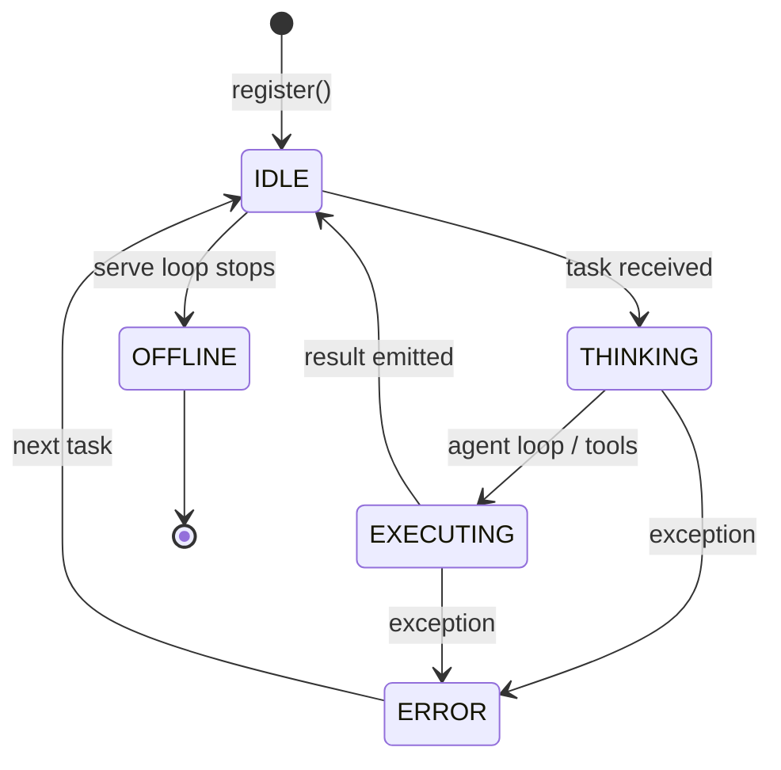

# System Graph

A full graph of the Blvckshell harness: module structure, runtime objects, data
stores, and the schema hierarchy. Mermaid renders on GitHub.

---

## 1. Module dependency graph



---

## 2. Runtime object graph (single process)



All workers share one `BrainRuntime`. The `Orchestrator` is owned by the harness
and is **not** in `workers` and **not** in the registry. A fresh `PipelineRouter`
is created per run.

---

## 3. Execution hierarchy (data)



Ancestry travels on every `TASK` message in `metadata`
(`objective_id` → `run_id` → `task_id`), enabling correct `AgentCall` parentage.

---

## 4. Memory tiers & persistence

```mermaid
graph LR
    subgraph tier1["Tier 1 — Working memory"]
        CTX[ContextStore]
    end
    subgraph tier2["Tier 2 — Episodic"]
        LED[JudgmentLedger]
    end
    subgraph tier3["Tier 3 — Doctrine"]
        DOC[DoctrineStore]
    end
    CTX -->|Redis hash, TTL 24h| REDIS[(Redis)]
    LED -->|table judgment_ledger| SUPA[(Supabase)]
    DOC -->|table doctrine, append-only| SUPA
    LED -.promote correct + conf>=0.8.-> DOC
    AUD[Observer / AuditStore] -->|table audit_log| SUPA
```

With offline defaults, all four use in-memory backends — no Redis or Supabase.

---

## 5. Brain state machine (UI orbs)



Colors: idle = dim purple, thinking = pulsing purple, executing = white pulse,
error = red, offline = grey. See `frontend/components/BrainOrb.tsx`.
