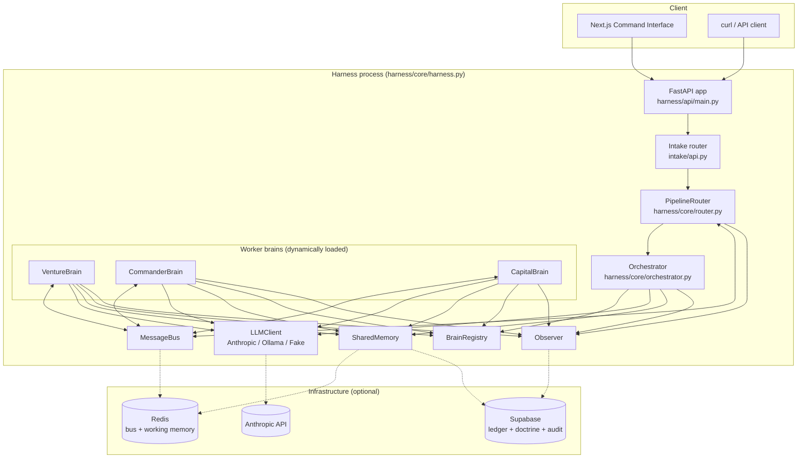
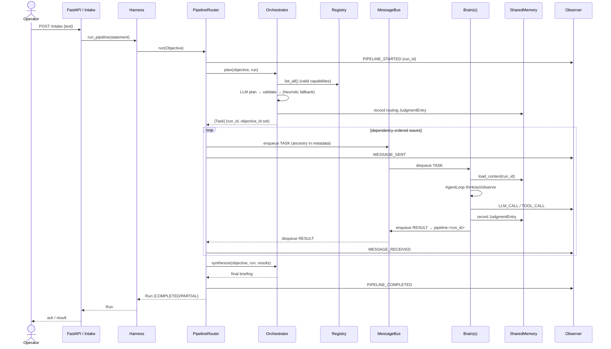
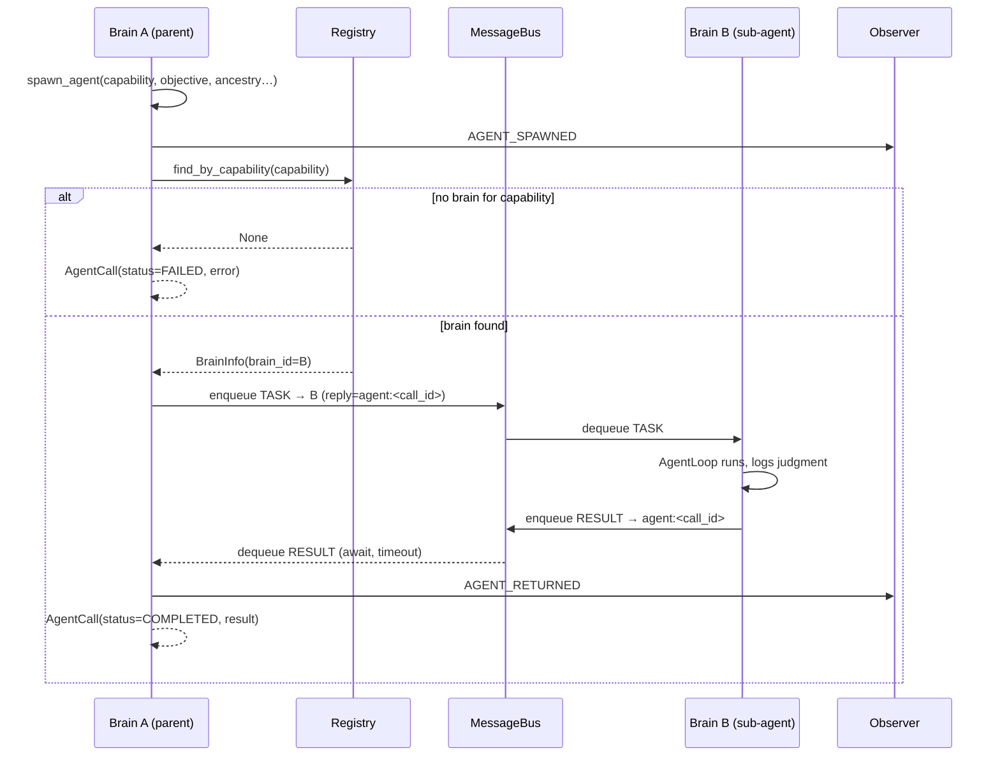

# Workflows, Connections & API Reference

Wireframe-level views of how data moves through the harness, the connections
between components, and the full HTTP API. Mermaid diagrams render on GitHub.

---

## 1. Component connection map



`-.->` edges are optional backends; with the in-memory/fake defaults the whole
graph runs in one process with no external infrastructure.

---

## 2. Workflow: idea → executed run



---

## 3. Workflow: a brain spawns a sub-agent



A timeout or missing capability yields `status=FAILED`; the parent continues.

---

## 4. Workflow: dependency-ordered task waves

```
plan() → [T1, T2, T3(depends_on T1)]

wave 1: dispatch T1, T2 in parallel ──► collect 2 results
wave 2: T3 ready (T1 done); inject T1.summary into T3.inputs.upstream
        dispatch T3 ──► collect 1 result
synthesize([R1, R2, R3])
```

Unsatisfiable dependencies (cycles / missing deps) fail only the stragglers with
`error="dependency_not_satisfiable"`; the rest of the run still completes.

---

## 5. Intake wireframe (UI)

```
┌──────────────────────────────────────────────────────────┐
│                                                            │
│                     Drop an idea.                          │
│        The harness takes over. Orchestrator routes.        │
│                                                            │
│   ┌────────────────────────────────────────────────────┐ │
│   │  I want to build a trading AI that …                │ │
│   │                                                     │ │
│   │  [ ● voice ]                            [ Run → ]   │ │
│   └────────────────────────────────────────────────────┘ │
│                 ⌘/Ctrl + Enter to run                      │
└──────────────────────────────────────────────────────────┘
```

Pipeline view: a grid of breathing **brain orbs** (idle / thinking / executing /
error) above a run list and a per-run synthesis panel. See `frontend/README.md`.

---

## 6. HTTP API reference

Base URL defaults to `http://localhost:8000`. Defined in `harness/api/main.py`
and `intake/api.py`.

| Method | Path                  | Body / Query                              | Returns |
|--------|-----------------------|-------------------------------------------|---------|
| GET    | `/health`             | —                                         | `{status, environment, in_memory, anthropic}` |
| POST   | `/intake`             | `{text: str, wait: bool=false}`           | `IntakeResponse` |
| POST   | `/intake/voice`       | `{audio_base64: str, wait: bool=false}`   | `IntakeResponse` |
| GET    | `/pipelines`          | —                                         | `[{pipeline_id, idea, status}]` |
| GET    | `/pipelines/{id}`     | `id` = objective_id                        | `{pipeline_id, run_id?, idea, plan[], history[], output, status}` |
| GET    | `/brains`             | —                                         | `[BrainInfo]` (live state for orbs) |
| GET    | `/ledger`             | `?brain_id=&limit=`                        | `[JudgmentEntry]` |
| GET    | `/doctrine`           | `?limit=`                                 | `[JudgmentEntry]` (active) |
| GET    | `/observer/events`    | `?context_id=&limit=`                      | `[AuditEvent]` (context_id = run_id) |
| GET    | `/observer/stream`    | —                                         | SSE stream of `AuditEvent` |

### `IntakeResponse`

```json
{
  "pipeline_id": "<objective_id>",
  "status": "running | COMPLETED | PARTIAL | NEEDS_OPERATOR",
  "message": "Got it, running.",
  "idea": "<normalized statement>",
  "result": { "...Run.to_dict() when wait=true, else null" }
}
```

### Async vs. sync intake

- `wait=false` (default): returns immediately with `status="running"` and a
  `pipeline_id`. Poll `GET /pipelines/{pipeline_id}` for progress, or subscribe
  to `GET /observer/stream`.
- `wait=true`: blocks until the run completes and returns the full `Run` in
  `result`.
